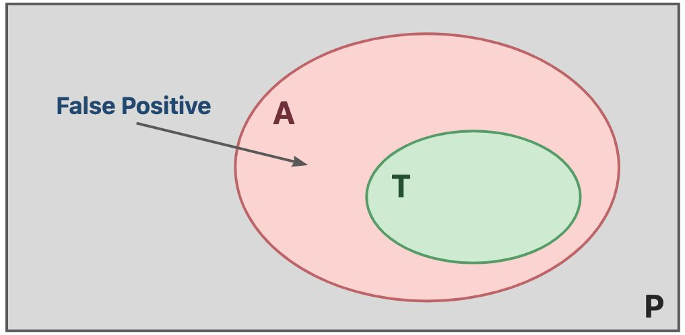
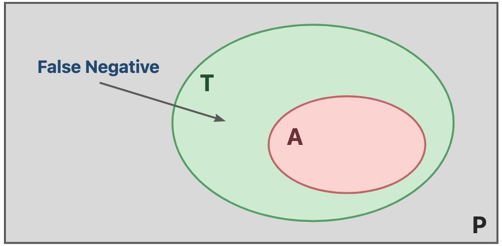

# 1 静态分析概述

## 1.1 静态分析的基本概念

::: definition 定义1.1
**静态分析（Static Analysis）** 是指在实际运行程序P之前，通过分析静态程序P本身来推测程序的行为，并判断程序是否满足某些特定的 **性质（Property）** Q。
:::

我们会关心的程序性质可能有：

- 程序P是否会产生私有信息泄漏（Private Information Leak），或者说是否存在访问控制漏洞（Access Control Venerability）；
- 程序P是否有空指针的解引用(Null Pointer Dereference)操作，更一般的，是否会发生不可修复的运行时错误（Runtime Error）；
- 程序P中的类型转换（Type Cast）是否都是安全的；
- 程序P中是否存在可能无法满足的断言（Assersion Error）；
- 程序P中是否存在死代码（Dead Code, 即控制流在任何情况下都无法到达的代码）；

有些可惜的是，静态分析并不能对于我们上面关心的问题给出一个确切的答案。

::: theorem 定理1.1 Rice定理（Rice Theorem）
对于使用 **递归可枚举（Recursively Enumerable）** 的语言描述的程序，其任何 **有价值（Non-trivial）** 的性质都是无法完美确定的。
:::

在这个定理中，有几个字眼需要我们稍微关注一下：

- 关于递归可枚举，其含义是存在某个计算函数（可以是图灵机），能够将这种语言中的所有合法字符串枚举出来。这个概念有些抽象，不必深究，暂时只需要知道，目前我们所能想到的所有的编程语言都是递归可枚举语言。
- 关于有价值，我们认为，如果一种性质是所有的程序都满足的或者都不满足的，那么这种性质是没有价值的，除此之外的性质是有价值的。简单理解就是和程序运行时的行为相关的，让我们感兴趣的性质，就是有价值的性质。


## 1.2 静态分析的类型

### 1.2.1 完美的静态分析

::: definition 定义1.2
如果一个静态分析 能够对于程序P的某个有价值性质Q给出确切的答案，我们就称S是P关于Q的**完美静态分析（Perfect Static Analysis）**。我们定义程序P的关于Q的真实行为为**真相（Truth）**，那么完美静态分析有两层含义：

- **完整性（Soundness）**：真相一定在S给出的答案中；
- **正确性（Completeness）**：S给出的答案一定在真相中；

记这个静态分析程序给出的答案集合 $A$ ，真相集合为 $T$ ，则完美的静态分析满足：

$$
T \subseteq A \wedge A \subseteq T \Leftrightarrow A = T
$$

其中， $T \subseteq A$ 体现了完整性， $A \subseteq T$ 体现了正确性。
:::

简单理解，一个完美的静态分析给出的答案应当既是对的，也是全的。

但是Rice定理告诉我们，不存在完美的静态分析，那么静态分析是否就没用了呢？并不是，有用和完美之间，往往是有着一片广阔的空间的。

### 1.2.2 妥协的静态分析

因为完美的静态分析并不存在，所以我们通常需要做一些妥协，也就是在 $T \subseteq A$ 和 $A\subseteq B$ 中只尽力满足其中一个条件，妥协另一个条件。

于是，我们得到了两种妥协后的静态分析类型。

::: definition 定义1.3
记程序P的关于性质Q的静态分析S为 **贪婪静态分析（Greedy Static Analysis）** ，当且仅当S给出的答案集合A和P关于Q的真相集合T之间满足 $T \subseteq A$ 这种分析策略也称作 **饱和估计（Over-approximation）** 。
:::

::: definition 定义1.4
记程序P的关于性质Q的静态分析S为 **懒惰静态分析（Lazy Static Analysis）** ，当且仅当S给出的答案集合A和P关于Q的真相集合T之间满足 $A \subseteq T$ 这种分析策略也称作 **保守估计（Under-approximation）** 。
:::

::: theorem 定理1.2
**Rice定理（Rice Theorem）** 对于使用 **递归可枚举（Recursively Enumerable）** 的语言描述的程序，其任何 **有价值（Non-trivial）** 的性质都是无法完美确定的。
:::

其中，

-  贪婪的静态分析保证了完整性，妥协了正确性，会饱和估计（Overapproximate）程序的行为，因此会出现假积极（False Positive）的现象，即判定为积极，但实际是消极的。反映在现实场景中即为误报问题。

<p style="text-align:center"></p>

> 在继续推进之前，我们先解释一下积极和消极的含义，对于客观世界来说， $T$ 是积极的， $\overline T$ 是消极的，从S的视角来看， $A$ 是积极的， $\overline A$ 是消极的。
> 
> 所谓假积极，就是S认为的积极其实在客观世界中是消极。类似的，假消极也就可以理解了。

这里，借用之前的形式化语言，我们其实可以明确的定义出在静态分析中的False Positive： 

::: definition 定义1.5
记程序P的关于性质Q的静态分析S有 **假积极（False Positive）** 问题，当且仅当S给出的答案A和P关于Q的真相T满足如下关系：

$$
\exists a \in A, a\notin T
$$

其中， $a$ 称为一个 **假积极实例（False Positive Instance）** ，其实是一个 **消极实例（Negative Instance）** 。
:::

- 懒惰的静态分析保证了正确性，妥协了完整性，会保守估计（Underapproximate）程序的行为，因此会出现假消极（False Negative）现象，即判定为消极（在 $\overline A$ 中），但实际是积极（在 $T$ 中）。反映在现实场景中即为漏报问题。

<p style="text-align:center"></p>

和定义1.5类似，我们可以形式化的定义出False Negative：

::: definition 定义1.6
记程序P的关于性质Q的静态分析S有 **假消极（False Negative）** 问题，当且仅当S给出的答案A和P关于Q的真相T满足如下关系：

$$
\exists a \notin A, a\in T
$$

其中， $a$ 称为一个 **假消极实例（False Negative Instance）** ，其实是一个 **积极实例（Positive Instance）** 。
::: 


### 1.2.3 现实世界中有用的静态分析

大多数的静态分析会妥协正确性，保证完整性，即贪婪的静态分析居多，这样的静态分析虽然不是完美的，但是有用的。以debug为例，在实际的开发过程中，贪婪的静态分析可以帮助我们有效的缩小debug的范围，我们最多只需要暴力排查掉所有的假积极实例（False Positive Instance）就可以了。

由于假积极实例 $a \in A$ ，所以这个人工排查 $a$ 的代价仍然是可控的，假设暴力排查一个程序点是否为bug的平均代价是常数项时间，则排查假积极的代价在 $O(|A|)$ 以内。

但是，懒惰的静态分析做不到这一点，它不能够帮助我们有效缩小debug的范围。因为假消极实例（False Negative Instance）$a \notin A$ ，所以 $a$ 的范围是 $P - A$ 。这里注意的是，虽然假消极的理论范围是 $T - A$ ，但因为我们并不知道 $T$ 是什么，所以只能从 $P - A$ 中排查。而 $P - A$ 往往是比 $A$ 大得多的，因此排查假消极的代价是很大的。

除非存在某个懒惰的静态分析S，能够做到 $A$ 接近于 $P$ （这里的P理解为整个程序的全集），这样 $P - A$ 会比较小，从而排查假消极的代价就小了。但是 $A \subseteq T \subseteq P$ ，如果要做到让A接近于P，我们就需要一个$T$接近于P的前提条件，因为懒惰分析下 $A$ 不会超过 $T$ 。

换言之，为了让排除假消极变得容易，需要程序P本身就十分符合性质Q。但是，如果静态分析S对于程序P本身提出了 $P$ 接近于 $T$ 的要求，那么我们还要静态分析干嘛呢？

我们使用静态分析的原因就是我们做不到写出非常符合Q的P（如果Q是一个优良的性质）或者我们根本不会去分析非常符合Q的P（如果Q是一个糟糕的性质，那么非常符合Q的P就是一个非常糟糕的程序，我们需要分析的往往是普通的程序），也就是P本身达不到我们的期待，所以才需要静态分析来帮助改进P。

> 上面一段逻辑分析好像有点绕，不知道读者能不能理解逻辑（含义应该是好理解的，只是逻辑有点绕）。

至此，我应该已经比较有逻辑的阐述了完整性的重要性和必要性。下面再看一个例子：

```bash
if input then
    x = 1;
else
    x = 0;
output x;
```

我们可以有两种贪婪的静态分析：

- 当input为true，x为0，当input为false，x为1；
- x为0或1

这两种都保证了完整性，不过前者更精确，代价也更高；后者不那么精确，但相应的，代价也会更低一点。我们需要根据实际情况选择使用哪一种，也就是说在精度和速度之间做一个权衡。

基于上述所有的内容，我们可以对现实世界（Real World）中的静态分析做一个总结：

::: conclusion 结论1.1
**现实中的静态分析（Real-World Static Analysis）** 需要保证（或者尽可能保证）**完整性（Soundness）** ，并在 **速度（Speed）** 和 **精度（Precision）** 之间做出一个合适的 **权衡（Trade-off）** 。
:::

## 1.3 抽象

::: conclusion 结论1.2
如果用两个词概括静态分析，可以是 **抽象（Abstraction）** 和 **饱和估计（Overapproximation）** 。
:::

其中，饱和估计已经阐释的很清楚了（一个式子总结就是 $T \subseteq A$ ），下面我们来看一下抽象。

### 1.3.1 抽象的概念

当我们考虑程序P的性质Q时，程序P中的各种值，我们或许不一定非得事无巨细。比如说，当我们考虑除0错误（Zero Division Error）的时候，对于某个值，我们只需要判定其是否为0即可，至于它具体事多大，我们其实不关心，因为它和我们要研究的性质Q没有直接关联。

这种将P中的值的和我们需要研究的性质Q相关的性质提取出来，从而忽略其他细节的过程，就是一个抽象的过程。我们可以将这个过程形式化的定义出来：

::: definition 定义1.7
对于程序P的某个 **具体值集（Concrete Domain）** $D_C$ ，静态分析S基于要研究的性质Q设计一个 **抽象值集（Abstract Domain）** $D_A$ （一般 $|D_A| < |D_C|$ ，因为这样的设计才有简化问题的意义），并建立映射关系 $f_{D_C \to D_A}$ （等价于 $f_1 \subseteq D_C \times D_A$ ），这个过程称之为S对P关于Q的 **抽象（Abstraction）** 过程。

其中， $D_A$ 中通常有两个特殊的值： $\top$ 表示 **未确定（Unknown）** 值， $\bot$ 表示 **未定义（Undefined）** 值，即通常 $\top \in D_A \wedge \bot \in D_A$ ，并且通常 $\top$ 和 $\bot$ 会是程序中的表达式的值，因此我们还需要定义基于 $D_A$ 的运算（定义1.8）来理解 $\top$ 和 $\bot$ 。
::: 

当我们定义了 $D_A$ 和 $f_{D_C\to D_A}$ 之后，与 $D_C$ 有关的表达式的抽象值也应当能够随之确定，为此，我们还需要定义状态转移函数。

::: definition 定义1.8
基于定义1.7，记 $f_1 = f_{D_C \to D_A}$ 考虑程序P关于 $D_C$ 的二元操作集 $Op$ ，我们可以建立映射 $f_2 = f_{Op \times D_A \times D_A \to D_A}$ （等价于 $f_2 \subseteq Op \times D_A \times D_A\times D_A$ ），这样，我们就可以将所有 $D_c$ 相关的表达式的值通过 $f_2 \circ f_1$ 也映射到 $D_A$。其中 $f_1$ 称为 **状态函数（State Function）** ， $f_2$ 称为 **转移函数（Transfer Function）** 。

由此可见，状态函数定义了我们如何将具体值转化为抽象值，转移函数定义了我们如何基于抽象值去 **解析（Evaluate）** 表达式。
:::

> 这里需要额外说明一下的事，我们定义了Op为二元操作集，其原因是下一讲中，我们会学习 **三地址码（Three-Address Code, 3AC）** ，从而我们能够发现二元操作集表达能力的完备性，因此这里可以将Op定义为二元操作。

### 1.3.2 一个静态分析的例子

举一个例子，假如我们研究程序中变量的正负性，则我们可以设计 $D_A = \{+, -, 0, \top, \bot\}$ ，定义 $f_1 = f_{D_C\to D_A}$ ：

$$
\forall x \in D_C,
f_1(x)= \begin{cases}
+, if\ x > 0\\
0, if\ x = 0\\
-, if\ x < 0\\
\end{cases}
$$

再定义 $f_2 = f_{Op\times D_A\times D_A \to D_A}$ 如下：

$$
f_2 = \{(+, +, +, +), (+, -, -, -), (+, +, -, \top), (+, 0, 0, 0),
$$

$$
(/, +, +, +), (/, -, -, +), (/, \top, 0, \bot), (/, +, -, -), ......\}
$$

基于此：

1. 如果我们分析出某个数组的下标为 $\top$ ，那么我们就可以贪婪地（Overapproximately）认为这个地方很可能会发生数组越界错误（Index Out of Bound Exception）；

2. 如果我们分析出某个数组的下标为 $-$ ，那么我们就可以懒惰地（Underapproximately）认为这个地方一定会发生数组越界错误（Index Out of Bound Exception）；

3. 如果我们分析出某个地方出现了值 $\bot$ ，我们可以懒惰地确认，这个地方一定会发生除0错误（Zero-Division Error）

4. 如果我们分析出某个地方的分母为 $\top$ ，那么我们也可以贪婪地认为这个地方会发生除0错误。

于是，我们发现，抽象确实能够帮助我们分析问题，得出一些结论。其中，我们能够直观的感受到：

- 第2条和第3条结论是具有 **正确性（Completeness）** 但不完全的；
- 第4条结论具有 **完全性（Soundness）** 但并不一定是正确的；
- 第1条结论既没有完全性，也没有正确性，但是，它能够囊括一部分的真相。

于是，上述的静态分析S总体上是妥协了正确性（因为基于1.2.3中尽可能完全的原则，最终我们的答案应该会取并集——饱和估计 Overapproximate），接近完全（Close To Soundness）（其实也没有达到完全）的一种静态分析。

### 1.3.3 贪婪分析和饱和估计

再看一个例子，体会一下贪婪的，饱和估计的分析原则：

```bash
x = 1;
if input then
    y = 10;
else
    y = -1;
z = x + y;
```

我们会发现，在进入 2-5 行的条件语句的时候， $y$ 的值可能为 $10$ ，也可能为 $-1$ ，于是，我们最终会认为y的抽象值为 $\top$ ，最终 $z$ 的抽象值也就为 $\top$ ，这样，我们的分析就是尽可能全面的，虽然它并不精确。

## 1.4 自检问题

1. 静态分析（Static Analysis）和动态测试（Dynamic Testing）的区别是什么？
2. 完全性（Soundness）、正确性（Completeness）、假积极（False Positives）和假消极（False Negatives）分别是什么含义？
3. 为什么静态分析通常需要尽可能保证完全性？
4. 如何理解抽象（Abstraction）和饱和估计（Over-Approximation）？

