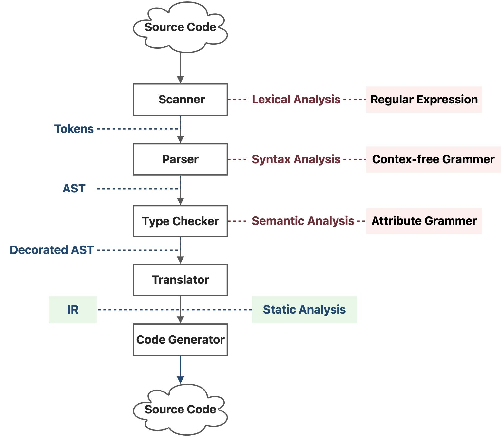
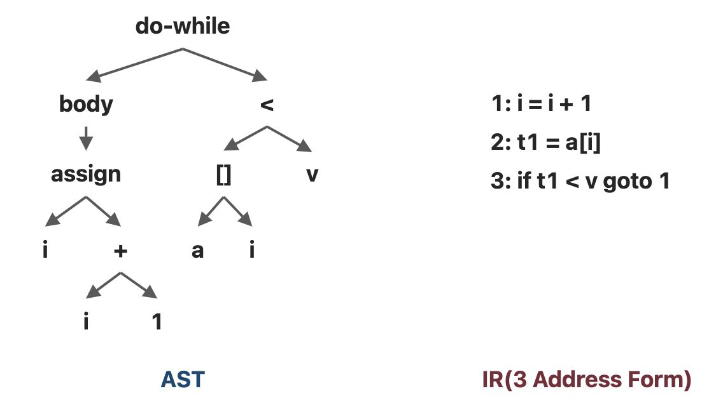
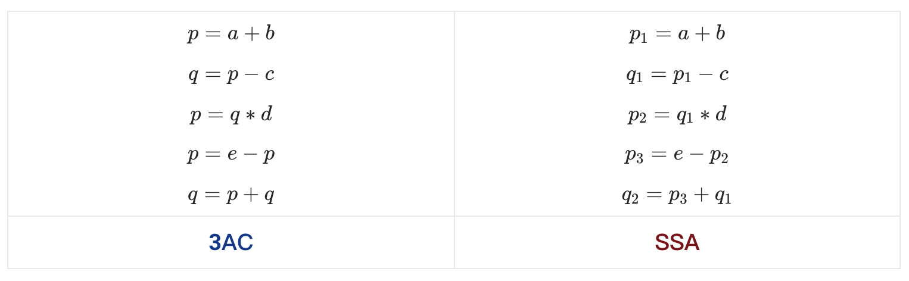
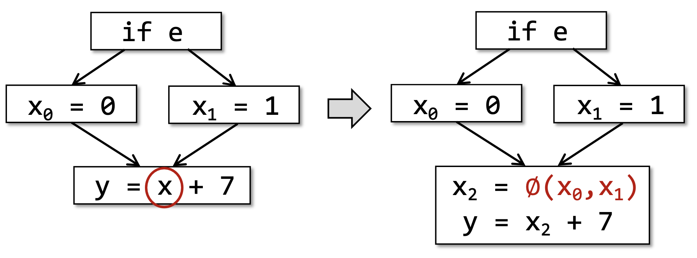
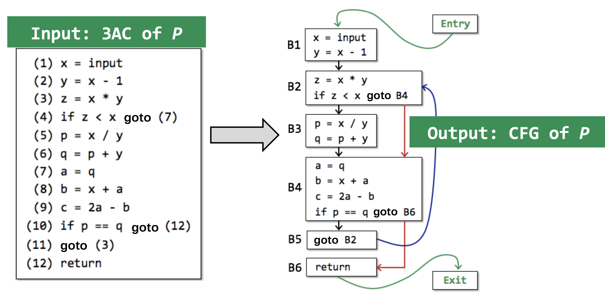
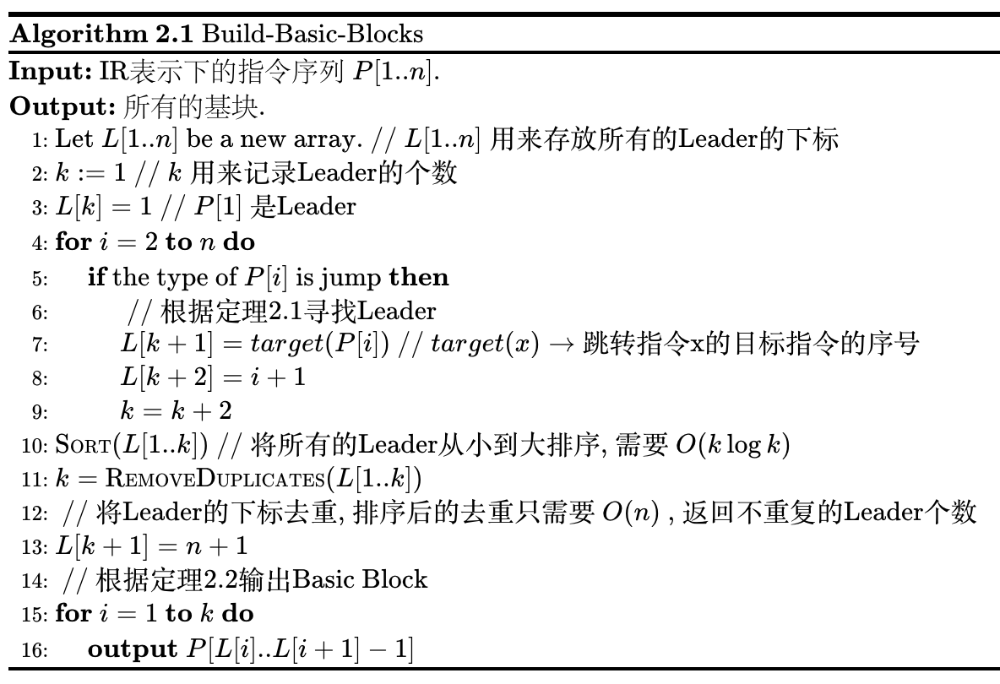
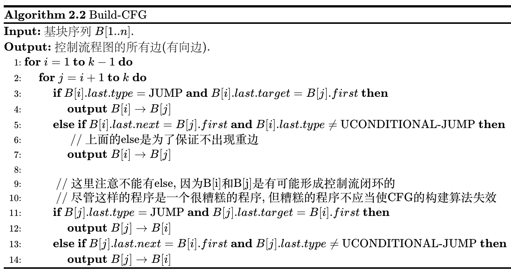

# 2 程序的中间表示

## 2.1 编译器和静态分析器

### 2.1.1 编程语言的各个层次

我们编写的源文件本质上是一个ASCII码字符串文件，它最终会被转化为二进制比特流以供CPU处理。一般的，需要编译的静态类型语言，其源代码向机器码转化的过程大致如下：

<p style="text-align:center"></p>

-  **扫描器（Scanner）** 扫描源代码，进行词法分析（Lexical Analysis）,词法分析会用到正则表达式（Regular Expression），词法分析后的结果为一个标记（Token）串。 
-  **解析器（Parser）** 遍历标记串，进行语法分析（Syntax Analysis），这里的语法分析分析的是上下文无关的语法（Context Free Grammer），解析器的内部应该是实现了一个有限状态机，用于识别和分析每个语法块格式的正确性，语法分析的结果为一棵抽象语法树（Abstract Syntax Tree, AST）。 
-  **类型检查器（Type Checker）** 会遍历抽象语法树，进行语义分析（Semantic Analysis），不过编译器的语意分析是简单的，主要是分析属性语法（Attribute Grammer），比如说变量类型，并适当调整一下语法树。语义分析的结果我们称之为装饰过的抽象语法树（Decorated AST）。 
-  **翻译器（Translator）** 会讲抽象语法树翻译成中间表示（Intermediate Representation, IR），其中，IR和机器语言之间往往有着一一对应的关系。 
   - 如果是Java的话，IR就是能够被JVM识别执行的指令序列；如果是C/C++的话，IR其实就是汇编语言，而汇编语言本质上也就是CPU能够识别的指令序列。JVM只是在物理CPU的基础上搭建了一个抽象层的虚拟CPU。
-  **机器码生成器（Code Generator）** 会讲IR转化成物理CPU能够直接执行的比特序列。 
   - 如果是Java的话，这个工作是由Java解释器完成的，如果是C/C++的话，这个工作是由当前系统架构下的汇编器（Assember）完成的。

而静态分析通常发生在IR这一层次，即刚好可以运行但是还没有运行的时候，这也是我们作代码优化的一个层次。

### 2.1.2 抽象语法树和中间表示的对比

考虑下面一小段代码：

```bash
do i = i + 1; while (a[i] < v);
```

这段代码的AST和IR分别为：

<p style="text-align:center"></p>


| AST | IR |
| --- | --- |
| 层次更高，和语法结构更接近 | 低层次，和机器代码相接近 |
| 通常是依赖于具体的语言类的 | 通常和具体的语言无关，主要和运行语言的机器（物理机或虚拟机）有关 |
| 适合快速的类型检查 | 简单通用 |
| 缺少和程序控制流相关的信息 | 包含程序的控制流信息 |
|| 通常作为静态分析的基础 |

::: definition 定义2.1
我们将形如 $f(a_1, a_2, ..., a_n)$ 的指令称为 $n$ **地址码（N-Address Code）**，其中，每一个 $a_i$ 是一个地址，既可以通过 $a_i$ 传入数据，也可以通过 $a_i$ 传出数据， $f$ 是从地址到语句的一个映射，其返回值是某个语句 $s$ ， $s$ 中最多包含输入的 $n$ 个地址。这里，我们定义某编程语言 $L$ 的语句 $s$ 是 $L$ 的操作符、关键字和地址的组合。
:::

因为我们后续的分析是基于java的，所以我们选用了soot框架，soot的IR是Jimple，形式上为3地址码，是为了配合JVM的设计。

但是这里需要注意以下的是，IR不一定非得是3地址码，因为我们现在最常用的硬件架构x86的汇编指令集是2地址码的形式，为了配合Intel CPU的设计。比如说 `add r1, r2` ，最终结果存 $r_1$ 。只不过2地址码的指令集会比3地址码更大，因为三地址码的 `r3 = r1 + r2` 可能需要二地址码的 `add r1, r2` ， `mov r3, r1` 两条指令来表示。

所以，IR的形式一方面源于我们如何去翻译解释源代码，另一方面也源于运行这门语言的计算部件的设计。JVM能够执行3地址码，而CPU（目前的大多数CPU）执行的是2地址码。

### 2.1.3 3地址码

下面我们具体来看一下3地址码。3地址码中的地址可能有如下的几种类型：

- 名字（Name），包括 
   - 变量（Variable）
   - 标签（Label）
      - 用于指示程序位置，方便跳转指令的书写
- 字面常量（Literal Constant）
- 编译器生成的临时量（Compiler-Generated Temporary）

每一种指令都有其对应的3地址码形式，一些常见的3地址码形式如下：

```bash
x = y bop z
x = uop y
x = y
goto L
if x goto L
if x rop y goto L
```


其中：

- x, y, z是变量的地址；
-  `bop` 是双目操作符（Binary Operator），可以是算数运算符，也可以是逻辑运算符；
-  `uop` 是单目操作符（Unary Operator），可能是取负、按位取反或者类型转换；
-  `L` 是标签（Label），是标记程序位置的助记符，本质上还是地址；
-  `rop` 是关系运算符（Relational Operator），运算结果一般为布尔值。
-  `goto` 是无条件跳转， `if... goto` 是条件跳转。

这里对于一些常见场景的三地址码结构，最好有一个直观的感知，这些场景包括循环结构、分支结构、方法调用和类。其实，如果有一定的汇编基础，对于三地址码的阅读和汇编差不多，甚至比汇编更简单。

这里需要注意一下的是，无论是三地址码还是汇编，其指令类型不取决于具体的语言，而取决于运行这个语言的机器的指令集体系结构（Instruction Set Architecture，ISA），Java虚拟机有自己的指令集体系结构，x86的CPU、Arm的CPU，RISCV的CPU也都有着自己的体系结构。这个运行语言的机器可以是物理机（比如说CPU），也可以是虚拟机（比如说JVM-Java Virtual Machine）。


### 2.1.4 静态单赋值表示

**静态单赋值（Static Single Assignment，SSA）** 是另一种IR的形式，它和3AC的区别是，在每次赋值的时候都会创建一个新的变量，也就是说，在SSA中，每个变量（包括原始变量和新创建的变量）都只有唯一的一次定义。

<p style="text-align:center"></p>

当控制流汇合（Merge）的时候，我们会用一个特殊的操作符表示汇和后的定义：

$$
x_3 = \phi(x_1, x_2) = \begin{cases}
x_1, if\ true\\
x_2, otherwise
\end{cases}
$$

<p style="text-align:center"></p>


关于SSA，我们只要简单了解一下定义和优缺点就可以了，之后还是用3AC比较多。

- 优点： 
   - 控制流的信息间接地被包含在了独特的变量名之中 
      - 当我们做一些对控制流敏感的分析的时候，这些信息可能会有帮助
   - 定义和使用的关系明确
- 缺点： 
   - 可能会引入过多的变量名和$\phi$函数
   - 被翻译成机器码的时候效率低，因为有太多对于程序执行来说不必要的赋值

## 2.2 控制流分析

**控制流分析（Control Flow Analysis, CFA）** 通常是指构建 **控制流图（Control Flow Graph，CFG）** 的过程。




### 2.2.1 基块

CFG是我们进行静态分析的基础，控制流图中的结点可以是一个指令，也可以是一个**基块（Basic Block）**。

::: definition 定义2.2
记一个程序P**在IR表示下**的指令序列为 $P = \{a_1, a_2, ..., a_n\}$ ，这里P是一个有序集。我们定义

-  $IN_i = \{a_j | next(a_j) = a_i\}$ ，其中 $next(a_j)$ 表示控制流中 $a_j$ 的下一条指令；
-  $OUT_i = \{a_j | prev(a_j) = a_i\}$ ，其中 $prev(a_j)$ 表示 $a_j$ 的上一条指令。

如果连续的指令序列 $a_p, a_{p + 1}, a_{p + 2}, ... a_q$ 的满足如下性质：

$$
\forall i \in [p + 1, q], IN_i = \{a_{i - 1}\} \wedge \forall i\in [p, q - 1], OUT_i = \{a_{i + 1}\}
$$

并且 $a_{p - 1}, a_p, ... ,a_{q - 1}, a_q$ 和 $a_p, a_{p + 1}, ... a_{q}, a_{q + 1}$ 都不满足上述性质，则称 $\{a_p, a_{p + 1}, ..., a_q\}$ 为**基块（Basic Block）**。
:::

> 简单理解，基块就是满足如下性质的最长指令序列：
> - 程序的控制流只能从首指令进入
> - 程序的控制流只能从尾指令流出

于是我们可以直观的感受到，跳转指令会讲一个完整的程序块切割为几个基块，如果我们能够把基块的分隔点找出来，那么整个程序P就可以被我们转化成许多的基块了。

::: definition 定义2.3
对于IR表示下的程序 $P = \{a_1, a_2, ..., a_n\}$ ，考虑某个基块 $B = \{a_p, a_{p + 1}, ..., a_{q - 1}, a_q\}$ ，我们称 $a_p$ 为 $P$ 的基块 $B$ 的**领导者（Leader）**。
:::


::: theorem 定理2.1
考虑程序 $P = \{a_1, a_2, ..., a_n\}$ 中所有的领导者组成的集合为 $L$ ，则

$$
L = \{a_1\} \cup \{a_j | \exists a_i, type(a_i) = jump \wedge target(a_i) = a_j\}
\cup \{a_{i + 1} | type(a_i) = jump\}
$$

其中， $type(a_i)$ 表示指令 $a_i$ 的类型，jump类型是跳转指令，包括**条件跳转（Conditional Jump）** 和 **无条件跳转（Unconditional Jump）**， $target(a_i)$ 仅用于 $a_i$ 是跳转指令的时候，表示 $a_i$ 的目标指令。
:::

> 简单理解，一个基块的领导者就是这个基块的首指令，整个程序中的领导者有如下3种：
> - 整个程序的首指令；
> - 跳转指令（包括条件跳转和无条件跳转）的目标指令；
> - 跳转指令（包括条件跳转和无条件跳转）紧接着的下一条指令。

::: theorem 定理2.2
考虑程序 $P = \{a_1, a_2, ..., a_n\}$ 中所有的领导者组成的集合为 $L$ ，则有

$$
a_p \in L \wedge a_{q + 1} \in L \wedge \forall a_i(i \in [p + 1, q]), a_i \notin L
\Leftrightarrow \{a_p, a_{p + 1}, ..., a_{q - 1}, a_q\}\ is\ basic\ block
$$

:::

> 简单理解，从一个Leader到紧接着的下一个Leader之前的所有指令组成了一个基块。

基于定理2.1和定理2.2，我们可以设计出一个寻找基块的算法：

**算法2.1** 基于中间表示的基块构建算法



<!--
    \begin{algorithm}
    \caption{Build-Basic-Blocks}
    \begin{algorithmic}
    \INPUT IR表示下的指令序列 $P[1..n]$.
    \OUTPUT 所有的基块.
    \STATE Let $L[1..n]$ be a new array. \COMMENT{$L[1..n]$ 用来存放所有的Leader的下标}
    \STATE $k := 1$ \COMMENT{$k$ 用来记录Leader的个数}
    \STATE $L[k] = 1$ \COMMENT{$P[1]$ 是Leader}
    \FOR{$i = 2$ \TO $n$}
        \IF{the type of $P[i]$ is jump}
            \STATE \COMMENT{根据定理2.1寻找Leader}
            \STATE $L[k+1] = target(P[i])$ \COMMENT{$target(x) \to$ 跳转指令x的目标指令的序号}
            \STATE $L[k+2] = i + 1$
            \STATE $k = k + 2$
        \ENDIF
    \ENDFOR
    \STATE \CALL{Sort}{$L[1..k]$} \COMMENT{将所有的Leader从小到大排序, 需要 $O(k\log k)$}
    \STATE $k =$ \CALL{RemoveDuplicates}{$L[1..k]$}
    \STATE \COMMENT{将Leader的下标去重, 排序后的去重只需要 $O(n)$ , 返回不重复的Leader个数}
    \STATE $L[k+1] = n + 1$
    \STATE \COMMENT{根据定理2.2输出Basic Block}
    \FOR{$i = 1$ \TO $k$}
        \STATE \textbf{output} $P[L[i]..L[i+1]-1]$
    \ENDFOR
    \end{algorithmic}
    \end{algorithm}
-->

算法的时间复杂度为最坏为 $O(n\log n)$ ，当 $k\log k < n$ 时，时间复杂度为 $O(n)$ 。

Leader最好能够按序找到，这样的话，算法复杂度可以优化到 $O(n)$ 。不过我暂时没有想到很好的一次遍历就能够按序找到所有Leader的办法。

我暂时的实现是用一次遍历乱序找到所有的Leader，然后手动排序（基于比较的排序至少需要 $O(n\log n)$ ）、去重（基于有序性用双指针去重只需要 $O(n)$ ），整体的复杂度取决于排序的 $O(n\log n)$ 。

不过这个复杂度是最坏估计，如果 $k\log k < n$ 的话，也就是说程序中并不是十分频繁的跳转，复杂度还是在$O(n)$量级的。


### 2.2.2 控制流图

::: definition 定义2.4
记程序P的基块组成了集合 $B = \{b_1, b_2, ..., b_k\}$ ，考虑图 $CFG_0 = (B, E_0)$ ，其中 $E_0\subseteq B\times B$ ，满足

$$
E_0 = \{(b_i, b_j) | (type(last(b_i)) = jump \wedge target(last(b_i)) = first(b_j)) \vee
$$

$$
(next(last(b_i)) = first(b_j)\wedge type(last(b_i))\ne unconditional\ jump) \}
$$

其中， $first(b_i)$ 表示基块 $b_i$ 的首指令（也就是Leader）， $last(b_i)$ 表示基块 $b_i$ 的尾指令， $next(x)$ 表示指令 $x$ 紧随其后的指令。其余记号含义同定理2.1。

如果 $(b_i, b_j)\in E_0$ ，我们称 $b_i$ 是 $b_j$ 的 **前驱（Predecessor）** ， $b_j$ 是 $b_i$ 的 **后继（Successor）** 。

- 对于图 $CFG_0$ 中所有入度为0的点（一般只有一个），考虑虚拟结点 **入口（Entry）** ，所有的 **入度（In Degree）** 为0的点都是Entry的后继；
- 对于图 $CFG_0$ 中所有出度为0的点（可能不止一个），考虑虚拟结点 **出口（Exit）** ，所有的 **出度（Out Degree）** 为0的点都是Exit的前驱。

记 $E_1 = \{(Entry, b) | b \in B \wedge inDegree(b) = 0\},E_2 = \{(b, Exit) | b \in B \wedge outDegree(b) = 0\}$ 则我们可以定义 **控制流图（Control Flow Graph）** 为 $CFG = (V, E)$ ，其中 

$$
V = B \cup \{Entry, Exit\}, E = E_0 \cup E_1\cup E_2
$$

:::

简单理解上述定义，程序控制流的产生来源于两个地方：

-  天然的顺序执行
   - 这是计算系统天然存在的一种控制流
-  跳转指令
   - 这是人为设计添加的一种控制流

基于上述定义，我们可以得到构建CFG的算法：

**算法2.2** 基于基块的控制流图构建算法



<!--
    \begin{algorithm}
    \caption{Build-CFG}
    \begin{algorithmic}
    \INPUT 基块序列 $B[1..n]$.
    \OUTPUT 控制流图的所有边(有向边).
    \FOR{$i = 1$ \TO $k - 1$}
        \FOR{$j = i + 1$ \TO $k$}
            \IF{$B[i].last.type =$ JUMP \AND $B[i].last.target = B[j].first$}
                \STATE \textbf{output} $B[i]\to B[j]$
            \ELIF{$B[i].last.next = B[j].first$ \AND $B[i].last.type \ne$ UCONDITIONAL-JUMP}
                \STATE \COMMENT{上面的else是为了保证不出现重边}
                \STATE \textbf{output} $B[i] \to B[j]$
            \ENDIF
            \STATE
            \STATE \COMMENT{这里注意不能有else, 因为B[i]和B[j]是有可能形成控制流闭环的}
            \STATE \COMMENT{尽管这样的程序是一个很糟糕的程序, 但糟糕的程序不应当使CFG的构建算法失效}
            \IF{$B[j].last.type =$ JUMP \AND $B[j].last.target = B[i].first$}
                \STATE \textbf{output} $B[j]\to B[i]$
            \ELIF{$B[j].last.next = B[i].first$ \AND $B[j].last.type \ne$ UCONDITIONAL-JUMP}
                \STATE \textbf{output} $B[j]\to B[i]$
            \ENDIF
        \ENDFOR
    \ENDFOR
    \end{algorithmic}
    \end{algorithm}
-->

这是一个简单的暴力算法，它的时间复杂度为 $O(k^2)$ 。

> 虽然上面的算法是一个暴力算法，但是对于稠密的图来说， $O(|V|^2) = O(|E|)$ ，由于我们后续还要对CFG进行处理，而正常的关于图的算法，其复杂度至少都是线性复杂度 $O(|V| + |E|)$ 。也就是说，可以“吸收”掉这里构建图的暴力复杂度。因此，这个蛮力的算法在图比较稠密的时候是不会造成整体静态分析复杂度的增加的。


> 不过，当图比较稀疏的时候，这个暴力算法的表现就很糟糕了。不过这只是我偷懒直接写的暴力算法，读者可以自行设计更加高效的算法来构建CFG。在设计算法的时候可以假设 `first` 、 `last` 、 `type` 、 `target` 、 `next` 等属性的获取是常数项时间。

其实，从计算机硬件的角度分析，程序的控制流体现在 **程序计数器（Program Counter, PC）** 的增减上。
每一种架构的CPU都会有PC，比如说x86的CPU用EIP（Extended Instruction Pointer）作为PC，RISCV的CPU用IR（Instruction Registor）作为PC，JVM应该也应该有对应的PC存在。

## 2.3 自检问题

1. 编译器（Compiler）和静态分析器（Static Analyzer）的关系是什么？
2. 三地址码（3-Address Code, 3AC）是什么，它的常用形式有哪些？
3. 如何在中间表示（Intermediate Representation, IR）的基础上构建基块（Basic Block, BB）？
4. 如何在基块的基础上构建控制流图（Control Flow Graph, CFG）?


