# 3 数据流分析-应用

## 3.1 数据流分析初步

### 3.1.1 基本概念

::: definition 定义3.1
**数据流分析（Data Flow Analysis, DFA）** 是指分析数据在程序中是怎样流动的。具体来讲，其

- 分析的对象是基于抽象（Abstraction，见定义1.7）的 **应用特定型数据（Application-Specific Data）** ；
- 分析的行为是数据的“流动”，分析的方式是 **安全估计（Safe-Approximation）** ——根据安全性需求选择饱和估计（Over-Approximation）还是保守估计（Under-Approximation）；
- 分析的基础是控制流图（Control Flow Graph, CFG），CFG是程序P的表征；
- 数据流动的场景有两个：
   - 在CFG的点（Node）内流动，即程序基块内部的数据流；
   - 在CFG的边（Edge）上流动，即由基块间控制流触发的数据流。
:::

::: definition 定义3.2
我们将采用饱和估计策略，输出所有可能为真的信息的数据流分析称为**可能性分析（May Analysis）**，将采用保守估计策略，输出信息必然为真的数据流分析称为**必然性分析（Must Analysis）**。可能性分析和必然性分析应用于不同的场景，其目的都是为了分析的安全性（Safety of Analysis）。
:::

从上述定义中可以看出，不同的数据流分析应用应当有：

- 不同的数据抽象（Data Abstraction）;
- 不同的流安全估计策略——饱和估计或者保守估计；
- 不同的转移函数（Transfer Function，见定义1.8）和控制流处理方法（Control-Flow Handlings）。

::: definition 定义3.3
定义程序P的**抽象数据状态（Abstract Data State，ADS）**为程序P中所有的数据的抽象值的集合，抽象数据状态也称作**数据流值（Data-Flow Value）**。基于此：

- 称每一个IR语句 $s$ 执行之前 $pre(s)$ 执行之后的数据流值为s的**输入状态（Input State）**，记为 $IN[s]$ ；
   - 其中， $pre(s)$ 为控制流中 $s$ 的前驱的集合（Predecessors，见定义2.4）；
- 称每一个IR语句 $s$ 执行之后 $suc(s)$ 执行之前的数据流值为s的**输出状态（Output State）**，记为 $OUT[s]$ ；
   - 其中， $suc(s)$ 为控制流中$s$的后继的集合（Successors，见定义2.4）；
:::

基于上述定义，我们不难发现控制流会将ADS在IR语句之间传递，为了描述方便，我们可以定义一下程序点的概念。

::: definition 定义3.4
考虑程序P的IR语句集为 $S$，定义集合

$$
PP = \{(s_i, s_j) | s_i, s_j\in S \wedge (s_j \in suc(s_i) \vee s_i \in pre(s_j))\}
$$

中的每一个元素为程序P的一个**程序点（Program Point）**。
:::

> 简单理解：程序点可以用控制流中相邻语句的顺序二元组表示。

::: definition 定义3.5
我们称程序P的所有可能的数据流值（见定义3.3）形成的集合为P的**定义域（Domain）**。
:::

::: theorem 定理3.1
记程序P的定义域为D，存在映射 $f_{PP\to D}$ 且 $f$ 是一个满射。
:::

> 简单理解：每个程序点都对应了一个数据流值，每一个不同的（集合具有互异性）数据流值都会有一个或者多个程序点与之对应。

::: definition 定义3.6
定义ADS在控制流推动下融合时的运算为**汇集（meet）**，用符号 $\wedge$ 表示，其含义由具体的数据流分析决定。一般的，可能性分析下， $\wedge$ 常定义为并集，必然性分析下， $\wedge$ 常定义为交集。
:::

::: theorem 定理3.2
正向分析中（见定义3.8），每个语句s的输入状态，是其前驱语句输出状态的汇集，即：

$$
IN[s] = \bigwedge_{s_i \in pre(s)} OUT[s_i]
$$

逆向分析中（见定义3.8），每个语句s的输出状态，是其后继语句输入状态的汇集，即：

$$
OUT[s] = \bigwedge_{s_i \in suc(s)} IN[s_i]
$$

:::

上述公式有如下3种常见的应用场景（以正向分析为例）。

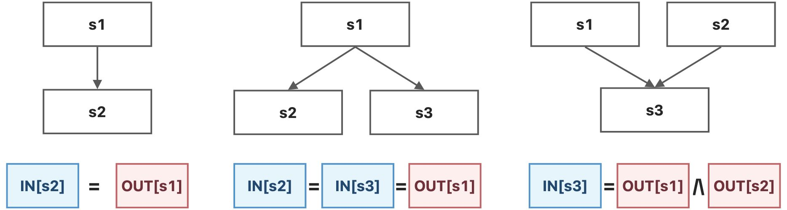

有了上面的一些定义和定理，我们就可以反过来再思考一下定义3.1，从而对数据流分析到底做了什么进行一些更加具体的、形式化的总结：

::: conclusion 结论3.1
在每个数据流分析的应用中，我们会为每一个程序点（Program Point，见定义3.4）关联一个数据流值（Data-Flow Value，见定义3.3），这个数据流值表征了在这个程序点能够观察到的所有可能的程序状态（定理3.2）。从这个视角来看，数据流分析就是确定定理3.1中的满射 $f_{PP\to D}$ 。
:::

从定理3.2中，我们还可以发现，每一个程序点 $(s_i, s_j)$ 处的数据流值与 $OUT[s_i]$ 和 $IN[s_j]$ 是对应的，也就是说 $f_{PP\to D}$ 和 $\{OUT[s], IN[s] | s\in S\}$ 两者是等价的，求出其中一个，另一个自然也就有了。所以，从输入状态和输出状态的角度，我们也可以总结一下数据流分析做了什么：

::: conclusion 结论3.2
数据流分析就是要寻找一种解决方案（即结论3.1中的 $f_{PP\to D}$ ），对于程序P中的所有语句s，这种解决方案能够满足 $IN[s]$ 和 $OUT[s]$ 所需要满足的**安全估计导向型约束（Safe-Approximation-Oriented Constraints, SAOC）**，SAOC主要有两种：
- 基于语句语意（Sematics of Statements）的约束，即由状态转移方程（见定义3.7）产生的约束；
- 基于控制流（Flow of Control）的约束，即定理3.2所产生的约束。
:::


### 3.1.2 约束记号

::: definition 定义3.7
考虑程序P，定义数据流分析中， **状态转移方程（State Transfer Function）** 为映射 $f_{D\to D}$ （D是P的定义域，见定义3.5），考虑语句s，关于语句s的状态转移方程记为 $f_s$ 。
:::

> 这里，定义3.7的状态转移方程和定义1.8中的转移函数都称为Transfer Function，其本质上是一样的，只不过应用场景不一样，原相和相的集合不一样而已。但是这两种Transfer Function本质上都是抽象和语句语意的表征。

::: definition 定义3.8
定义顺控制流方向的数据流分析为**正向分析（Forward Analysis）**，正向分析中， $f_s$ 满足 $OUT[s] = f_s(IN[s])$ ；定义逆控制流方向的数据流分析为**逆向分析（Backward Analysis）**，逆向分析中， $f_s$ 满足 $IN[s] = f_s(OUT[s])$ 。
:::

又了正向分析和逆向分析的定义之后，我们可以定义控制流中的约束记号。

::: definition 定义3.9
考虑基块（见定义2.2） $B = \{s_1, s_2, ..., s_n\}$ ，定义**基块B的输入状态**为 $IN[B] = IN[s_1]$ ，**基块B的输出状态**为 $OUT[B] = OUT[s_n]$ 。
:::

::: theorem 定理3.3
考虑基块 $B = \{s_1, s_2, ..., s_n\}$ ，则有

$$
\forall i = 1, 2, ..., n - 1, IN[s_{i + 1}] = OUT[s_i]
$$

:::

> 定理3.3描述的是基块内部的数据流。

::: definition 定义3.10
考虑基块 $B = \{s_1, s_2, ..., s_n\}$ ， $s_i$ 的状态转移方程为 $f_{s_i}$ 。
在顺序分析中，定义**基块B的状态转移方程**为 $f_B = f_{s_n}\circ ...\circ f_{s_2}\circ f_{s_1}$ ，满足

$$
OUT[B] = f_B(IN[B])
$$

其中， $IN[B] = \bigwedge_{P \in pre(B)} OUT[P]$ ；
在逆序分析中，定义**基块B的状态转移方程**为 $f_B = f_{s_1}\circ ...\circ f_{s_{n - 1}}\circ f_{s_n}$ ，满足

$$
IN[B] = f_B(OUT[B])
$$

其中， $OUT[B] = \bigwedge_{S \in suc(B)} IN[S]$ 。
:::

## 3.2 定义可达性分析

### 3.2.1 问题简化

在下面的讨论当中，我们暂时不考虑以下问题：

> 待到后期掌握了更多的方法之后，我们可以将下面的情况也纳入讨论。

- 方法调用（Method Calls）
   - 我们只考虑过程内部（Intra-Procedural）的CFG；
   - 跨过程分析（Inter-Procedural Analysis）将在之后的章节中展开。
- 别名（Aliases）
   - 在我们之后的分析中，每个变量都有唯一的一个名字，没有别名；
   - 关于别名的分析将在指针分析（Pointer Analysis）相关的章节中展开。

### 3.2.2 问题描述

::: definition 定义3.11
程序中变量v的一个 **定义（Definition）** 是指一条给v赋值的语句。
:::

::: definition 定义3.12
我们称在程序点p处的一个定义d**到达（Reach）**了程序点q，如果存在一条从p到q的“路径”（控制流），在这条路径上，定义d未被**覆盖（Kill）**。称分析每个程序点处能够到达的定义的过程为**定义可达性分析（Reaching Definition Analysis）**。
:::

<p style="text-align:center">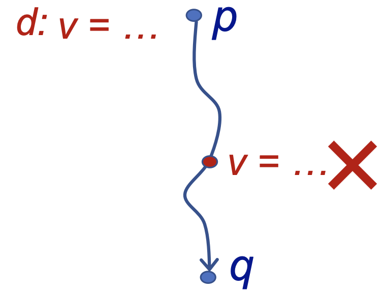</p>

从上面的定义中我们可以看出，“定义可达性”其实描述了一个定义可能的**最长的**生存期（Lifetime），因为如果存在只要一条路径，我们就认为可达，这是一个可能性分析（May Analysis，见定义3.2），采用的是饱和估计（Over-Approximation）的原则。

定义可达性分析可以应用于检测程序中可能存在的未被定义的变量。比如说，我们在DFG的入口处为每个变量v赋予一个伪定义（Dummy Definition），如果程序中存在某个使用变量v的程序点p，且v的伪定义能够到达程序点p，那么我们就可以分析出变量v可能在定义之前被使用，也就是可能程序存在变量未定义的错误。

这里为什么是可能存在，不是一定存在呢？原因在于我们进行定义可达性分析的时候采用的是可能性分析，只要有任意一条控制流能携带这个定义流到任何地方，我们都认为这个定义可达。在DFG中，虽然存在着多条控制流，但是，实际程序执行的时候，只有唯一的一条控制流会被真实的执行，而这条控制流并不一定刚好是我们用于得到定义可达结论的那一条。

### 3.2.3 问题分析

#### 数据抽象

这个小结，我们会应用我们之前学习的静态分析以及数据流分析的基本思路，来作定义可达性的分析。

首先，我们需要定义程序的抽象数据状态（见定义3.3，也就是确定数据流值的形式），在这个问题中，我们关心的数据流值是每个变量的定义，那么，程序的抽象数据状态可以用定义的集合来表示。

我们假设程序P中所有的定义为 $D = \{d_1, d_2, ..., d_n\}$ （在定义可达性问题下，D的幂集（Power Set）就是程序P的定义域Domain，见定义3.5），于是，我们可以用D的子集来表示每个程序点处，能够到达该点的定义的集合，即该程序点处的数据流值。其实也就是确定 $f_{PP \to D}$ （见定理3.1），为每一个程序点关联一个数据流值（见结论3.1）。

在具体的实现过程中，因为全集D是固定的，且我们记 $|D| = n$ ，所以我们可以采用n位的位向量（Bit Vector）来表示D的所有子集，也就是我们所有可能的抽象数据状态。其中位向量从左往右的第i位表示定义 $d_i$ 是否可达，具体地，第i位为0表示 $d_i$ 不可达，为1则可达。

> 其实用位向量表示全集确定的集合是很常见的，因为全集确定之后，假设全集的势为 $n$ ，则所有可能集合（一定是全集的子集）一共有 $2^n$ 个，而 $n$ 位的位向量也恰好有 $2^n$ 个不同的可能，所以我们可以根据每个元素在或者不在子集中为对应法则，建立起所有子集与位向量之间的一个双射。

除了位向量以外，集合也有很多别的表示方式，比如哈希表、红黑树等等，这里只是介绍一下位向量的表示方法，因为这在数据流分析中是常用的。不过，为了更具一般性，我们接下来的分析只基于集合的抽象，而不基于其具体实现。

#### 约束分析

完成数据抽象之后，我们就可以进行估计了，这里采用的安全估计方式是饱和估计，分析的顺序是正向分析。

估计的时候需要考虑两种约束：语意约束和控制流约束（见3.1.2节和结论3.2）。

考虑**语意的约束**，语句 `D: v = x op y` 生成了关于变量v的一个新定义D，并且覆盖了程序中其他地方对于变量v的定义，不过并不会影响后续其他的定义再来覆盖这里的定义。赋值语句只是定义的一种形式而已，定义也可以有别的形式，比如说引用参数。

我们以基块为粒度考虑问题，一个基块中可能有许多具有定义功能的语句，基块B所产生的新的定义记为集合 $gen_B$ ，这些定义语句会覆盖其他地方的别的对于相关变量的定义，基块B所覆盖掉的定义记为集合 $kill_B$ 。例如：

<p style="text-align:center">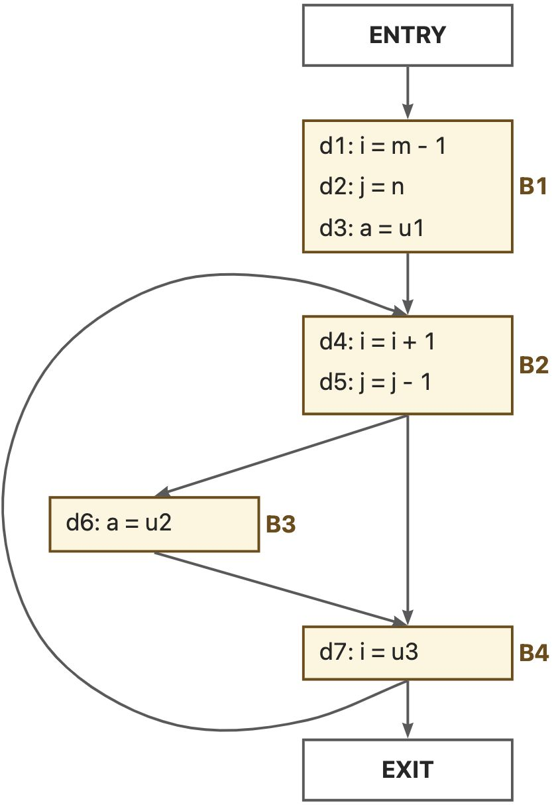</p>

$$gen_{B_1} = \{d_1, d_2, d_3\}, kill_{B_1} = \{d_4, d_5, d_6, d_7\}$$

$$gen_{B_2} = \{d_4, d_5\}, kill_{B_2} = \{d_1, d_2, d_7\}$$

$$gen_{B_3} = \{d_6\}, kill_{B_3} = \{d_3\}$$

$$gen_{B_4} = \{d_7\}, kill_{B_4} = \{d_1, d_4\}$$


我们不难发现，对于一个静态的程序来说， $kill_B$ 和 $gen_B$ 都是固定不变的。再次基础上，我们可以得到一个基块B的转移方程为：

$$
OUT[B] = gen_B \cup (IN[B] - kill_B)
$$

考虑**控制流的约束**，因为我们采用的是饱和估计方式，因此一个定义达到某个程序点，只需要有至少一条路径能够到达这个点即可。因此，我们定义汇集操作符（Meet Operator，见定义3.6）为集合的并操作，即 $\wedge = \cup$ ，则控制流约束为：

$$
IN[B] = \bigcup_{P \in pre(B)} OUT[P]
$$

### 3.2.4 问题求解

#### 算法设计

根据上面的分析，我们可以设计定义可达性问题的求解算法。

**算法3.1** 定义可达性分析算法

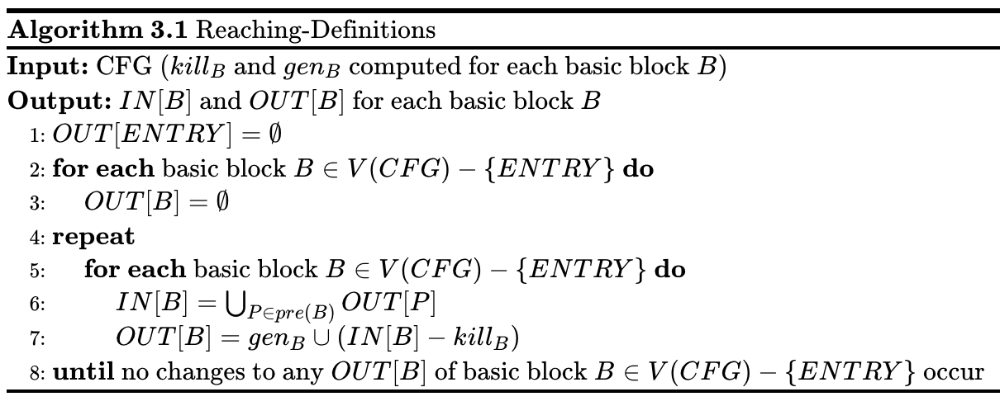

<!--
    \begin{algorithm}
    \caption{Reaching-Definitions}
    \begin{algorithmic}
    \INPUT CFG ($kill_B$ and $gen_B$ computed for each basic block $B$)
    \OUTPUT $IN[B]$ and $OUT[B]$ for each basic block $B$
    \STATE $OUT[ENTRY] = \empty$
    \FOR{\textbf{each} basic block $B\in V(CFG) - \{ENTRY\}$}
        \STATE $OUT[B] = \empty$
    \ENDFOR
    \REPEAT
        \FOR{\textbf{each} basic block $B\in V(CFG) - \{ENTRY\}$}
            \STATE $IN[B] = \bigcup_{P\in pre(B)} OUT[P]$
            \STATE $OUT[B] = gen_B\cup (IN[B] - kill_B)$
        \ENDFOR
    \UNTIL{}
    \STATE \textbf{until} no changes to any $OUT[B]$ of basic block $B\in V(CFG) - \{ENTRY\}$ occur
    \end{algorithmic}
    \end{algorithm}
-->

> 上述算法的复杂度和集合的实现方式以及遍历顺序的选择有关，在这里我们不讨论具体的算法实现，而聚焦于算法的设计。
> 在下一章里面，我们会探讨到，迭代算法总的迭代次数为 $O(k\cdot h)$ ，其中 $h$ 为值集的大小（也是定义域形成的格的高度），这里就是整个程序中所有的定义的个数， $k$ 为CFG中结点的个数。

我们可以通过下面的例子来直观感受一下上面的算法。

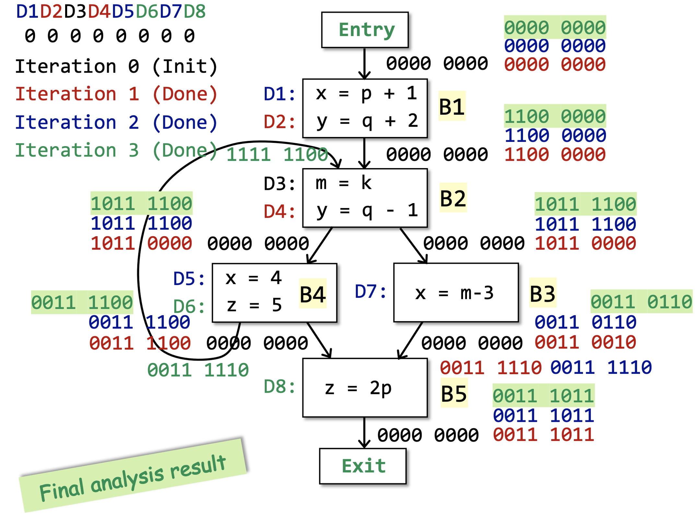

#### 算法分析

这里算法最开始初始化的时候Entry和除了Entry意外的其他基块是分开初始化的，其实合起来也没关系。这样写是因为算法3.1是一个很经典的静态分析中迭代算法的模版，有的时候Entry和Entry以外的基块初始化的内容是不一样的。

::: theorem 定理3.4
算法3.1能够正常终止。
:::

这个算法的 `repeat-until` 迭代终止的条件其实是有些可疑的，终止条件是当某次迭代的过程中，所有的BB的输出状态都不变。
我们看一下算法中唯一能够改变输出状态的语句 $OUT[B] = gen_B\cup (IN[B] - kill_B)$ ，我们不难发现：

-  $gen_B$ 和 $kill_B$ 是不变的，因为程序P本身是不改变的（至少我们现在的分析场景下是这样的）；
- 当更多的定义从控制流流入 $IN[B]$ （也就是当别处的定义到达B的时候），这里流入的更多的定义
   - 要么被 $kill_B$ 给覆盖了，
   - 要么幸存了下来，流入了 $OUT[B]$ ，记为 $survivor_B = IN[B] - kill_B$ 。
- 也就是说，当一个定义d被加入 $OUT[B]$ 集合的时候，无论是通过 $gen_B$ 还是 $survivor_B$ ，它会永远的留在 $OUT[B]$ 中；
   - 因为这一轮的幸存者在下一轮依然是幸存者。
- 因此，集合 $OUT[B]$ 是不会收缩的，也就是说 $OUT[B]$ 要么变大，要么不变。
- 而定义的总集合D是固定的，而 $OUT[B] \subseteq D$ ，因此最终一定会有一个所有的 $OUT[B]$ 都不变的状态。
   - 最多的迭代次数为 $|D| \times |\{B | B\ is\ a\ basic\ block\ of\ P\}|$ ，因为最慢的时候就是每次迭代只有一个 $OUT[B]$ 增加了一个元素。

到此为止，我们完成了定理3.4的一个非形式化的证明。

> 上面的分析过程不仅适用于定义可达性分析迭代算法，也适用于其他的关于数据流分析的迭代算法。其中，上面分析中的“定义”，更抽象的视角应该是定义3.3中的数据流值，也可以称为**因素（Facts）**。

更具体的，当OUT不变的时候，由于 $IN[B] = \bigcup_{P\in pre(B)} OUT[P]$ ，IN也就不变了，而IN不变的话，由于$OUT[B] = gen_B\cup (IN[B] - kill_B)$ ，则OUT也就不变了。此时，我们称这个迭代的算法到达了一个“不动点（Fixed Point）”，这也和算法的单调性（Monotonicity）有关。这些会包含在后面的内容中。

## 3.3 变量活性分析

### 3.3.1 问题描述

::: definition 定义3.13
在程序点p处，某个变量v的变量值（Variable Value）可能在之后的某条控制流中被用到，我们就称变量v是程序点p处的**活变量（Live Variable）**，否则，我们就称变量v为程序点p处的**死变量（Dead Variable）**。分析在各个程序点处所有的变量是死是活的分析，称为**变量活性分析（Live Variable Analysis）**。
:::

::: theorem 定理3.5
程序点p处的变量v是活变量，当且仅当在CFG中存在某条从p开始的路径，在这条路径上变量v被使用了，并且在v被使用之前，v未被重定义。
:::

<p style="text-align:center">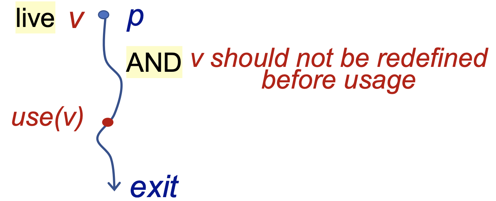</p>

这个定义有些迷惑，注意，我们判断变量活性的标准不是这个变量之后有没有可能用到，而是**这个变量当前所储存的值在之后有没有可能被用到**。

变量活性分析可以应用在寄存器分配（Register Allocation）中，可以作为编译器优化的参考信息。比如说，如果在某个程序点处，所有的寄存器都被占满了，而我们又需要用一个新的寄存器，那么我们就要从已经占满的这些寄存器中选择一个去覆盖它的旧值，我们应该更青睐于去覆盖哪些储存死变量的寄存器。

### 3.3.2 问题分析

#### 数据抽象

有了前面的基本概念和定义可达性分析的基础，下面的数据抽象就不难理解了。

在变量活性分析问题中，我们关心的是变量，所以可以用变量作为数据流值，假设程序P中的所有变量为 $V = \{v_1, v_2, ..., v_n\}$ ，则数据分析的定义域为V的幂集，即 $D = 2^{V}$ 。

每个程序点处的抽象程序状态就是 $V$ 的一个子集，表示这个程序点处所有的活变量的集合，我们的变量活性分析的任务就是确定每个程序点的抽象程序状态。

和定义可达性分析同样的，因为全集确定，所以子集的实现可以用位向量，这里不再赘述。

#### 约束分析

在某个程序点处的变量是否存活，判断标准是这个程序点之后，该变量的值还有被使用的可能。换句话来说，如果在某个程序点处，一个变量被使用了，那么在它之前的“一些”程序点上，该变量就是活的。这里的“一些”的标准是到某个变量的定义为止，因为我们判断变量活性看的是变量的值，而不是变量本身。

> 用变量值判断活性的原因或许是在实际应用场景中，哪怕是同一个变量，其值改变了，也是要重新修改寄存器的。

因此，变量活性分析适合用逆向分析（Backward Analysis，见定义3.8）的方式来进行。

从定理3.5中我们可以知道，只要存在一条路径使得p处的变量v的值被用到，那么就认为v在p处是活的，因此，这里应该采用饱和估计的方式。

确定了分析顺序和安全估计的策略，下面我们只要确定语意约束和控制流约束即可（见结论3.2）。

考虑**语意约束**，在基块$B$中，考虑 $OUT[B]$ 如何被转化为 $IN[B]$ ，也就是 $IN[B]$ 中存活的变量从何而来？

- 第一种是 $OUT[B]$ 中已经存活，并且在$B$并没有重定义；
- 第二种是在 $B$ 中被使用的在B之前定义的变量（也就是说，如果B自己先定义了一个变量，然后再使用这个变量，那么这个变量在 $IN[B]$ 处还是死的）。

举一个简单的例子，对于下面左边的DFG，我们假设 $OUT[B] = \{v\}$ ，考虑B中的语句的6种具有代表性的情况，则 $IN[B]$ 的结果应当如右所示：

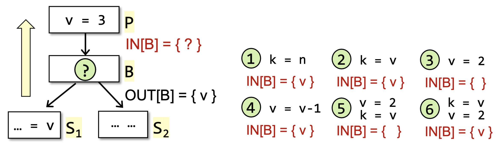

我们可以定义在基块B中被定义的变量集合为$def_B$，在基块B中定义前使用的变量集合为 $use_B$ 。

> 被使用但未被定义也属于在定义前使用，也就是说上述的2、4、6都满足 $v \in use_B$ ，而在情况5中， $v\notin use_B$ ）。

于是，我们可以得到语意约束下的状态转移方程为：

$$
IN[B] = use_B \cup (OUT[B] - def_B)
$$

考虑控制流约束，由于我们采用饱和估计的方式，所以汇集操作符应当定义为并集，即 $\wedge = \cup$ ，又因为是逆向分析，因此控制流约束为：

$$
OUT[B] = \bigcup_{S \in suc(B)} IN[S]
$$

### 3.3.3 问题求解

#### 算法设计

通过上面的分析，我们可以设计变量活性分析的算法如下。

**算法3.2** 变量活性分析算法

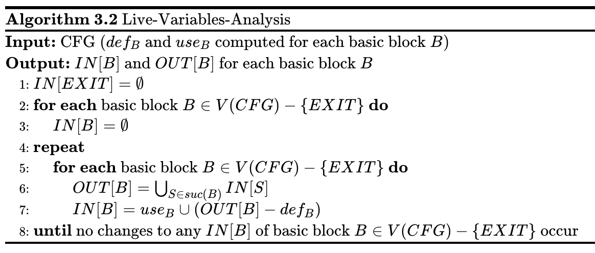

<!--
    \begin{algorithm}
    \caption{Live-Variables-Analysis}
    \begin{algorithmic}
    \INPUT CFG ($def_B$ and $use_B$ computed for each basic block $B$)
    \OUTPUT $IN[B]$ and $OUT[B]$ for each basic block $B$
    \STATE $IN[EXIT] = \empty$
    \FOR{\textbf{each} basic block $B\in V(CFG) - \{EXIT\}$}
        \STATE $IN[B] = \empty$
    \ENDFOR
    \REPEAT
        \FOR{\textbf{each} basic block $B\in V(CFG) - \{EXIT\}$}
            \STATE $OUT[B] = \bigcup_{S \in suc(B)} IN[S]$
            \STATE $IN[B] = use_B \cup (OUT[B] - def_B)$
        \ENDFOR
    \UNTIL{}
    \STATE \textbf{until} no changes to any $IN[B]$ of basic block $B\in V(CFG) - \{EXIT\}$ occur
    \end{algorithmic}
    \end{algorithm}
-->

> 上述算法的复杂度和集合的实现方式以及遍历顺序的选择有关，在这里我们不讨论具体的算法实现，而聚焦于算法的设计。

我们可以通过下面的例子来直观感受一下上面的算法。

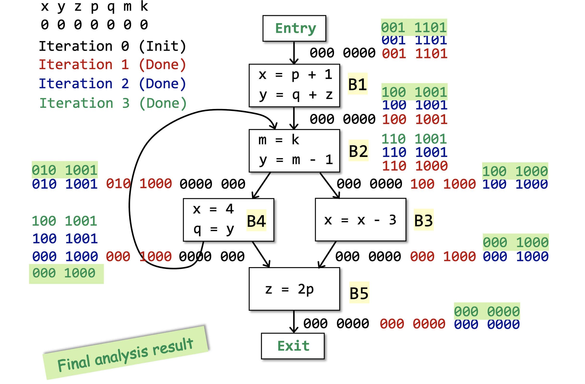

#### 算法分析

::: theorem 定理3.5
算法3.2能够正常终止。
:::

算法3.2和算法3.1基本上是一致的，都是可能性分析（May Analysis）的迭代算法，不同的是

- 分析顺序，3.1是顺序分析，3.2是逆序分析；
- 初始化的时候，3.1先初始化的是输出状态，而3.2先初始化的是输入状态，其实也是由分析顺序决定的。

## 3.4 空闲表达式分析

### 3.4.1 问题描述


::: definition 定义3.14

我们称一个表达式（Expression）`x op y`在程序点p处是**空闲的（Avaliable）**，如果：

- **所有**的从程序入口到程序点p的路径都**必须**经过 `x op y` 表达式的评估（Evaluation），并且
- 在最后一次 `x op y` 的评估之后，没有x或者y的重定义（Redefinition）。

对于程序中每个程序点处的空闲表达式的分析，我们称之为**空闲表达式分析（Avaliable Expression Analysis）**。
:::

这里说一个表达式是空闲的，指的是这个表达是的值肯定已经被计算过了，可以直接复用之前的结果，没必要再算一遍，也就是说，这个表达式**不需要忙碌于计算**。我们考虑一个简单的场景。

```bash
if a - b > c then
    c = a - b;
```

```bash
d = a - b;
if d > c then
  c = d
```

上面两个例子功能性上是等价的，但是在Example 01中， `a - b` 被重复计算了两次，而Example 02中， `a - b` 只被计算了一次，因此Example 02的效率是更高的。在Example 01的第2行， `a - b` 就是一个空闲表达式，在之前肯定已经被计算过，因此我么可以对程序进行优化，通过一个变量或者是寄存器储存之前的计算结果，从而在之后不需要进行重复的计算。

空闲表达式的相关信息还可以被用来检测全局的公共子表达式（Global Common Subexpression）。

从定义中不难看出，空闲表达式分析是一种必然性分析。因为在上述表达式优化的应用场景中，我们可以不优化每一个表达式，但不可以优化错误。

### 3.4.2 问题分析

经过了前两种数据流分析的铺垫，相信读者对于数据流分析的基本过程已经轻车熟路了，下面和前面重复的部分我就不多解释了。

#### 数据抽象

在这个问题中，考虑程序中所有表达式的集合，即 $E = \{e_1, e_2, ..., e_n\}$ ，其中 $e_i$ 是程序中的表达式。那么，每个程序点处的抽象程序状态，也就是数据流值，则为 $E$ 的一个子集，整个分析的定义域 $D = 2^E$ 。之后我们只需要建立 $f_{PP\to D}$ 即可。

#### 约束分析

定义3.14中已经指出从程序入口开始了，所以是顺序分析。定义3.14还告诉我们，需要所有的路径都空闲才算空闲，因此这是一个必然性分析（Must Analysis，见定义3.2）。

下面考虑两种约束：语意约束和控制流约束。

考虑语意约束，基于定义3.14，我们每次需要从 $IN[B]$ 中加入B中产生的新表达式，删去 $IN[B]$ 中被B重定义变量的表达式。定义 $gen_B$ 为基块B中的所有的表达式的集合， $kill_B$ 为**程序中所有的变量被B重定义的表达式**的集合。

> 这里 $kill_B$ 为程序中所有的变量被B重定义的表达式的集合，而不是 $IN[B]$ 中被B重定义变量的表达式集合，这是因为 $gen_B$ 与 $kill_B$ 需要能够在数据流分析算法执行之前被静态的计算好，并且我们之后是取差集操作，因此 $kill_B$ 大一点并不会影响结果。

于是，我们可以得到状态转移方程如下：

$$
OUT[B] = gen_B \cup (IN[B] - kill_B)
$$

考虑控制流约束，由于是必然性分析，所以汇集操作应该是交集，即 $\wedge = \cap$ ，于是控制流约束为：

$$
IN[B] = \bigcap_{P \in pre(B)} OUT[P]
$$

### 3.4.3 问题求解

#### 算法设计

基于上述分析，我们可以设计空闲表达式分析算法如下。

**算法3.3** 空闲表达式分析算法

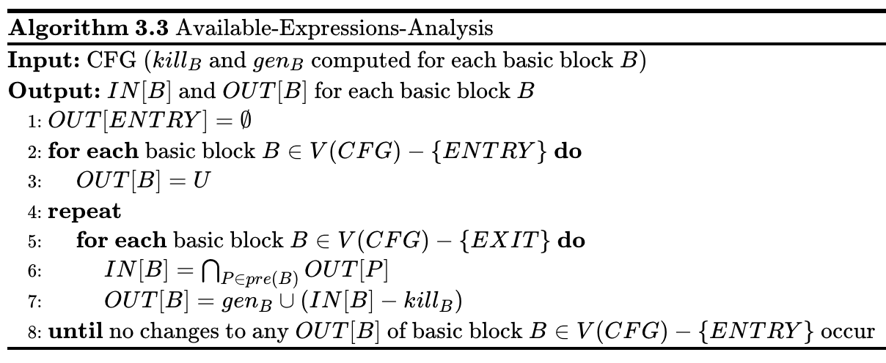

<!--
    \begin{algorithm}
    \caption{Available-Expressions-Analysis}
    \begin{algorithmic}
    \INPUT CFG ($kill_B$ and $gen_B$ computed for each basic block $B$)
    \OUTPUT $IN[B]$ and $OUT[B]$ for each basic block $B$
    \STATE $OUT[ENTRY] = \empty$
    \FOR{\textbf{each} basic block $B\in V(CFG) - \{ENTRY\}$}
        \STATE $OUT[B] = U$
    \ENDFOR
    \REPEAT
        \FOR{\textbf{each} basic block $B\in V(CFG) - \{EXIT\}$}
            \STATE $IN[B] = \bigcap_{P \in pre(B)} OUT[P]$
            \STATE $OUT[B] = gen_B \cup (IN[B] - kill_B)$
        \ENDFOR
    \UNTIL{}
    \STATE \textbf{until} no changes to any $OUT[B]$ of basic block $B\in V(CFG) - \{ENTRY\}$ occur
    \end{algorithmic}
    \end{algorithm}
-->

> 注：U和I常在集合论中表示全集。

我们可以通过下面的例子来直观感受一下上面的算法。

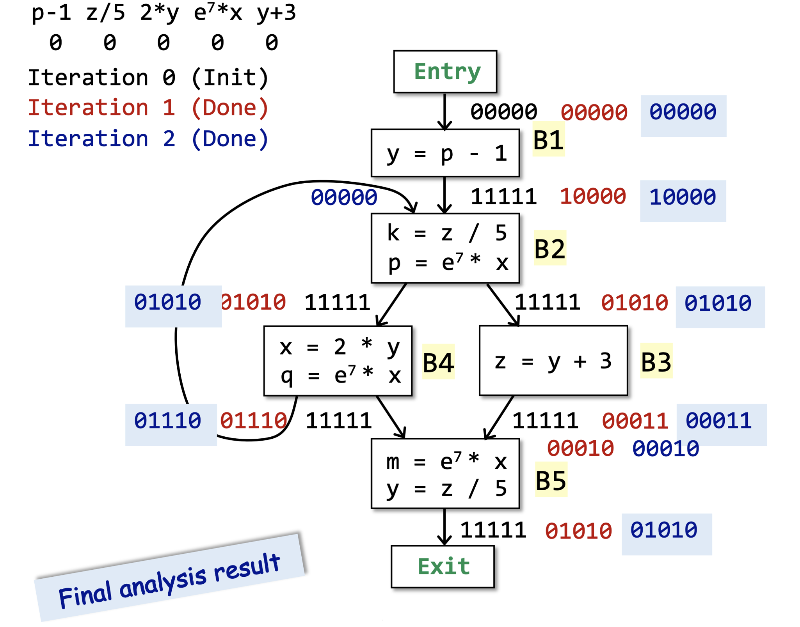

#### 算法分析

::: theorem 定理3.6
算法3.3能够正常终止。
:::

算法3.3和算法3.1基本上是一致的，不同的地方有：

- 初始化的时候，除了程序入口之外的其他基块B的 $OUT[B]$ 都初始化为了全集，因为在最开始的时候，所有的表达式都是空闲的。只有当我们在分析过程中发现表达式中的某个变量被重定义的时候，表达式才会变得忙碌起来（需要计算）。
- 控制流约束部分变成了交集，因为我们这里是必然性分析。

当我们分析出初始状态的时候，需要通过语意以及对算法执行过程的影响来分析，到底是空集还是全集。当然，在下一章中会有更加形式化的基于数学语言的解释。

## 3.5 总结

到此，我们已经学习完了3种经典的数据流分析，我们可以稍微对比一下。


于是，我们可以简单总结一下数据流分析的基本过程。

::: conclusion 结论3.1 数据流分析的基本过程
1. 问题描述：
   - 定义要研究的问题，从而确定分析顺序（正向还是逆向）和估计方式（饱和还是保守）；
2. 数据抽象：
   - 确定抽象数据状态集（也就是数据流值集），从而确定定义域；
3. 约束分析：
   - 考虑语意约束，确定状态转移方程；
   - 考虑控制流约束，确定汇集操作符的含义；
4. 算法设计：
   - 根据上述分析设计算法，我们目前只学了迭代算法，还可以有其他的算法设计；
5. 算法分析：
   - 分析算法的正确性和复杂度。
:::

## 3.6 自检问题

1. 定义可达性（Reaching Definitions）分析、变量活性（Live Variables）分析和空闲表达式（Avaliable Expressions）分析分别是什么含义？
2. 上述三种数据流分析（Data Flow Analysis）有哪些不同点？又有什么相似的地方？
3. 如何理解数据流分析的迭代算法？数据流分析的迭代算法为什么最后能够终止？


