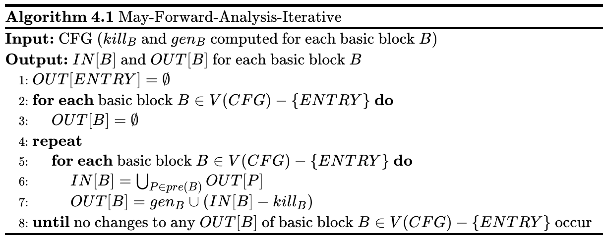
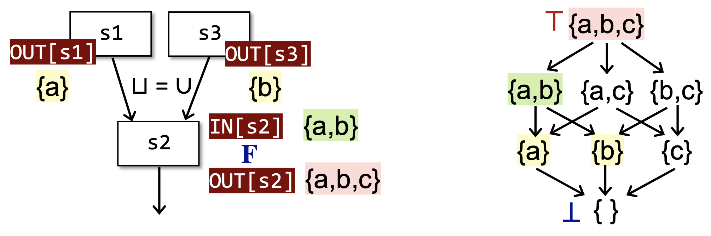
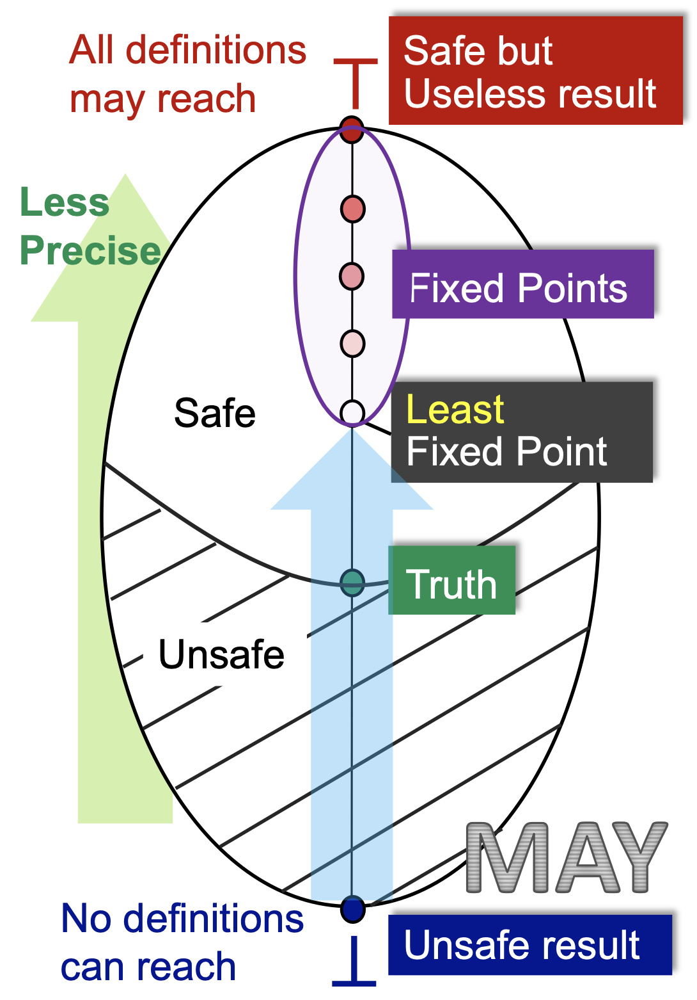
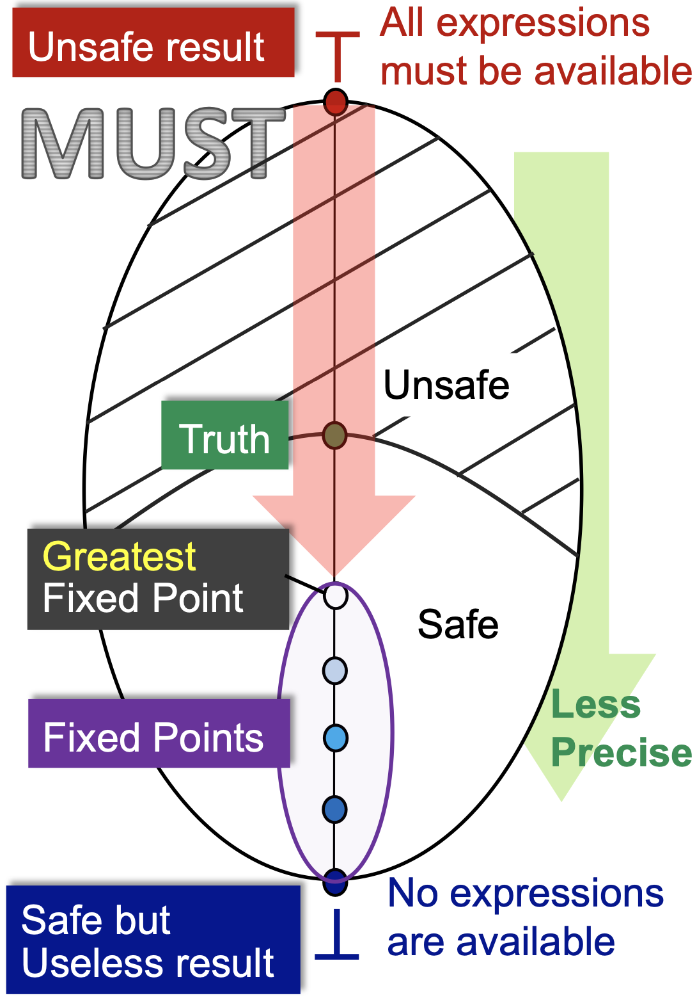
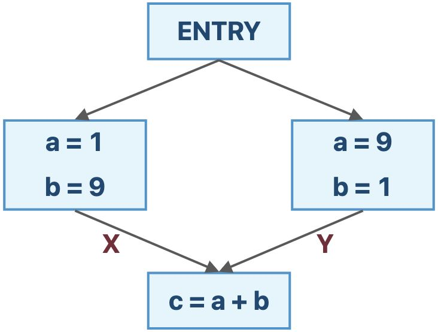
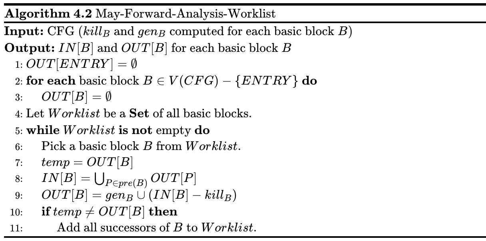

# 4 数据流分析-基础

## 4.1 重新审视迭代算法

**算法4.1** 可能性（May Analysis）正向（Forward Analysis）数据流分析的迭代算法

<!--
    \begin{algorithm}
    \caption{May-Forward-Analysis-Iterative}
    \begin{algorithmic}
    \INPUT CFG ($kill_B$ and $gen_B$ computed for each basic block $B$)
    \OUTPUT $IN[B]$ and $OUT[B]$ for each basic block $B$
    \STATE $OUT[ENTRY] = \empty$
    \FOR{\textbf{each} basic block $B\in V(CFG) - \{ENTRY\}$}
        \STATE $OUT[B] = \empty$
    \ENDFOR
    \REPEAT
        \FOR{\textbf{each} basic block $B\in V(CFG) - \{ENTRY\}$}
            \STATE $IN[B] = \bigcup_{P\in pre(B)} OUT[P]$
            \STATE $OUT[B] = gen_B\cup (IN[B] - kill_B)$
        \ENDFOR
    \UNTIL{}
    \STATE \textbf{until} no changes to any $OUT[B]$ of basic block $B\in V(CFG) - \{ENTRY\}$ occur
    \end{algorithmic}
    \end{algorithm}
-->

其他类型的数据流分析也有类似的迭代算法，我们后续以算法4.1为例进行理论的分析和讲解。迭代算法是一个具有通用性的数据流分析算法，能够提供一种数据流分析的解决方案（解决方案的含义见结论3.2）。

下面我们从另一个视角来审视一下迭代算法。

- 给定一个具有k个结点的程序流程图CFG，对于CFG中的每个结点n，迭代算法的每一次迭代都会更新 $OUT[n]$ ；
- 设数据流分析的定义域V，我们可以定义一个k元组（k-tuple）来表示每次迭代后的分析值：

$$
(OUT[n_1], OUT[n_2], ..., OUT[n_k]) \in V \times V \times ... \times V = V^k
$$

- 每次迭代可以视为将 $V^k$ 中的某个值映射为 $V^k$ 中的另一个值，通过状态转移方程和控制流约束式，这个过程可以抽象为一个函数 $F_{V^k \to V^k}$ ；
- 然后这个算法会输出一系列的k元组，直到某两个连续输出的k元组完全相同的时候算法终止。

于是，算法的过程可以表示为：

| 初始化 | $(\bot, \bot, ..., \bot) = X_0$ |
| :-: | :-: |
| 第1次迭代 | $(v_1^1, v_2^1, ..., v_k^1) = X_1 = F(X_0)$ |
| 第2次迭代 | $(v_1^2, v_2^2, ..., v_k^2) = X_2 = F(X_1)$ |
| ...... | ...... |
| 第i次迭代 | $(v_1^i, v_2^i, ..., v_k^i) = X_i = F(X_{i - 1})$ |
| 第i+1次迭代 | $(v_1^i, v_2^i, ..., v_k^i) = X_{i + 1} = F(X_i) = X_i$ |

其中， $v_i^j$ 表示第i个结点第j次迭代后的数据流值。

算法终止的时候，我们发现 $X_{i + 1} = F(X_i) = X_i$ ，因此 $X_i$ 是函数 $F$ 的一个**不动点（Fixed Point）**，故而我们称算法到达了一个不动点。

不过这时我们会有一些疑问：

- 算法保证能够终止吗？也就是说不动点一定存在吗？或者说数据流分析是否总会有一个解决方案？
- 如果是的话，不动点是只有一个吗？不止一个的话，我们算法终止的不动点是最好的那个吗？
- 算法什么时候会到达不动点？或者说我们什么时候能够得到一个解决方案？

为了回答上面这些问题，我们需要一些离散数学的内容作铺垫。

## 4.2 唤醒一些记忆深处的数学

### 4.2.1 偏序

::: definition 定义4.1
我们定义**偏序集（Poset）**为 $(P, \preceq)$ ，其中 $\preceq$ 为一个**二元关系（Binary Relation）**，这个二元关系在 $P$ 上定义了**偏序（Partial Ordering）**关系，并且 $\preceq$ 具有如下性质：

1. **自反性（Reflexivity）**： $\forall x\in P, x \preceq x$ ；
2. **反对称性（Antisymmetry）**： $\forall x, y\in P, x \preceq y \wedge y \preceq x \Rightarrow x = y$ ；
3. **传递性（Transitivity）**： $\forall x, y, z \in P, x \preceq y \wedge y \preceq z \Rightarrow x \preceq z$ 。

:::

例如 $(Z, \le)$ 是偏序集， $(2^S, \subseteq)$ 也是偏序集。并且，偏序意味着集合中可能存在某两个元素，它们之间是不可比（Incomparable）的。

::: definition 定义4.2
考虑偏序集 $(P, \preceq)$ 及其子集 $S \subseteq P$ ，我们称 $u\in P$ 是 $S$ 的一个**上界（Upper Bound）**，如果 $\forall x\in S, x \preceq u$ 。类似的，我们称 $l\in P$ 是 $S$ 的一个**下界（Lower Bound）**，如果 $\forall x\in S, l\preceq x$ 。
:::

::: definition 定义4.3
考虑偏序集 $(P, \preceq)$ 及其子集 $S \subseteq P$ ，定义 $S$ 的 **最小上界（Least Upper Bound, LUB）** 为 $\vee S$ ，使得对于 $S$ 的任意一个上界 $u$ ，有 $\vee S \preceq u$ 。

类似的，定义 $S$ 的 **最大下界（Greatest Lower Bound, GLB）** 为 $\wedge S$ ，使得对于 $S$ 的任意一个下界 $l$ ，有 $l \preceq \wedge S$ 。

通常，如果 $S$ 只包含两个元素 $a$ 和 $b$ ，即 $S = \{a, b\}$ ，则 $\vee S$ 可写作 $a \vee b$ ，称为 $a$ 和 $b$ 的 **联合（Join）** ； $\wedge S$ 可写作 $a \wedge b$ ，称为 $a$ 和 $b$ 的 **汇集（Meet）** 。
:::

并不是每一个偏序集都有最小上界或者最大下界，比如说 $(Z, \le)$ ，子集 $Z_{+}$ 就没有最小上界。

::: theorem 定理4.1
如果一个偏序集存在最小上界，则这个偏序集最小上界是唯一的；如果一个偏序集存在最大下界，则这个偏序集的最大下界也是唯一的。
:::

> 证明：反证法。假设偏序集 $(P, \preceq)$ 存在两个不同的最小上界 $g_1, g_2 \in P$ ，根据最小上界的定义有 $g_1 \preceq g_2 \wedge g_2 \preceq g_1$ ，有偏序关系的反对称性可知 $g_1 = g_2$ ，这与两个不同的最小上界矛盾，因此这个偏序集的最小上界是唯一的。同理，一个偏序集的最大下界如果存在，也是唯一的。

### 4.2.2 格

::: definition 定义4.4
考虑偏序集 $(P, \preceq)$ ，如果 $\forall a, b\in P$ ， $a\vee b$ 和 $a \wedge b$ 都存在，则我们称 $(P, \preceq)$ 为**格（Lattice）**。
:::

简单理解，格是每对元素都存在最小上界和最大下界的偏序集。

比如说 $(Z, \le)$ 是格，其中 $\vee = \max, \wedge = \min$ ； $(2^S, \subseteq)$ 也是格，其中 $\vee = \cup, \wedge = \cap$ 。

::: definition 定义4.5

考虑偏序集 $(P, \preceq)$ ，

- 如果 $\forall a, b\in P$ ， $a\vee b$ 存在，则我们称 $(P, \preceq)$ 为**联合半格（Joint Semilattice）**；
- 如果 $\forall a, b\in P$ ， $a\wedge b$ 存在，则我们称 $(P, \preceq)$ 为**汇集半格（Meet Semilattice）**；

联合半格和汇集半格统称为**半格（Semilattice）**。
:::

::: definition 定义4.6

考虑偏序集 $(P, \preceq)$ ，如果 $\forall S \subseteq P$ ， $\vee S$ 和 $\wedge S$ 都存在，则我们称 $(P, \preceq)$ 为**全格（Complete Lattice）**。

:::

简单理解，全格的所有子集都有最小上界和最大下界。由于 $(Z, \le)$ ，子集 $Z_{+}$ 没有最小上界，因此它不是全格；与之不同的， $(2^S, \subseteq)$ 就是一个全格。

::: theorem 定理4.2
每一个全格 $(P, \preceq)$ 都有一个**序最大（Greatest）**的元素 $\top = \vee P$ 称作**顶部（Top）**，和一个**序最小（Least）**的元素 $\bot = \wedge P$ 称作**底部（Bottom）**。
:::

::: theorem 定理4.3
每一个**有限格（Finite Lattice）** $(P, \preceq)$ （ $P$ 是有限集）都是一个全格。
:::

::: definition 定义4.7
考虑偏序集 $L_1 = (P_1, \preceq_1), L_2 = (P_2, \preceq_2), ..., L_n = (P_n, \preceq_n)$ ，其中 $L_i = (P_i, \preceq_i), i = 1, 2, ..., n$ 的LUB运算为 $\vee_i$ ，GLB运算为 $\wedge_i$ ，定义 **积格（Product ）** 为 $L^n = (P, \preceq)$ ，满足：

-  $P = P_1 \times P_2 \times ...\times P_n$
-  $(x_1, x_2, ..., x_n) \preceq (y_1, y_2, ..., y_n) \Leftrightarrow (x_1 \preceq y_1) \wedge (x_2 \preceq y_2) \wedge ... \wedge (x_n \preceq y_n)$
-  $(x_1, x_2, ..., x_n) \wedge (y_1, y_2, ..., y_n) = (x_1 \wedge y_1, x_2 \wedge y_2, ..., x_n \wedge y_n)$
-  $(x_1, x_2, ..., x_n) \vee (y_1, y_2, ..., y_n) = (x_1 \vee y_1, x_2 \vee y_2, ..., x_n\vee y_n)$
:::

::: theorem 定理4.4
积格是格。
:::

::: theorem 定理4.5
全格的积格还是全格。
:::

### 4.2.3 不动点

::: definition 定义4.8
我们称一个函数 $f_{L\to L}$ （ $L$ 是格）是**单调的（Monotonic）**，具有**单调性（Monotonicity）**，如果 $\forall x, y\in L, x\preceq y \Rightarrow f(x) \preceq f(y)$ 。
:::

> 其实，格和格所在的那个集合我们一般是不严格区分的，也就是说，L既可以表示格，也可以表示定义格的那个集合。

::: definition 定义4.9
我们称 $x$ 是一个函数$f$的**不动点（Fixed Point）**，如果 $f(x) = x$ 。
:::

::: definition 定义4.10
我们定义一个**格的高度**$h$为从底部到顶部的最长路径。
:::

::: theorem 定理4.6 不动点定理（Fixed-Point Theorem）
考虑一个全格 $(L, \preceq)$ ，如果 $f_{L\to L}$ 是单调的且$L$是有限集，那么 **序最小的不动点（Least Fixed Point）** 可以通过如下的迭代序列找到：

$$
f(\bot), f(f(\bot)), ..., f^{h + 1}(\bot)
$$

**序最大的不动点（Greatest Fixed Point）** 可以通过如下的迭代序列找到：

$$
f(\top), f(f(\top)), ..., f^{h + 1}(\top)
$$

其中， $h$ 是 $L$ 的高度。
:::

下面证明这个定理。具有代表性地，这里只证一下序最小的不动点，序最大的不动点也是类似的。
> 证明：由定理4.2，有 $\bot \preceq f(\bot)$ ，而 $f$ 是单调的，则 $f(\bot) \preceq f(f(\bot)) = f^2(\bot)$ （定义4.9）。
> 
> 多次应用 $f$ ，结合 $L$ 是有限集，考虑 $L$ 的高度 $h$ 我们可以得到一个 $h + 2$ 个元素的递增序列：
>
> $$\bot \preceq f(\bot) \preceq f^2(\bot) \preceq  ... \preceq f^{h + 1}(\bot)$$
>
> 根据鸽笼原理，存在 $0 \le k < j \le h + 1$ ，使得 $f^k(\bot) = f^j(\bot)$ ，其中，记 $f^0(\bot) = \bot$ 。
> 
> 又因为 $f^k(\bot) \preceq f^{k + 1}(\bot) \preceq ... \preceq f^j(\bot)$ ，由偏序关系的反对称性有 $f^k(\bot) = f^{k + 1}(\bot)$ 。
> 
> 于是，我们找到了一个不动点 $x_0 = f^k(\bot)$ ，使得 $f(x_0) = x_0$ 。不动点的存在性证毕。
> 
> 下面证明找到的这个不动点是最小不动点。
> 
> 反证法。假设我们有一个序更小的不动点 $x_1 \prec x_0$ （即 $x_1 \preceq x_0 \wedge x_1 \ne x_0$ ），使得 $f(x_1) = x_1$ 。
> 
> 由定理4.2，我们有 $\bot \preceq x_1$ ，而 $f$ 是单调的，则 $f(\bot) \preceq f(x_1) = x_1$ 。
> 
> 多次应用 $f$ ，不难有 $x_0 = f^k(\bot) \preceq x_1$ ，这与 $x_1 \prec x_0$ 是矛盾的。
> 
> 因此不存在序更小的不动点，不动点的序最小性证毕。
> 
> 综上，不动点定理的第一部分是正确的，第二部分类似可证。

到此为止，我们得到了一个格上的单调函数一定能够对端点元素（ $\top$ 或 $\bot$ ）迭代出不动点的性质。

不过我们还不能因此说明我们的迭代算法也有这样的性质，除非我们之后可以将迭代算法和不动点定理关联起来。

::: theorem 定理4.7
汇集 $\wedge$ / 联合 $\vee$ 操作是单调的。
:::

> 证明：
>
> $\forall x, y, z\in L$ ，若 $x \preceq y$ ，由于 $x \wedge z \preceq x \preceq y$ ， $x \wedge z \preceq z$ ，于是有 $x \wedge z \preceq y \wedge z$ ，从而 $\wedge$ 是单调的。
> 
> $\forall x, y, z \in L$ ，若$x \preceq y$，由于 $x \preceq y \preceq y \vee z$ ， $z \preceq y \vee z$ ，于是有 $x \vee z \preceq y \vee z$ ，从而 $\vee$ 也是单调的。

### 4.2.4 分配律

::: theorem 定理4.8
定义在格 $(L, \preceq)$ 上的单调函数 $f(x)$ 满足： $f(x) \vee f(y) \preceq f(x \vee y)$ ， $f(x \wedge y) \preceq f(x) \wedge f(y)$ 。
:::

> 证明：
> 
> 由 $x \preceq x \vee y$ 且 $f(x)$ 单调，有 $f(x) \preceq f(x \vee y)$ ，同理 $f(y) \preceq f(x \vee y)$ ，于是 $f(x) \vee f(y) \preceq f(x \vee y)$ 。
>
> 由 $x \wedge y \preceq x$ 且 $f(x)$ 单调，有 $f(x \wedge y) \preceq f(x)$ ，同理 $f(x \wedge y) \preceq f(y)$ ，于是 $f(x \wedge y) \preceq f(x) \wedge f(y)$ 。

::: definition 定义4.11
我们称定义在格 $(L, \preceq)$上的函数 $f(x)$ 满足**分配律（Distributive）**，如果 $f(x \vee y) = f(x) \vee f(y)$ ， $f(x \wedge y) = f(x)\wedge f(y)$ 。
:::

## 4.3 基于格的数据流分析框架

::: definition 定义4.12
一个**数据流分析框架(Data Flow Analysis Framework)** $(D, L, F)$ 由以下3个部分组成：
- D（Direction）：数据流的方向——正向或者逆向；
- L（Lattice）：一个包含值集 $V$ 的域（即 $V$ 的幂集）的格以及一个汇集操作符（Meet Operator）或者联合操作符（Joint Operator）；
- F（Function Family）：一个从 $V$ 到 $V$ 的转移函数族（Transfer Function Family）。
:::

对于每一个结点来说，数据流分析可以被视为在某个格的值上面迭代地应用转移函数和汇集/联合操作的过程。因为定义域是值集 $V$ 的幂集，而**幂集本身就是一个天然的全格**，记为 $(L, \subseteq)$ 。

那么，对于整个CFG来说，数据流分析可以被视为在所有结点的格的积格上面迭代地应用转移函数和汇集/联合操作的过程，假设有 $k$ 个结点，则迭代算法的每一次迭代可视为 $F_{L^k \to L^k}$ （结合4.1来看）。其中 $L^k$ 是一个全格（见定理4.5）。所以，根据定理4.6，我们只需要证明 $F$ 是单调的，就可以回答4.1最后三个问题：迭代算法一定会达到不动点，并且达到的是序最小的不动点（对于正向可能性分析，逆向、必然性分析也是类似的），且可以在 $O(kh)$ 内达到，其中 $h$ 是定义域格的高度。

 $F$ 有两个部分组成，一个部分是状态转移方程 $f_{L\to L}$ ，从定理3.4后面的证明中我们可以发现，定义可达性分析的状态转移方程是单调的，类似的，变量活性分析和空闲表达式分析的状态转移方程都是单调的。在我们进行其他分析的时候，我们设计状态转移方程时，需要保证其单调性。也就是说，一个设计糟糕的状态转移方程可能是不单调的，从而导致我们的迭代算法无法终止，或者无法求出符合预期的结果。

> 其实 `gen/kill` 形式的状态转移方程一般都是单调的，因为它的输出状态不会收缩。

另一个部分是由控制流产生的汇集/联合操作函数 $f_{L\times L \to L}$ ，从定理4.7我们不难看出，它也是单调的，从而 $F$ 是单调的。

因此满足不动点定理的条件，我们的迭代算法一定会达到一个最好（可能性分析则是序最小，必然性分析则是序最大）的不动点。并且，从不动点定理的证明中我们可以发现，迭代次数最多为格的高度，我们不妨记定义域格的高度为 $h$ ，则每次迭代的最坏情况是 $k$ 个格中只有一个格变化了一次，并且直到 $\top$ 才找到不动点，在这种最坏情况下，迭代的次数为 $k \cdot h + 1$ ，最后一次用于确认所有的数据流值都不会发生变化了。于是，我们便可以分析出算法的复杂度了。

::: theorem 定理4.9
假设集合操作是常数项时间，则数据流分析的迭代算法的时间复杂度为 $O(kh)$ ，其中 $k$ 为CFG的结点个数， $h$ 为定义域格的高度。
:::

> 位向量实现的集合操作就是常数项时间，哈希表接近常数项时间，红黑树为对数时间。

## 4.4 格视角下的可能性分析与必然性分析

### 4.4.1 可能性分析

我们以典型的可能性分析——Reaching Definitions为例。从某个程序点的视角来看，我们初始化的时候是 $\bot$ ，即没有任何定义可以到达此处，然后我们一次次迭代，每次迭代向前走最安全的一步，发现越来越多的定义能够到底此处，直到算法在一个最小的不动点处停了下来。

首先，初始化的状态是不安全的，因为没有任何定义可达显然是一个最不正确的结论。其次， $\top$ 状态是最安全的，所有的定义都“可能”到达此处，但这是一个没有用的结论，因为它并不能帮到我们什么，且我们一开始就知道这个结论。

我们假设这个程序点处真实可达的定义集合为 $Truth$ ，那么**包含** $Truth$ 且越接近 $Truth$ 的答案才是最有价值的。因此，在包含 $Truth$ 的前提下最小的不动点是最好的。

至于最小的不动点为什么会包含 $Truth$ ，这是由我们设计的转移方程和控制流约束函数所决定的，需要具体的问题具体分析。言下之意，如果我们设计的状态转移方程和控制流约束函数不合理，最小不动点可能会是不安全的，也就是算法可能会出错。

这里还需要强调一下的是，因为定义域是值集的幂集，所以格上的每个元素都是值集的一个子集。对于定义可达性问题来说，值集是整个程序中所有的定义组成的集合 $D = \{d_1, d_2, ..., d_n\}$ ，而对应数据流分析的定义域其实是 $V = 2^D$ 。所以Truth和Least Fixed Point都是一个集合。在这个格上的序大小关系其实就是集合的包含关系。

从上面可以看出，数据流分析的过程是从不安全到安全（From Unsafe to Safe），然后从准到不准（From Precise to Less Precise）的过程。可能性分析如此，必然性分析也是如此。

### 4.4.2 必然性分析

我们以典型的必然性分析——Avaliable Expressions为例。从某个程序点的视角来看，我们初始化的时候是 $\top$ ，即所有的表达式都是空闲的，然后我们一次次迭代，每次迭代向前走最安全的一步，发现越来越少的表达式是空闲的，直到算法在一个最大的不动点处停了下来。

首先，初始化的状态是不安全的，因为所有的表达式都空闲显然是一个最不正确的结论（如果我们用这个结论来作表达式优化，是最会导致程序错误的）。其次， $\bot$ 状态是最安全的，所有的表达式都不空闲（也就是我们并不能优化，啥也不用干就行），但这是一个没有用的结论，因为它并不能帮助我们优化表达式，减少计算次数。

我们假设这个程序点处真实空闲的表达式集合为 $Truth$ ，那么**包含于** $Truth$ （注意，可能性分析里面是包含，必然性分析里面是包含于）且越接近 $Truth$ 的答案才是最有价值的。因为包含于 $Truth$ 说明用这个结果做优化一定不会错，越接近 $Truth$ 那么我能够优化掉的表达式才越多，优化效果越好。因此，在包含于 $Truth$ 的前提下最大的不动点是最好的。

至于最大的不动点为什么会包含于 $Truth$ ，这是由我们设计的状态转移方程和控制流约束函数所决定的，需要具体问题具体分析。言下之意，如果我们设计的状态转移方程和控制流约束函数不合理，最小大动点可能会是不安全的，也就是算法可能会出错。

到这里我们会再一次从新的视角发现，可能性分析和必然性分析的区别就是对于安全估计的判断标准不同，可能性分析的适用的是饱和估计的原则，言下之意多多益善，油多不坏菜；必然性分析适用的是保守估计原则，言下之意宁可放过，绝不错杀，放过事小，错杀事大。

## 4.5 算法精度分析

我们通过对比的方式来简要分析一下迭代算法的精度。首先，介绍一种以暴力枚举为基本思想的算法，虽然暴力算法比较慢，但是可以将其作为一个理论工具来衡量一些可行算法（比如说迭代算法）的精度。

### 4.5.1 全路汇集的解决方案

::: definition 定义4.13
考虑从程序入口到沿着某条控制流某个程序点$s_i$处所经过的所有语句，记为 $P = ENTRY \to s_1 \to s_2 \to ... \to s_i$ ，称序列 $s_1s_2...s_i$ 是到程序点 $(s_i, s_{i + 1})$ （见定义3.4）的一条 **路径（Path）**。
:::

::: theorem 定理4.10
若路径 $s_1s_2...s_i$ 上每个语句的状态转移方程（见定义3.7）为 $f_{s_i}$ ，则路径P的状态转移方程为

$$
F_P = f_{s_i} \circ f_{s_{i - 1}} \circ ... \circ f_{s_2} \circ f_{s_1}
$$

:::

::: definition 定义4.14
数据流分析的 **全路汇集（Meet-Over-All-Paths）** 的解决方案通过如下步骤计算某个程序点 $(s_i, s_{i+1})$ 处的数据流值，记为 $MOP[s_i]$ :

- 考虑从程序入口到 $s_i$ 处的路径 $P$ 的状态转移方程 $F_P$，所有路径的集合记为 $Paths(ENTRY, s_i)$ ；
- 使用联合或者汇集操作来求这些值的最小上界或者最大下界。

形式化表示为：

$$
MOP[s_i] = \bigvee_{\forall P \in Paths(ENTRY, s_i)} F_P(OUT[ENTRY])
$$

或

$$
MOP[s_i] = \bigwedge_{\forall P \in Paths(ENTRY, s_i)} F_P(OUT[ENTRY])
$$

:::

由于CFG中并不是每一条控制流都会被执行的，所以MOP算法并不是完全精确的。并且，由于MOP算法需要考虑所有的路径，因此它也是不现实的。故而，我们并不会实际使用MOP算法，而更多的把MOP当作是用于比较分析其他算法精度的标尺。

### 4.5.2 MOP与迭代算法的比较

我们通过一个例子来比较一下这两个算法。

如果采用迭代算法，我们最终得到的结果为：

$$
IN[s_4] = f_{s_3}(f_{s_1}(OUT[ENTRY]) \vee f_{s_2}(OUT[ENTRY]))
$$

如果采用MOP算法，我们最终得到的结果为：

$$
IN[s_4] = f_{s_3}(f_{s_1}(OUT[ENTRY])) \vee f_{s_3}(f_{s_2}(OUT[ENTRY]))
$$

从这个例子中，我们可以发现，迭代算法求的是 $F(x\vee y)$ ，而MOP算法求的是 $F(x) \vee F(y)$ （如果是汇集操作也是类似的）。

根据定理4.8，有 $F(x) \vee F(y) \preceq F(x\vee y)$ ，结合4.4.1（以May Analysis为例），迭代算法的精度不如MOP。

不过，当 $F(x)$ 满足分配律的时候，迭代算法的精度和MOP是一样的。并且，目前我们学过的3中数据流分析的状态转移方程都是满足分配律的。也就是说，在这些情景下，迭代算法可以达到MOP算法的精度，但是其实现要比MOP简单得多。

其实，对于许多可以通过 $gen/kill$ 的视角解决的问题，也就是说将 $\wedge$ 定义为交集（Intersection）， $\vee$ 定义为并集（Union）的分析，它们的状态转移都是满足分配律的。不过也有一些问题的状态转移函数并不满足分配律，比如说4.6。

## 4.6 常量传播

### 4.6.1 问题描述

::: definition 定义4.15
**常量传播（Constant Propagation）** 问题：考虑程序点p处的变量x，求解x在p点处是否保证（Guarantee）是一个常量。
:::

如果我们知道了某些程序点处的某些变量一定是一个常量的话，我们就可以直接优化，将这个变量视为常量，从而减少内存的消耗（可以在编译的时候就完成一部分计算，并且有些常量并不需要分配储存它的内存空间）。

### 4.6.2 问题分析

#### 数据抽象

我们可以用一个有序对 $(x, v)$ 的集合表示每个程序点处的抽象程序状态，其中 $x$ 是变量名， $v$ 是变量的常数值， $v$ 的取值可能有某个常数， $UNDEF$ （Undefined，未定义的）或 $NAC$ （Not A Constant，不是常量）。

#### 控制流约束

基于此，我们可以定义值之间的汇集操作：

-  $(x, v) \wedge (x, NAC) = (x, NAC)$ ，变量和任意常量汇集还是变量，因为我们需要**保证**是一个常量，采用的是必然性分析的策略；
-  $(x, UNDEF) \wedge (x, v) = (x, v)$ ，未初始化的变量并不是我们这个问题的关注点（言下之意出了Undefined的错误，锅由Reaching Definitions背），我们当它不存在即可。
-  $(x, v_1) \wedge (x, v_2) = \begin{cases}(x, v_1),\quad if\ v_1 = v_2\\(x, NAC),\quad otherwise\end{cases}$ ，两个的值汇聚到某一点，说明这个变量不是常量，否则，在这个程序点处，我们可以将其视为常量。

#### 状态转移方程

考虑语句 `s: x = ...` ，定义其状态转移方程为：

$$
F: OUT[s] = gen_s \cup (IN[s] - \{(x, \_)\})
$$

其中， $(x, \_)$ 是一个通配符，表示所有的以 $x$ 作为第一个元素的有序数对。
为了表示方便，我们下面用 $val(x)$ 来表示变量 $x$ 的值（可能是常数，UNDEF或者NAC），定义 $gen_s$ 如下：

-  `s: x = c; //c is a constant` ，则 $gen_s = \{(x, c)\}$ ；
-  `s: x = y;` ，则 $gen_s = \{(x, val(y))\}$ ；
-  `s: x = y op z;` ，则 $gen_s = \{(x, f(y, z))\}$ ，其中， 

$$
f(y,z) = \begin{cases}val(y)\ op\ val(z)\quad if\ y\ and\ z\ are\ constants\\ NAC\quad if\ y\ or\ z\ is NAC\\ UNDEF\quad otherwise\end{cases}
$$

如果 $s$ 不是赋值语句，那么 $F: OUT[s] = IN[s]$ （Identity Function）。

### 4.6.3 区别

我们前面学的3种数据流分析，其转移方程都满足分配律，而常量传播的转移方程是不满足分配律的，我们可以用一个例子来看。

在上图的例子中，

$$F(X \wedge Y) = \{(a, NAC), (b, NAC), (c, NAC)\}$$

而

$$F(X) \wedge F(Y) = \{(a, NAC), (b, NAC), (c, 10)\}$$

虽然 $F(X \wedge Y) \preceq F(X) \wedge F(Y)$ ，与单调性是契合的；但是 $F(X \wedge Y) \ne F(X) \wedge F(Y)$ ，不满足分配律。

因此，迭代算法的精度达不到MOP精度。

## 4.7 工作表算法

**算法4.2** 可能性（May Analysis）正向（Forward Analysis）数据流分析的 **工作表算法（Worklist Algorithm）**

<!--
    \begin{algorithm}
    \caption{May-Forward-Analysis-Worklist}
    \begin{algorithmic}
    \INPUT CFG ($kill_B$ and $gen_B$ computed for each basic block $B$)
    \OUTPUT $IN[B]$ and $OUT[B]$ for each basic block $B$
    \STATE $OUT[ENTRY] = \empty$
    \FOR{\textbf{each} basic block $B\in V(CFG) - \{ENTRY\}$}
        \STATE $OUT[B] = \empty$
    \ENDFOR
    \STATE Let $Worklist$ be a \textbf{Set} of all basic blocks.
    \WHILE{$Worklist$ \textbf{is} \NOT empty}
        \STATE Pick a basic block $B$ from $Worklist$.
        \STATE $temp = OUT[B]$
        \STATE $IN[B] = \bigcup_{P\in pre(B)} OUT[P]$
        \STATE $OUT[B] = gen_B\cup (IN[B] - kill_B)$
        \IF{$temp \ne OUT[B]$}
            \STATE Add all successors of $B$ to $Worklist$.
        \ENDIF
    \ENDWHILE
    \end{algorithmic}
    \end{algorithm}
-->

工作表算法是对迭代算法的优化，用一个集合储存下一次遍历会发生变化的基块，这样，已经达到不动点的基块就可以不用重复遍历了。这里需要提一下的是 $Worklist$ 最好采用去重的集合实现，不然的话， $Worklist$ 中可能有重复的基块。

还有一个需要解释一下的地方是，算法的最后一行只将输出状态发生变化的基块的后继，也就是在下一轮当中输入状态会发生变化的基块加入工作表，这是由于只有当输入状态发生变化时，输出状态才会发生辩护，因为 $gen_B$ 和 $kill_B$ 是提前计算好的，且不会变化的 。

其实这个算法本质上是图的广度优先遍历算法的变体，只是加入了一些剪枝的逻辑，每一轮只遍历可能会发生变化的结点，不发生变化的结点提前从遍历逻辑中去除。

## 4.8 自检问题

1. 如何从函数的角度来看待数据流分析的迭代算法？
2. 格和全格的定义是什么？
3. 如何理解不动点定理？
4. 怎样使用格来总结可能性分析与必然性分析？
5. 迭代算法提供的解决方案与MOP相比而言精确度如何？
6. 什么是常量传播（Constant Propagation）分析？
7. 数据流分析的工作表算法（Worklist Algorithm）是什么？

