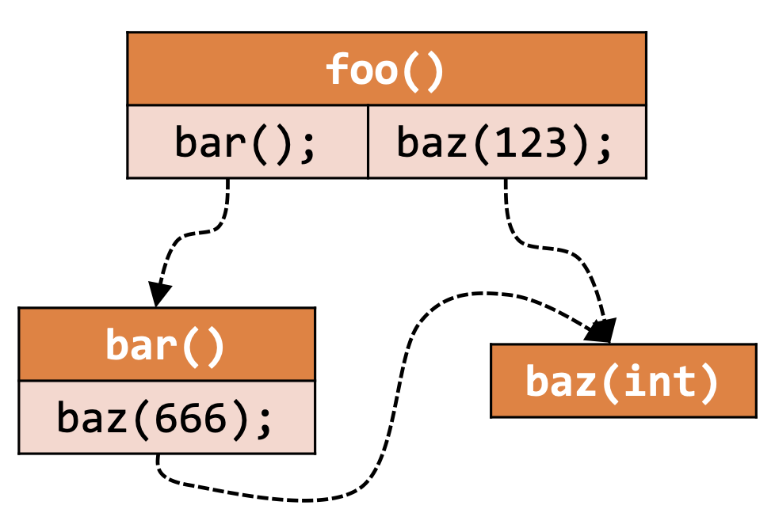
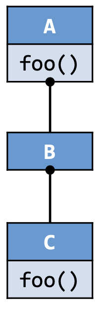
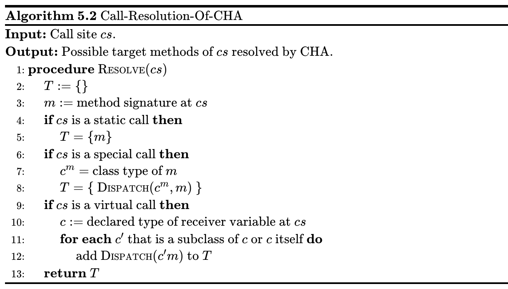
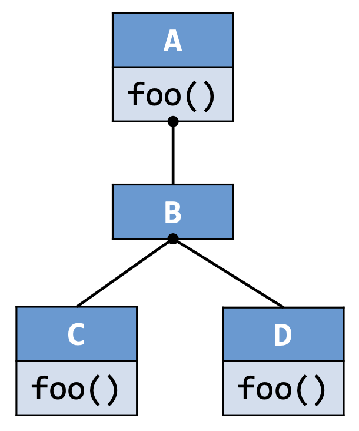
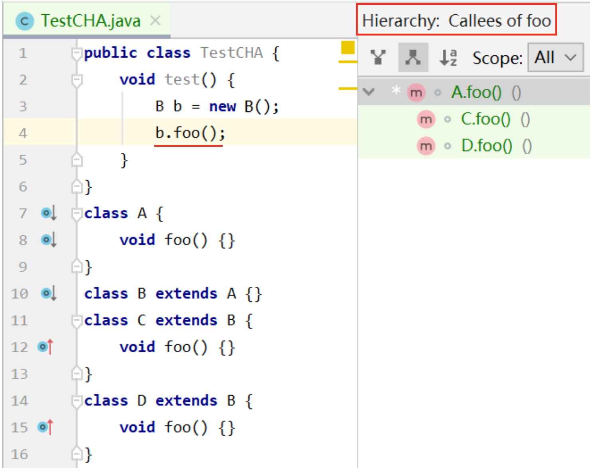
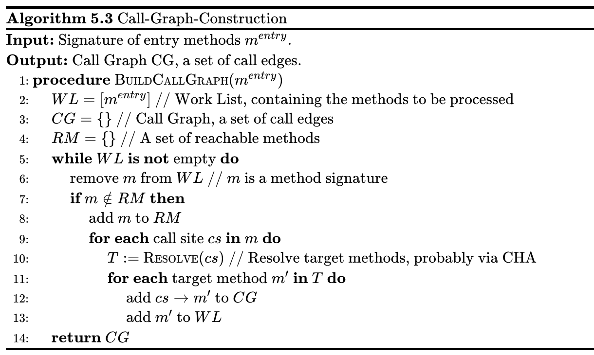
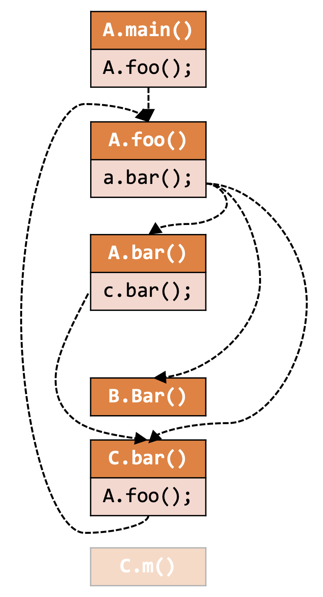
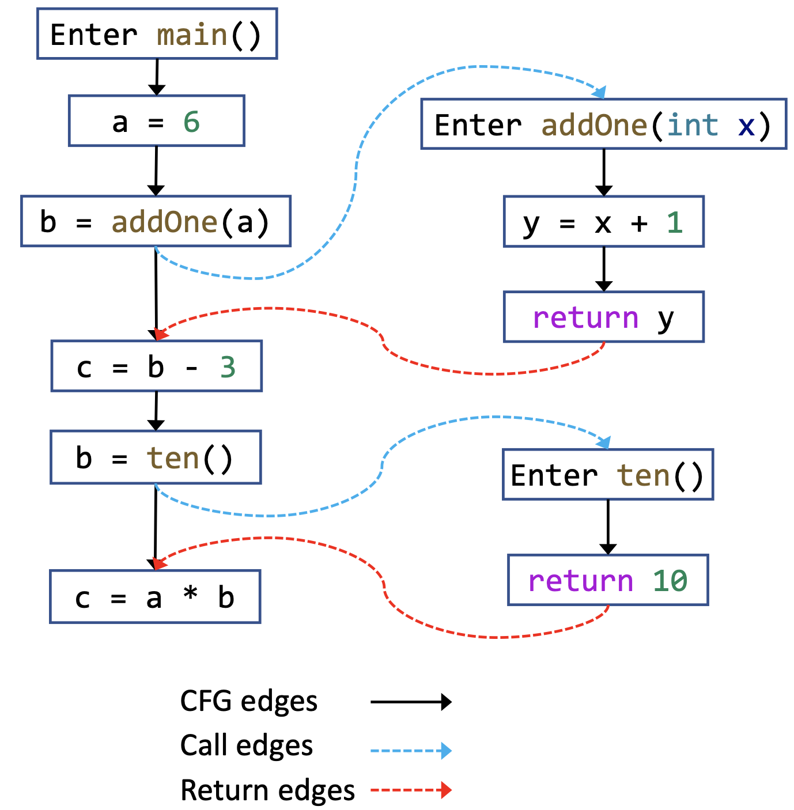
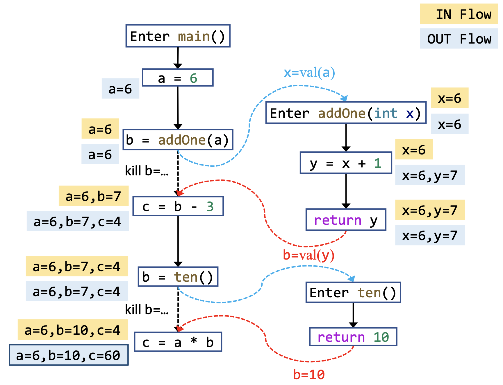
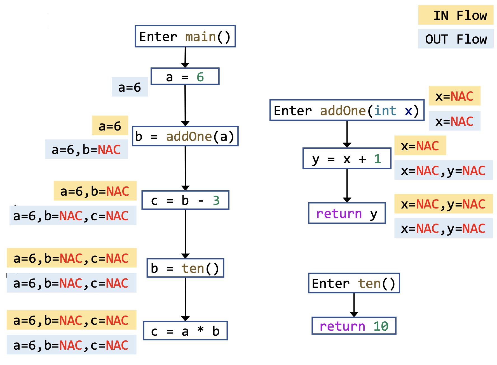

# 5 过程间分析

> 在这一章当中只考虑传值调用（Call-By-Value），传址调用（Call-By-Reference）暂不考虑，会在指针分析中详细讲解。

## 5.1 过程间分析的动机

::: definition 定义5.1
我们称一个静态分析是 **过程内分析（Intraprocedural Analysis）** ，如果它因为 **安全估计（Safe-approximation）** 的原则，对程序中所有的过程调用作 **最保守的假设（Most Conservative Assumption）** ；如果一个静态分析考虑过程间的控制流，分析过程内的具体变化，我们称其为 **过程间分析（Interprocedural Analysis）** 。
:::

::: definition 定义5.2
我们将表示过程间控制流的边称为**过程间的控制流边（Interprocedural Control-flow Edge）**，也就是**调用边（Call Edge）** 和 **返回边（Return Edge）**。
:::

到目前为止，我们学习的所有的静态分析都是过程内分析，如果我们用过程内分析的方法来处理方法调用的话，比如说常量传播问题，为了安全估计，我们会保守地假设所有的过程调用的结果为 `NAC` ，这样会导致分析结果极其不精确（Imprecision），虽然安全，但是过于保守，近乎无用。

因此，我们需要过程间分析，通过过程间的控制流边来传递数据流信息。也就是通过调用边和返回边传递信息。为了能够进行过程间的分析，我们需要一种对于过程间调用关系的表示——调用图。

## 5.2 调用图的构建

### 5.2.1 基本概念

::: definition 定义5.3
调用图是程序中各过程（Procedure）之间调用关系的一种表示，考虑程序中的所有**调用点（Call Site，调用表达式所在的语句）**，所有的从调用点到“**目标方法（Target Method）**——即**被调用者（Callee）**”的边组成的集合为**调用图（Call Graph）**。记程序中所有调用点的集合为 $V_1$ ，所有的方法的集合为 $V_2$ ，调用图 $G$ 满足 $G \subseteq V_1\times V_2$ 。
:::

比如说考虑下面一个例子：

```java
void foo() {
    bar();
    baz(123);
}

void bar() {
    baz(666);
}

void baz(int x) { }
```

<p style="text-align:center"></p>

调用图是非常重要的程序信息，它有很多的应用，比如说：

- 过程间分析的基础
- 程序优化（Optimization）
- 程序理解（Understanting）
- 程序调试（Debugging）
- 程序测试（Testing）

我们后面聚焦于对面向对象编程语言（Object-Oriented Programming Language，OOPL）的调用图构建，以Java为例，常见的方法有：

- 类层级结构分析（Class Hierarchy Analysis，CHA）
- 快速类型分析（Rapid Type Analysis，RTA）
- 变量类型分析（Variable Type Analysis，VTA）
- 指针分析（Pointer Analysis，k-CFA）

上面的四种方法自上而下精度（Precision）越来越高，但是效率（Efficiency）也越来越低。这一章重点讲解类层级结构分析的方法，在后面几章里面会讲解指针分析的方法。

### 5.2.2 Java中的方法调用

Java中有如下的三种 **方法调用（Method Call / Invocation）** 类型：

|  | 静态调用（Static Call） | 特殊调用（Special Call） | 虚调用（Virtual Call） |
| --- | --- | --- | --- |
| **指令** | `invokestatic` | `invokespecial` | `invokeinterface` ， `invokevirtual` |
| **接收对象（Receiver Object）** | 无 | 有 | 有 |
| **目标方法** | 静态方法 | 构造函数<br/>私有实例方法<br/>基类实例方法 | 其他的实例方法|
| **目标方法数量** | 1 | 1 | $\ge 1$（多态-Polymorphism） |
| **决定时间（Determinacy）** | 编译时 | 编译时 | 运行时 |

其中我们会发现，静态调用和特殊调用的目标方法确定是简单的（Trivial），在编译的时候就可以确定下来，真正对我们构造调用图造成挑战的是虚调用，它有不止一个可能的目标方法，到运行时才能完全确定下来，这也是面向对象编程范式的一个特性——多态。因此，我们构建调用图的关键是处理好虚调用。

### 5.2.3 虚调用的方法派发

::: definition 定义5.4
一个方法的 **描述符（Descriptor）** 由这个方法的 **返回类型（Return Type）** 和 **形参类型（Parameter Type）** 。
:::

::: definition 定义5.5
一个方法的 **签名（Signature）** 由这个方法所在的 **类名（Class Type）** ，方法本身的 **方法名（Method Name）** 以及方法的 **描述符（Descriptor）** 组成。签名可以用作一个方法的 **标识符（Identifier）** 。

考虑如下的实例方法：

```java
class C {
    T foo(P p, Q q, R r) { ... }
}
```

上述方法的签名为 `<C: T foo(P, Q, R)>` ，其中 `C` 是类名， `T` 是返回类型， `(P, Q, R)` 是形参类型， `foo` 是方法名。在不产生歧义的前提下，方法签名可以简写为 `C.foo(P, Q, R)` 。
:::

::: definition 定义5.6
对于某个形如 `o.foo()` 的调用点，记接收对象的类型为 $c$ ，方法签名为 $m$ ，定义在运行时刻解析调用点所调用的目标方法的过程为**方法派发（Method Dispatch）**，记为

$$
Dispatch(c,m)
$$

:::

在运行时刻，一个虚调用会基于接受对象的类型以及调用点处的方法签名来解析调用关系，决定具体调用哪个实例方法，解析过程见算法5.1。

**算法5.1** 虚调用的方法派发算法


<!--
    \begin{algorithm}
    \caption{Method-Dispatch-Of-Virtual-Calls}
    \begin{algorithmic}
    \INPUT Type $c$ of receiver object and method signature $m$ at call site.
    \OUTPUT The signature of target method.
    \PROCEDURE{Dispatch}{$c,m$}
        \IF{$c$ contains non-abstract method $m'$ that has the same name and descriptor as $m$}
            \RETURN $m'$
        \ELSE
            \STATE Let $c'$ be the superclass of $c$.
            \RETURN \CALL{Dispatch}{$c', m$}
        \ENDIF
    \ENDPROCEDURE
    \end{algorithmic}
    \end{algorithm}
-->

方法派发的过程简单理解就是从接受对象所在的类开始，按照从子类向到基类的顺序查找，直到找到一个方法名和描述符都相同的非抽象方法为止。

比如说下面这个例子：

```java
class A {
    void foo() { ... }
}

class B extends A {
}

class C extends B {
    void foo() { ... }
}
```

<p style="text-align:center"></p>

```java
void dispatch() {
    A x = new B();
    x.foo();
    
    A y = new C();
    y.foo();
}
```

- 对于调用点 `x.foo()` ，我们有 `Dispatch(B, A.foo()) = A.foo()` ；
- 对于调用点 `y.foo()` ，我们有 `Dispatch(C, A.foo()) = C.foo()` 。

其实，Dispatch算法模拟的是实际运行时的动态绑定过程。但是，在静态分析阶段，大部分情况下我们是无法直接获取接收对象的类型的，因为大多数时候，由于控制流的作用，一个调用点可能有不止一种可能的接受对象类型。

### 5.2.4 类层级结构分析

#### 解析算法

::: definition 定义5.7
通过查找类的层级结构来解析目标方法的过程，称之为**类层级结构分析（Class Hierarchy Analysis，CHA）**。其解析算法见算法5.2。CHA满足如下的一些描述：
- CHA需要知道整个程序的类之间的继承关系，也就是层级结构；
- CHA会根据调用点处的**接收变量（Receiver Variable）** 的 **声明类型（Declare Type）** 来解析虚调用；
- CHA假设声明类型为 `A` 的接收变量 `a` 可能会指向 `A` 类以及 `A` 的所有 **子类（Subclass）** 的对象。
:::

**算法5.2** CHA的调用解析（Call Resolution）算法



<!--
    \begin{algorithm}
    \caption{Call-Resolution-Of-CHA}
    \begin{algorithmic}
    \INPUT Call site $cs$.
    \OUTPUT Possible target methods of $cs$ resolved by CHA.
    \PROCEDURE{Resolve}{$cs$}
        \STATE $T := \{\}$
        \STATE $m :=$ method signature at $cs$
        \IF{$cs$ is a static call}
            \STATE $T = \{m\}$
        \ENDIF
        \IF{$cs$ is a special call}
            \STATE $c^{m} =$ class type of $m$
            \STATE $T = \{$ \CALL{Dispatch}{$c^m, m$} $\}$
        \ENDIF
        \IF{$cs$ is a virtual call}
            \STATE $c :=$ declared type of receiver variable at $cs$
            \FOR{\textbf{each} $c'$ that is a subclass of $c$ or $c$ itself}
                \STATE add \CALL{Dispatch}{$c' m$} to $T$
            \ENDFOR
        \ENDIF
        \RETURN $T$
    \ENDPROCEDURE
    \end{algorithmic}
    \end{algorithm}
-->

> 需要注意的是，当我们说 $c$ 的子类的时候，包括 $c$ 的直接子类和间接子类。

CHA的调用解析算法处理虚调用的方式是暴力的枚举，将变量声明类型及其子类中所有和调用点处签名匹配的方法都视为可能的目标方法。

其中需要说明的是，因为特殊方法除了构造函数、私有实例方法之外，还包括基类的实例方法，而到底调用的是哪个基类的实例方法，需要通过 $Dispatch(c^m, m)$ 才能查到。

下面我们通过一个例子来理解一下这个算法对于虚调用的处理过程 ：

```java
class A {
    void foo() { ... }
}

class B extends A { }

class C extends B {
    void foo() { ... }
}

class D extends B {
    void foo() { ... }
}
```

<p style="text-align:center"></p>

```java
void resolve() {
    C c = ...;
    c.foo();
    
    A a = ...;
    a.foo();
    
    B b = new B();
    b.foo();
}
```

算法会对于每一个接收变量的声明类型本身及其子类关于调用点处的函数签名进行方法派发的操作，将所有找到的目标方法加入结果之中。因此

- `Resolve(c.foo()) = {C.foo()}` ；
- `Resolve(a.foo()) = {A.foo(), C.foo(), D.foo()}` ；
- `Resolve(b.foo()) = {A.foo(), C.foo(), D.foo()}` ；

其中，我们需要注意一下的是第三个调用点， `A.foo()` 也在其结果之内，因为对于 `B` 类本身的方法派发得到的结果是 `A.foo()` 。

并且，CHA的Resolve算法只关心声明类型，因此 `new B()` 其实并没有在算法中发挥作用，从而我们 `Resolve(b.foo())` 产生了两个虚假的目标调用（Spurious） `C.foo()` 和 `D.foo()` 。

#### 特点

- 优点：快
   - 只考虑了调用点处接收对象的声明类型及其继承结构
   - 忽略数据流和控制流信息
- 缺点：不精确
   - 很容易引入虚假的目标方法

> 之后的指针分析会处理不精确的问题。

#### 应用

CHA的常见应用是在IDE中帮助程序员查看调用点处可能的目标方法，因为IDE只是给程序员一个提示，所以只需要保证不发生错误，对于精确性要求不高。

<p style="text-align:center"></p>

比如说IntelliJ IDEA就是用CHA算法帮助程序员分析目标调用的。

### 5.2.5 通过CHA构建调用图

通过CHA构建整个程序调用图的基本过程为：

- 从入口方法开始（通常为main方法）；
- 对于每个可达的方法 $m$ ，通过CHA解析 $m$ 中的每个调用点$cs$的目标方法，即 $Resolve(cs)$ ；
- 重复上述过程，直到没有发现新的方法为止。

**算法5.3**  调用图构建（Call Graph Construction）算法



<!--
    \begin{algorithm}
    \caption{Call-Graph-Construction}
    \begin{algorithmic}
    \INPUT Signature of entry methods $m^{entry}$.
    \OUTPUT Call Graph CG, a set of call edges.
    \PROCEDURE{BuildCallGraph}{$m^{entry}$}
        \STATE $WL = [m^{entry}]$ \COMMENT{Work List, containing the methods to be processed}
        \STATE $CG = \{\}$ \COMMENT{Call Graph, a set of call edges}
        \STATE $RM = \{\}$ \COMMENT{A set of reachable methods}
        \WHILE{$WL$ \textbf{is} \NOT empty}
            \STATE remove $m$ from $WL$ \COMMENT{$m$ is a method signature}
            \IF{$m \notin RM$}
                \STATE add $m$ to $RM$
                \FOR{\textbf{each} call site $cs$ \textbf{in} $m$}
                    \STATE $T :=$ \CALL{Resolve}{$cs$} \COMMENT{Resolve target methods, probably via CHA}
                    \FOR{\textbf{each} target method $m'$ \textbf{in} $T$}
                        \STATE add $cs \to m'$ to $CG$
                        \STATE add $m'$ to $WL$
                    \ENDFOR
                \ENDFOR
            \ENDIF
        \ENDWHILE
        \RETURN $CG$
    \ENDPROCEDURE
    \end{algorithmic}
    \end{algorithm}
-->

我们可以通过下面的例子来直观的感受一下算法的运行过程。

```java
class A {
    static void main() {
        A.foo();
    }
    
    static void foo() {
        A a = new A();
        a.bar();
    }
    
    void bar() {
        C c = new C();
        c.bar();
    }
}

class B extends A {
    void bar() { }
}

class C extends A {
    void bar() {
        if (...) {
            A.foo();
        }
    }
    
    void m() { }
}
```

<p style="text-align:center"></p>

在上述例子当中需要注意的是，虽然 `A a = new A()` ，但是解析 `a.bar()` 的目标方法时候，依旧会对 `A` 以及 `A` 的所有子类作 $Dispatch$ ，故而会有3条从 `a.bar()` 出发的边。

最后我们会发现存在一个不可达的方法（Unreachable Method） `C.m()` ，那么这个方法中的代码就是死代码（Dead Code，即在任何情况下控制流都不能到达的代码）。

## 5.3 过程间控制流图

CFG代表了一个独立方法的控制流结构，类似的，我们可以用ICFG（Interprocedural Control Flow Graph）来代表整个程序的控制流结构。有了ICFG，我们就可以用分析CFG的方式来分析整个程序。

::: definition 定义5.8
定义一个程序的 **过程间控制流图（Interprocedural Control Flow Graph，ICFG）** 由两个部分组成：

- 程序中所有方法的控制流图，其中的边称为**CFG边（CFG Edge）**；
- 两种额外的边：
    - **调用边（Call Edge）**：从调用点（Call Site）到调用点对应的被调用者（Callee）的入口结点（Entry Node）的边；
    - **返回边（Return Edge）**：从被调用者的出口结点（Exit Node）到 **返回点（Return Site, 控制流中紧接着调用点的语句）** 的边。
:::

简单理解， `ICFG = CFG + call & return edges` ，连接调用边和返回边的信息可以从调用图中获得。因此，过程间控制流图的精度取决于调用图的精度。
   
我们可以通过一个例子来更直观的理解一下上面的定义。

```java
static void main() {
    int a, b, c;
    a = 6;
    b = addOne(a);
    c = b - 3;
    b = ten();
    c = a * b;
}

static int addOne() {
    int y = x + 1;
    return y;
}

static int ten() {
    return 10;
}
```

<p style="text-align:center"></p>

其中，有一种边会有些疑惑，就是从调用点到返回点的边，控制流并不会从这条边走，但是我们的图中需要这条边，因为方法调用具有独立性，有一些信息，没必要进入方法体的内部（比如说除了参数以外的其他变量的信息），可以直接从外面的这条边传递，能够提高效率。

> 虽然进入方法体多走几步也是可以的，但这会降低效率。

::: definition 定义5.9
CFG边中从调用点到对应返回点的边称为**调用-返回边（Call-to-return edges）**，除此之外的边称为**普通边（Normal Edges）**。
:::

简单理解， `CFG Edges = Call-to-return Edges + Normal Edges` 。调用-返回边相当于为子过程不需要用到的外部状态提供了一条传播的捷径。

> 例如，常量传播问题当中，一个调用点处一般只有接收方法调用返回值的那个变量会发生变化，除此之外的本地变量并不会发生变化，我们可以将这些本地变量沿着调用-返回边传递到下一个结点，方法调用的返回值则由返回边传递。

## 5.4 过程间数据流分析

### 5.4.1 过程间与过程内数据流分析的区别

::: definition 定义5.10
我们将基于CFG分析单个方法内部的数据流分析称为 **过程内数据流分析（Intraprocedural Data-Flow Analysis）** ，将基于ICFG分析整个程序的数据流分析称为 **过程间数据流分析（Interprocedural Data-Flow Analysis）** 。
:::

::: definition 定义5.11

定义数据流沿着ICFG中的边转移的过程为**边转移（Edge Transfer）**，包括：

- **普通边转移（Normal Edge Transfer）**：数据流沿着某个方法的CFG中的边的转移函数；
- **调用-返回边转移（Call-Return Edge Transfer）**：数据流从调用点沿着调用-返回边到返回点的转移函数；
- **调用边转移（Call Edge Transfer）**：数据流从调用点（见定义5.3）沿着调用边转移到被调用者的入口结点的转移函数；
- **返回边转移（Return Edge Transfer）**：数据流从被调用者的出口结点沿着返回边转移到返回点（见定义5.8）的转移函数。
:::

> 这里转移函数可视为边的状态转移方程（见定义3.7）。

::: definition 定义5.12
称CFG中结点所对应的状态转移方程（见定义3.7）为 **结点转移（Node Transfer），** 包括：

- **调用结点转移（Call Node Transfer）**：调用点对应的结点的状态转移方程；
- **其他结点转移（Other Node Transfer）**：调用点以外的其他结点的状态转移方程。
:::

过程间数据流分析和过程内数据流分析的对比如下：

|  | 过程内数据流分析 | 过程间数据流分析 |
| :-: | :-: | :-: |
| **程序表示** | `CFG` | `ICFG = CFGs + call & return Edges` |
| **转移函数** | 结点转移 | 结点转移 + 边转移 |

### 5.4.2 过程间常量传播

下面我们以常量传播为例，走一遍过程间数据流分析的基本步骤。

#### 转移函数

- 结点转移：
   - 调用结点转移：恒等函数（Identity Function，即直接将输入当输出返回的函数）；
      - 调用点左值变量留给调用-返回边处理；
   - 其他结点转移：和过程内的常量传播一致（见4.6.2）；
- 边转移：
   - 普通边：恒等函数
   - 调用-返回边：消除调用点的 **左值变量（Left-hand-side Variable, LHS Variable）** 的值，传播其他本地变量的值；
   - 调用边：传递参数值；
   - 返回边：传递返回值。

#### 例子

沿用上一个例子（见第3节）的代码，分析过程及结果如下。

<p style="text-align:center"></p>

这里再解释一下调用-返回边的作用，以上面那条调用返回边为例。通过这条调用返回边，我们可以将本地变量 `a = 6` 的数据流信息传递到下一个结点，如果没有这条边的话，我们需要在 `addOne` 的CFG中一直维护着 `a = 6` 这条数据，这是十分低效的。

在这个例子中，如果我们只运用过程内分析的做法，对所有的调用作最保守的假设，那么我们最终得到的结果会是这样的：

<p style="text-align:center"></p>

从上面两种结果的对比中，我们会发现：

::: conclusion 结论5.1
过程间常量传播分析比过程内常量传播分析精确得多。
:::

## 5.5 自检问题

1. 如何通过类层级结构分析（Class Hierarchy Analysis, CHA）来构建调用图（Call Graph）？
2. 如何理解过程间控制流图（Interprocedural Control-Flow Graph, ICFG）的概念？
3. 如何理解过程间数据流分析（Interprocedural Data-Flow Analysis, IDFA）的概念？
4. 如何进行过程间常量传播（Interprocedural Constant Propagation）分析？

