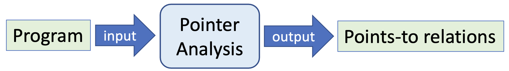
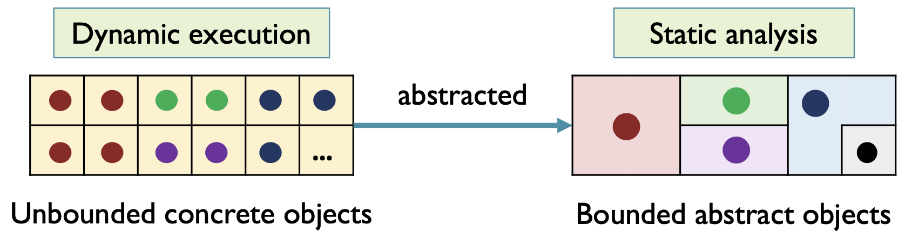
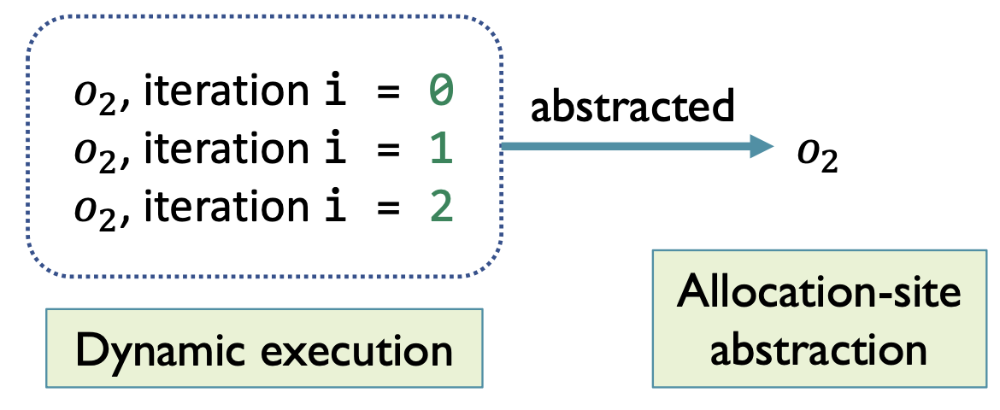
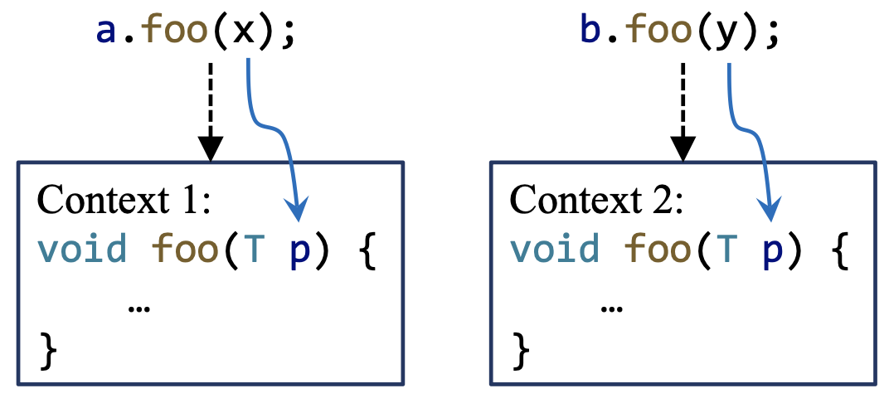
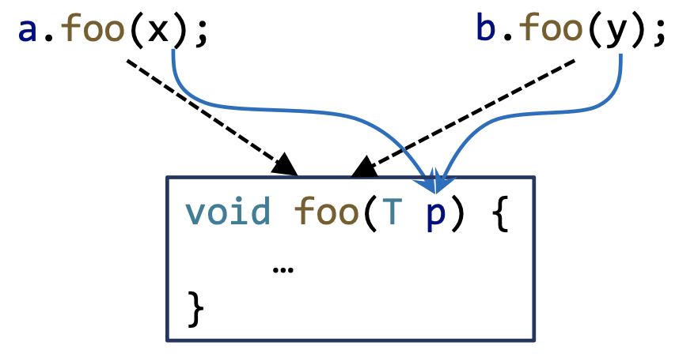
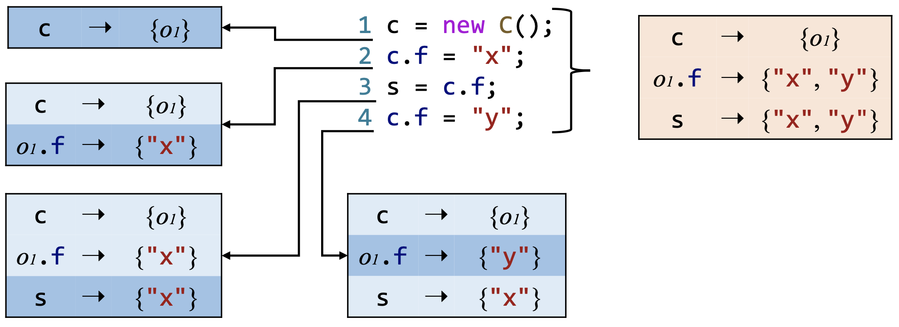
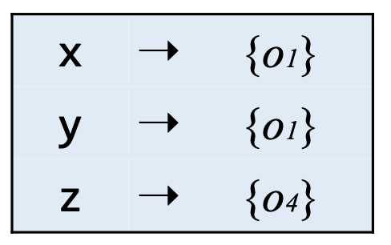
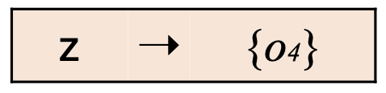

# 6 指针分析-引入

> 这一章主要是指针分析的一些概念和要素，具体的算法和理论见后两讲的内容。 

## 6.1 指针分析的动机

我们用一个简单的常量传播的例子来说明一下为什么要进行指针分析。考虑如下的类结构：

```java
interface Number {
    int get();
}
class Zero implements Number {
    public int get() { return 0; }
}
class One implements Number {
    public int get() { return 1; }
}
class Two implements Number {
    public int get() { return 2; }
}
```

当我们分析下面的方法时：

```java
void foo() {
    Number n = new One();
    int x = n.get();
}
```

如果我们用CHA来构建调用图，由于CHA只考虑声明类型的层级结构， `n.get()` 会指向3个目标方法—— `Zero.get()` 、 `One.get()` 、 `Two.get()` ，所以 `x` 有3个不同的值可能与之绑定，所以最终 `x` 会被分析成一个不精确的结果： `NAC` 。

这是因为，在CHA分析给出的3个目标方法中，有两个是假积极（False Positive，见定义1.5），分析的精度太低了。

而指针分析是基于指向关系（Point-to Relation）的分析，我们发现 `n` 只可能指向 `new One()` ，因此调用点 `n.get()` 的目标方法只有一个—— `One.get()` 。最终 `x` 为常量1，这个结果是精确的。

因此，我们进行指针分析的动机在于追求更高的分析精度。

## 6.2 指针分析介绍

### 6.2.1 定义和概况

<p style="text-align:center"></p>

::: definition 定义6.1
我们将分析一个指针可能指向的 **内存区域（Memory Location）** ，以 **程序（Program）** 为输入，以程序中的 **指向关系（Point-to Relation）** 为输出的分析称作 **指针分析（Pointer Analysis）** 。
:::

例如：

```java
class A {
    B b;
    
    void setB(B b) { this.b = b; }
    B getB() { return this.b; }
}
```

```java
void foo() {
    A a = new A();
    B x = new B();
    a.setB(x);
    B y = a.getB();
}
```

其中的指向关系有：

| 变量/字段（域） | 对象 |
| :-: | :-: |
| `a` | `new A` |
| `x` | `new B` |
| `this` | `new A` |
| `b` | `new B` |
| `new A.b` | `new B` |
| `y` | `new B` |

指针分析是一种基本的静态分析，它分析程序中的一个指针可能会指向哪些内存区域。对于面向对象的语言来说（比如Java），指针分析会分析程序中的一个指针（可能是变量或者字段）能够指向哪些对象。

> 我们之后的内容会聚焦在面向对象语言的指针分析上。  

指针分析是一种可能性分析（May Analysis，见定义3.2），我们会饱和估计（Over-approximation，见定义1.3）一个指针可能指向的对象集合，也就是说，一个指针可能指向的所有对象，我们都会把它考虑在内。

### 6.2.2 别名分析

::: definition 定义6.2
我们称两个指针 $p$ 和 $q$ 互为**别名（Alias）**，如果它们指向同一块内存区域，在面向对象语言中即指向同一个对象。
:::

::: definition 定义6.3
我们称研究程序中别名关系的分析称为**别名分析（Alias Analysis）**。
:::

指针分析和别名分析是两个联系紧密但不尽相同的概念。

- 指针分析回答的是一个指针可能会指向哪些对象，别名分析回答的是两个指针是否会指向同一个对象。
- 不过，别名分析可以基于指针分析来进行，因为如果程序中的指向关系确定了，那么别名关系也随之变得明显了。

### 6.2.3 应用

- 为其他的静态分析提供基础信息
    - 调用图、别名关系
- 编译器优化（Compiler Optimization）
    - 虚调用内联（Virtual Call Inlining）
- 错误检测（Bug Detection）
    - 空指针检测（Null Pointer Detection）
- 安全分析（Security Analysis）
    - 信息流分析（Information Flow Analysis）
- ......

> 指针分析是最基础的静态分析之一，几乎所有的其他静态分析都需要基于指针分析而进行。

## 6.3 指针分析的关键因素

指针分析是一个非常复杂的系统，许多因素都会影响到它的精度（Precision）和效率（Efficiency）。

| 因素 | 问题 | 选择 |
| --- | --- | --- |
| **堆抽象（Heap Abstraction）** | 如何对堆区内存建模？ | 分配点（Allocation-site）<br/> 无储存（Storeless）|
| **上下文敏感性（Context Sensitivity）** | 如何对调用语境建模？ | 上下文敏感（Context-sensitive）<br/> 上下文不敏感（Context-insensitive）|
| **流敏感性（Flow Sensitivity）** | 如何对控制流建模？ | 流敏感（Flow-sensitive）<br/> 流不敏感（Flow-insensitive）|
| **分析范围（Analysis Scope）** | 程序的哪个部分应该被分析？ | 全程序（Whole-program）<br/> 需求驱动（Demand-driven）|

### 6.3.1 堆抽象

#### 如何对堆内存建模？

由于循环和递归等因素，在动态运行的时候堆区的对象数目是没有边界的，多少都有可能。

::: definition 定义6.4
**堆抽象（Heap Abstraction）** 是指，为了保证静态分析能够正常终止，将 **动态分配的（Dynamically Allocated）** ， **无界的具体对象（Unbounded Concrete Objects）** 建模成 **有限/有界的抽象对象（Finite/Bounded Abstract Objects）** 的过程。
:::

<p style="text-align:center"></p>


#### 分配点抽象

::: definition 定义6.5
将同一**分配点（Allocation Site**，通常是一条 `new` 语句 **）** 处分配内存而产生的所有具体对象抽象成一个抽象的对象，称这种堆抽象的方式为**分配点抽象（Allocation-Site Abstraction）**。
:::

例如下面的例子：

```java
for (i = 0; i < 3; i++) {
    a = new A();
    ......
}
```

<p style="text-align:center"></p>

在上述程序中有一个分配点在第2行，它在动态执行的时候会执行3次，从而为3个新对象分配内存。分配点抽象会将该分配点处产生的3个对象抽象成1个对象$o_2$，然后再进行后续的分析。

而一个静态的程序总是有限的，因此程序中的分配点也是有限的，所以我们抽象出来的抽象对象的个数也一定是有限的了。

### 6.3.2 上下文敏感性

#### 如何模拟调用上下文？

::: definition 定义6.6
称一个静态分析是**上下文敏感的（Context-Sensitive, C.S.）**，如果它区分一个方法不同的的**调用语境（Calling Context）**；称一个静态分析是**上下文不敏感的（Context-Insensitive, C.I.）**，如果它将一个方法所有的调用语境汇合到一起分析。
:::

在上下文敏感的分析中，对于每一个调用的上下文都会单独分析，因此，一个方法可能在不同的上下文中被分析很多次。

比如说下图中的 `a.foo(x)` 和 `b.foo(y)` 是两个不同上下文中的调用，因此 `foo` 方法会被分析两次，每次分析都是在对应的上下文里面分析的。

<p style="text-align:center"></p>

上下文敏感技术一种十分有用的技术，因为它能够大大提高指针分析的精度，将会在后面的章节中详细讨论。

<p style="text-align:center"></p>

在上下文不敏感的分析中，我们会将所有的调用语境汇合在一起，只分析一次方法调用。

这样实现起来会简单一些，速度也会快一些，但是精度会有所损失。因为数据流汇合的过程中是会损失精度的。
不过，我们下一章会先从上下文不敏感的分析讲起。

### 6.3.3 流敏感性

#### 如何处理程序的控制流？

::: definition 定义6.7
称一个静态分析是**流敏感的（Flow-sensitive）**，如果它尊重语句的执行顺序；称一个静态分析是**流不敏感的（Flow-insensitive）**，如果它忽略控制流顺序，将程序视为一个无序语句的集合来对待。
:::

流敏感性的中的流指的是控制流，到目前为止，我们学习的数据流分析都是流敏感的。

我们通过一个例子来看一下流敏感和流不敏感的指针分析：

```java
c = new C();
c.f = "x";
s = c.f;
c.f = "y";
```

其流敏感和流不敏感的分析结果如下：

<p style="text-align:center"></p>

我们会发现，流不明感的指针分析结果中出现了假积极的现象，也就是说流敏感的指针分析是更加精确的。

但是，流敏感的分析代价会比流不敏感高：

- 流敏感的指针分析需要在每一个程序点处都维护一个指向关系的映射表；
- 而流不敏感的指针分析只需要为整个程序维护一个指向关系的映射表。

我们之后会选择使用流不敏感的分析方式，因为这种分析方式的代价和复杂度比较低，并且结果虽然不是最精确，但还是可以接受的。

### 6.3.4 分析范围

#### 程序的哪个部分应当被分析？

::: definition 定义6.8
称为程序中所有的指针计算指向信息的指针分析为 **全程序分析（Whole-program Analysis）** ；称只计算会影响 **特定兴趣点（Specific Sites of Interest）** 的指针的指向信息的指针分析为 **需求驱动分析（Demand-driven Analysis）** 。
:::

全程序分析能够给所有可能的客户提供信息，而需求驱动分析只能给特定需求的客户提供信息。例如：

```java
x = new A();
y = x;
...
z = new T();
z.bar();
```

这段代码的全程序分析结果为：

<p style="text-align:center"></p>

其中， $o_i$ 表示第 $i$ 行产生的变量。

假设我们的客户为调用图构建，那么的兴趣点就只有第5行。和第5行相关的指针只有 $z$ ，因此，这段代码的需求驱动分析结果为：

<p style="text-align:center"></p>

之后，我们会着眼于全程序分析。

综上，我们后面的章节中会着重分析具有如下关键因素的指针分析。

| 因素 | 问题 | 选择 |
| --- | --- | --- |
| **堆抽象（Heap Abstraction）** | 如何对堆区内存建模？ | **分配点（Allocation-site）**<br/>无储存（Storeless）|
| **上下文敏感性（Context Sensitivity）** | 如何对调用语境建模？ | **上下文敏感（Context-sensitive）**<br/>**上下文不敏感（Context-insensitive）**|
| **流敏感性（Flow Sensitivity）** | 如何对控制流建模？ | 流敏感（Flow-sensitive）<br/>**流不敏感（Flow-insensitive）**|
| **分析范围（Analysis Scope）** | 程序的哪个部分应该被分析？ | **全程序（Whole-program）**<br/>需求驱动（Demand-driven）|

## 6.4 指针分析关心的语句

现代的编程语言又许多典型的语句类型，比如 `if-else` 、 `switch-case` 、 `for/while/do-while` 、 `break/continue` 等等，但是这些语句并不会直接影响程序中各种指针的指向关系，因此在指针分析中，我们会忽略这些语句。我们后续只聚焦于**指针影响型语句（Pointer-affecting Statements）**。

### 6.4.1 对于各类指针的抽象处理

以Java为例，java中有4种指针：

- 本地变量（Local Variable），形如 `x` ；
- 静态域（Static Field），形如 `C.f` ；
   - 有时候也称为全局变量（Global Variable）
- 实例域/实例字段（Instance Field），形如 `x.f` ；
   - 在指针分析的时候建模成 `x` 指向的对象的域 `f` ；
- 数组元素（Array Element），形如 `array[i]` ；
   - 在指针分析时，我们会忽略数组下标，建模成 `array` 指向的一个对象，这个对象只有一个字段 `arr` ，可能指向数组中存放的任意值。

将数组抽象成单个字段的对象是因为数组的下标操作过于复杂，下标中可能还有变量，因此我们将数组的所有元素放在一个字段中，简化问题。

我们举一个例子来说明一下对于数组元素的抽象：

实际的代码：

```java
array = new String[10];
array[0] = "x";
array[1] = "y";
s = array[0];
```

指针分析视角下对应的代码：

```java
array = new String[];
array.arr = "x";
array.arr = "y";
s = array.arr;
```

因为我们采用的是流不敏感分析，因此控制流的顺序对我们的分析没有影响，遵循保守估计的 原则，我们的指针分析会认为 `array.arr` 指向的是 `"x"` 和 `"y"` 两个可能值，并不会存在后来居上覆盖前者的问题。

综上，我们最终只会聚焦于本地变量（全局变量和本地变量是类似的）和实例字段（数组元素被转化成了实例字段）。

### 6.4.2 指针影响型语句

::: definition 定义6.9
称对程序中指针的指向关系产生影响的语句为**指针影响型语句（Pointer-affecting Statement）**。
:::

Java中的指针影响型语句有：

| 语句类型 | 示例 |
| :-: | :-: |
| New（创建新对象） | `x = new T()` |
| Assign（赋值语句） | `x = y` |
| Store（字段存储语句） | `x.f = y` |
| Load（字段载入语句） | `y = x.f` |
| Call（方法调用语句） | `r = x.k(a, ...)` |

其中，需要解释一下的是关于Store语句和Load语句，我们的程序中可能会有链式嵌套的访存表达式，它们最终都会通过引入临时变量的方式被转化为三地址码（3AC，见定义2.1），从而变成基本的，一次访存的形式。

比如说 `x.f.g.h = y` 会被转化成如下的三地址码形式：

```java
t1 = x.f;
t2 = t1.g;
t2.h = y;
```

然后，方法调用有三种具体的类型（见5.2.2），我们会重点聚焦于虚调用（Virtual Call），因为这是和指针的指向关系有关的（其他两种调用的解析结果是唯一的，不需要指针分析）。

## 6.5 自检问题

1. 什么是指针分析（Pointer Analysis）？
2. 如何理解指针分析的关键因素（Key Factors）？
3. 我们在指针分析的过程中具体都分析些什么？
