# 7 指针分析-基础

## 7.1 指针分析的规则

在上一讲的最后，我们提到了Java中的5类指针影响型语句（见6.4.2，注：6表示第6讲）。在这一讲的前3大部分中，我们会重点聚焦于创建、赋值、存储、载入这四种，也就是说，我们会先从过程内分析开始做起；最后第4部分里面，我们会引入调用语句，学习全程序的指针分析。

### 7.1.1 定义和记号

为了后续的表示方便，我们先定义一些表示记号。

|内容|记号|
|:-:|:-:|
|变量（Variables）| $x, y \in V$ |
|字段（Fields）| $f,g \in F$ |
|对象（Objects）| $o_i, o_j \in O$ |
|实例字段（Instance Fields）| $o_i.f, o_j.g \in O\times F$ |

有了上述的记号之后，我们可以形式化的定义什么是指针，以及一个程序中指针的集合。

::: definition 定义7.1
记某程序中的变量集合为 $V$ ，字段集合为 $F$ ，对象集合为 $O$ ，定义这个程序中的某个 **指针（Pointer）** 为 $p$ ，其中 $p$ 满足

$$
p\in V\cup(O\times F)
$$

记所有的指针组成的集合为 $Pointer$ ，则 $Pointer$ 满足

$$
Pointer \subseteq V\cup(O\times F)
$$

:::

指针分析的目的是输出整个程序中所有的指向关系，根据上述定义，我们也可以形式化的定义出指向关系。

::: definition 定义7.2
记程序的指针集为 $Pointer$ ， 对象集合为 $O$ ，其幂集记为 $P(O)$ ，定义 **指向关系（Points-to Relation）** 是从 $Pointer$ 到 $P(O)$ 映射，用 $pt$ 表示，满足

$$
pt \subseteq Pointer \times P(O)
$$

于是，我们可以用 $pt(p)$ 来表示指针 $p$ 的 **指向集合（Points-to Set）** 。
:::

### 7.1.2 规则

我们用推导式的方式来描述各种语句在指针分析中的规则。

::: definition 定义7.3
考虑命题 $P_1, P_2, ... P_m$ 和 命题 $Q_1, Q_2, ..., Q_n$ ，定义 **推导式（Comprehension）** 形式如下：

$$
\frac{P_1, P_2, ..., P_m}{Q_1, Q_2, ..., Q_n}
$$

其含义是，若 $P_1, P_2, ... P_m$ 为真，则 $Q_1, Q_2, ..., Q_n$ 为真。
其中，$P_i$ 称为 **前提（Premises）** ， $Q_j$ 称为 **结论（Conclusion）** 。
若 $m = 0$ ，则称结论 **无条件（Unconditional）** 成立。
:::

于是各种类型语句的规则可以用下表表示：

|类型|语句|规则|图示|
|:-:|:-:|:-:|:-:|
|创建|`i: x = new T()`| $\overline{o_i \in pt(x)}$ |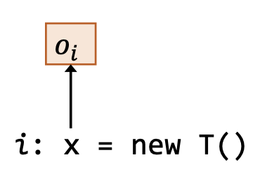|
|赋值|`x = y`| $o_i\in pt(y)$<br/>$\overline{o_i \in pt(x)}$|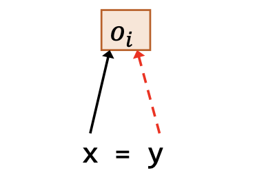|
|存储|`x.f = y`| $\underline{o_i \in pt(x), o_j\in pt(y)}$<br/>$o_j \in pt(o_i.f)$ |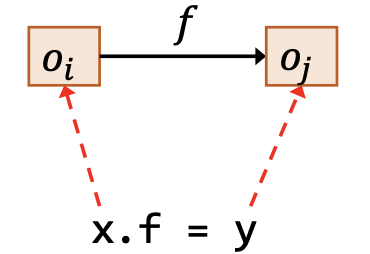|
|载入|`y = x.f`| $\underline{o_i\in pt(x), o_j\in pt(o_i.f)}$<br/>$o_j\in pt(y)$ |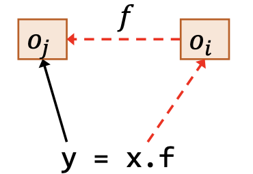|

其中，图示用红色虚线表示作为前提的指向关系，用黑色实线表示结论得出的指向关系。

## 7.2 如何实现指针分析

### 7.2.1 实现思路

指针分析就是要在指针（变量或者实例字段）之间传播(propagate)指向信息。

<p style="text-align:center">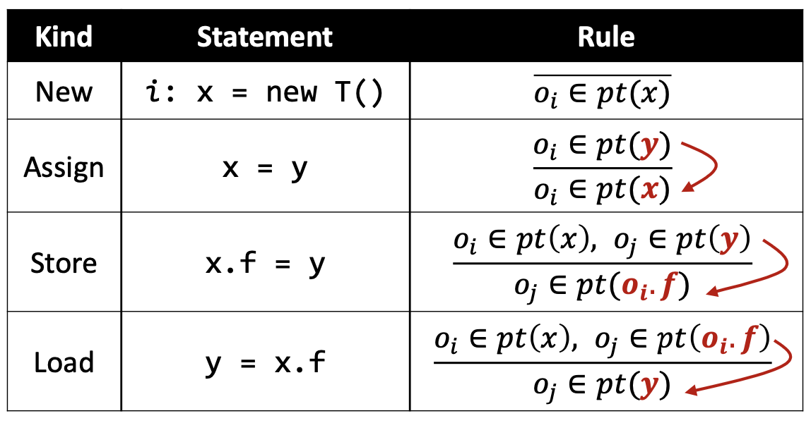</p>

::: definition 定义7.4
我们根据语句的语义确定了一系列的指向集合传播规则，从而我们可以将指针分析的过程视为求解一个 **包含约束(Inclusion Constraints)** 系统的过程，这种分析风格被称为 **安德森式分析（Andersen-Style Analysis）** 。
:::

实现指针分析的关键是当 $pt(x)$ 改变的时候，将改变的部分传递给和 $x$ 相关的其他指针。

因此，我们的解决方案是：
- 使用一个图来连接相关的指针；
- 当 $pt(x)$ 改变的时候，将改变的部分传递给 $x$ 的后继们。

### 7.2.2 指针流图

::: definition 定义7.5
一个程序的 **指针流图(Pointer Flow Graph)** 指的是表示对象如何在程序中的指针之间流动的有向图。
- PFG中的一个节点 $n$ 代表了一个变量或者某个对象的一个字段，即

$$
n \in Pointer \subseteq V \cup (O\times F)
$$

- PFG中的一条边 $x \to y \in Pointer\times Pointer$ 表示指针 $x$ 指向的对象可能会流到指针 $y$ 的指向集合中（即也可能被 $y$ 指向）。

其中， $V$ 表示程序中所有变量的集合， $O$ 表示所有对象的集合， $F$ 表示所有字段的集合。
:::

PFG的节点是容易确定的，就是程序中所有的指针；于是，我们只需要根据程序中的语句以及语句对应的规则添加PFG的边即可。

<p style="text-align:center">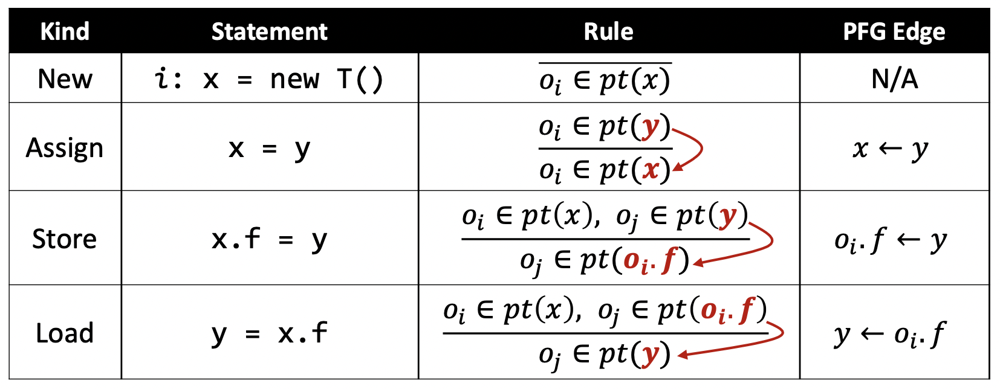</p>

比如说下面这个例子：

<p style="text-align:center">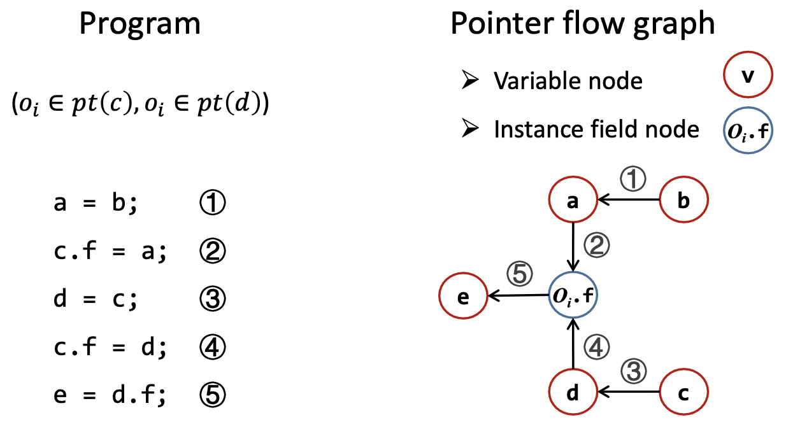</p>

有了PFG之后，指针分析就可以通过计算PFG的传递闭包（Transitive Closure）来解决。

比如说，在上面的例子中，$e$ 是从 $b$ 可达的结点，这就意味着所有的 $b$ 指向的对象都可能会流向 $e$ ，也就是可能还会被 $e$ 指向。

### 7.2.3 分析的步骤

如果程序中有这样一句语句： `j: b = new T()` ，显然有 $pt(b) = \{o_j\}$ ，根据PFG，也会有 $pt(a) = \{o_j\}$ ， $pt(o_i.f) = \{o_j\}$ ， $pt(e) = \{o_j\}$ 。

所以，指针分析的实现可以分两步：
- 构建指针流图PFG
- 在PFG上传递指向信息

但是，上面这两步是没有严格的依赖关系的。考虑存储语句和载入语句（即上面例子中的2、4、5行），一个指针是没有字段的，当我们通过指针来访问字段的时候，其实访问的是指针指向的对象的字段，也就是说，图中的2、4、5这3条边的构建就已经使用到了 $o_i \in pt(c)$ 和 $o_i \in pt(d)$ 这两条指向信息了。

因此，我们发现，构建指针流图是需要用到指向信息的，而传递指向信息有需要指针流图的基础，因此上面所说的两步是相互依赖（Mutually Dependent）的。

总结一下就是：

::: conclusion 结论7.1
指针流图是在指针分析的过程当中 **动态更新（Dynamically Updated）** 的。
:::

## 7.3 指针分析算法

### 7.3.1 算法内容

**算法7.1** 过程内上下文不敏感的全程序指针分析算法

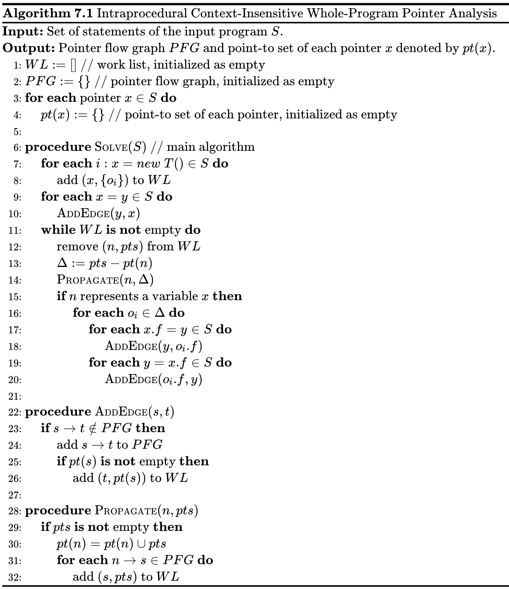

<!--
    \begin{algorithm}
    \caption{Intraprocedural Context-Insensitive Whole-Program Pointer Analysis}
    \begin{algorithmic}
    \INPUT Set of statements of the input program $S$.
    \OUTPUT Pointer flow graph $PFG$ and point-to set of each pointer $x$ denoted by $pt(x)$.
    \STATE $WL := []$ \COMMENT{work list, initialized as empty}
    \STATE $PFG := \{\}$ \COMMENT{pointer flow graph, initialized as empty}
    \FOR{\textbf{each} pointer $x \in S$}
        \STATE $pt(x) := \{\}$ \COMMENT{point-to set of each pointer, initialized as empty}
    \ENDFOR
    \STATE
    \PROCEDURE{Solve}{$S$} \COMMENT{main algorithm}
        \FOR{\textbf{each} $i:x = new\ T() \in S$}
            \STATE add $(x, \{o_i\})$ to $WL$
        \ENDFOR
        \FOR{\textbf{each} $x = y \in S$}
            \STATE \CALL{AddEdge}{$y, x$}
        \ENDFOR
        \WHILE{$WL$ \textbf{is not} empty}
            \STATE remove $(n, pts)$ from $WL$
            \STATE $\Delta := pts - pt(n)$
            \STATE \CALL{Propagate}{$n, \Delta$}
            \IF{$n$ represents a variable $x$}
                \FOR{\textbf{each} $o_i \in \Delta$}
                    \FOR{\textbf{each} $x.f = y \in S$}
                        \STATE \CALL{AddEdge}{$y, o_i.f$}
                    \ENDFOR
                    \FOR{\textbf{each} $y = x.f \in S$}
                        \STATE \CALL{AddEdge}{$o_i.f, y$}
                    \ENDFOR
                \ENDFOR
            \ENDIF
        \ENDWHILE
    \ENDPROCEDURE
    \STATE
    \PROCEDURE{AddEdge}{$s, t$}
        \IF{$s \to t \notin PFG$}
            \STATE add $s \to t$ to $PFG$
            \IF{$pt(s)$ \textbf{is not} empty}
                \STATE add $(t, pt(s))$ to $WL$
            \ENDIF
        \ENDIF
    \ENDPROCEDURE
    \STATE
    \PROCEDURE{Propagate}{$n, pts$}
        \IF{$pts$ \textbf{is not} empty}
            \STATE $pt(n) = pt(n) \cup pts$
            \FOR{\textbf{each} $n\to s\in PFG$}
                \STATE add $(s, pts)$ to $WL$
            \ENDFOR
        \ENDIF
    \ENDPROCEDURE
    \end{algorithmic}
    \end{algorithm}
-->

### 7.3.2 算法分析

#### 工作列表

- 工作列表（Worklist）包含了即将被处理的指向信息。

$$WL \subseteq Pointer \times P(O)$$

- 每个工作列表里面的表项 $(n, pts)$ 是一个指针 $n$ 和 指向集合 $pts$ 的有序对，意味着 $pts$ 应当被传递给 $pt(n)$

    $$[(x, \{o_i\}), (y, \{o_j, o_k\}), (o_j.f, \{o_l\}), ...]$$

#### 处理 `New` 和 `Assign`

算法的第7-10行是对创建语句和赋值语句的处理。创建语句的规则是无条件的，所以它们是我们算法指向关系的初始状态。赋值语句是最简单的PFG边，在添加边的子过程中（算法第22-26行），我们主要做了3个步骤：
1. 如果 $s\to t$ 已经在PFG中为空，则啥也不干，避免冗余操作（第23行）
2. 添加PFG边（第24行）
3. 保证每个 $s$ 指向的对象也被 $t$ 指向（第25-26行）

在算法的第11-14行是对于工作列表中的表项的处理，后面15-20行是对于 `Store` 和 `Load` 的处理，我们这里暂时不考虑。

对于工作列表中的每个表项，我们将其取出（第12行），然后取 $pts$ 中还不在 $pt(n)$ 里面的那部分对象集合（第13行），这是为了避免冗余的操作，然后通过子过程 $Propagate(n,\Delta)$ 将 $\Delta$ 传播给 $n$ 及其后继。

在第28-32的传播子过程，我们主要干了下面3个步骤：
1. 如果 $pts$ 是空集，则啥也不干，因为空集就没必要向后传播了（第29行）
2. 将 $pts$ 传播给 $n$ 的指向集合 $pt(n)$（第30行）
3. 将 $pts$ （改变的部分，因为我们第14行传入的参数是 $\Delta$ ） 传播给 $n$ 在PFG上的后继结点（第31-32行）。

#### 差量传播

::: definition 定义7.6
称算法7.1第13-14行避免处理和传播冗余指向信息的做法为 **差量传播（Differential Propagation）** 。
:::

使用差量传播的原因是算法的过程保证了现存于 $p(n)$ 中的指向信息已经会被传播给 $n$ 的后继了，也就不需要再次被传播了。

实际上，和已有的指向集合相比， $\Delta$ 通常是很小的，所以仅仅传播新的指向信息 $\Delta$ 能够极大地提升效率。

除此之外， $\Delta$ 在处理存储、载入以及调用语句的时候对于效率的提升也很有作用，这些会在后续加以解释。

#### 处理 `Store` 和 `Load`

在算法7.1的第15-20行，我们处理了 `Store` 和 `Load` 语句，这两种语句的指针流是会受已知的指向关系的影响的，新的指向关系可能会在这两种语句的作用下引入新的PFG边

因为我们是基于3地址码的IR讨论的指针分析，所以不存在实例域的潜逃访问，也就是说我们只会通过变量访问实例域（详见6.4.2），因此才有了第15行的判断，可以避免后续冗余的处理（如果 $n$ 是一个实例字段，则不会存在关于 $n$ 的 `Store` 和 `load` 语句）。

具体的处理很简单，对于所有指向集中新增的对象，更新和这个变量相关 `Store` 和 `Load` 语句产生的PFG边。

一个 `Assign` 语句只会产生一个PFG边，而一个 `Store` 或者 `Load` 语句可能会产生多个PFG边。

### 7.3.3 实例

比如说下面这段程序：

```java
b = new C();
a = b;
c = new C();
c.f = a;
d = c;
c.f = d;
e = d.f;
```

应用算法7.1，可以得到对应的PFG以及各指针结点的指向集合为：

<p style="text-align:center">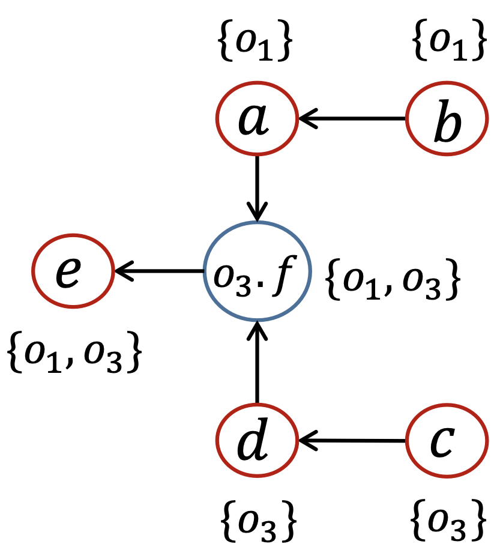</p>

## 7.4 带方法调用的指针分析

### 7.4.1 过程间分析与指针分析

过程间的指针分析需要调用图，我们之前调用图的构建方式是CHA，基于变量的声明类型来解析目标方法。不过这是极不精确的，因为CHA会引入很多虚假的调用边和指向关系。

而如果有了指针分析的话，我们就不必根据声明类型来解析目标方法，可以根据更精确的指向关系，即 $pt(x)$ 来解析目标方法了。而指针分析就会比CHA精确得多了，无论是在调用图构建还是在指向关系方面。

基于指针分析来构建调用图的过程中，反过来又会促进指针分析的过程，因为调用边和返回边也是会传递指向关系的，从而两者是相互依赖的，我们称这种调用图的构建方式为即时调用图构建（On-the-fly Call Graph Construction）。

::: definition 定义7.7
称边使用调用图，边构建调用图的方式为**即时调用图构建（On-the-fly Call Graph Construction）**。
:::

### 7.4.2 调用语句的规则

|类型|语句|规则|PFG边|
|:-:|:-:|:-:|:-:|
|调用|`l: r = x.k(a1, ..., an)`|$o_i\in pt(x), m=Dispatch(o_i, k)$<br/>$o_u\in pt(a_j), 1\le j\le n$<br/>$o_v\in pt(m_{ret})$<br/>$\overline{o_i\in pt(m_{this})}$<br/>$o_u\in pt(m_{p_j}), 1\le j\le n$<br/>$o_v\in pt(r)$|$a_1\to m_{p_1}$<br/>... ...<br/>$a_n\to m_{p_n}$<br/>$m_{ret}\to r$|

其中，
- $Dispatch(o_i, k)$ 是根据对象 $o_i$ 的类型来做虚方法 $k$ 的派发，从而准确的找到对象 $o_i$ 对应的目标方法。这个方法派发是绝对精确的，因为Dispatch算法是对运行时的模拟。这里影响精度的因素只有变量 $x$ 的指向集合内可能有不止一个指向对象。
- $m_{this}$ 是 $m$ 方法对应的 $this$ 变量；
- $m_{p_j}$ 是 $m$ 方法的第 $j$ 个形参；
- $m_{ret}$ 是存放 $m$ 方法返回值的变量。

比如说下面的例子：我们会建立3条PFG边，并且将 $o_i$ 赋给 `this` 。

<p style="text-align:center">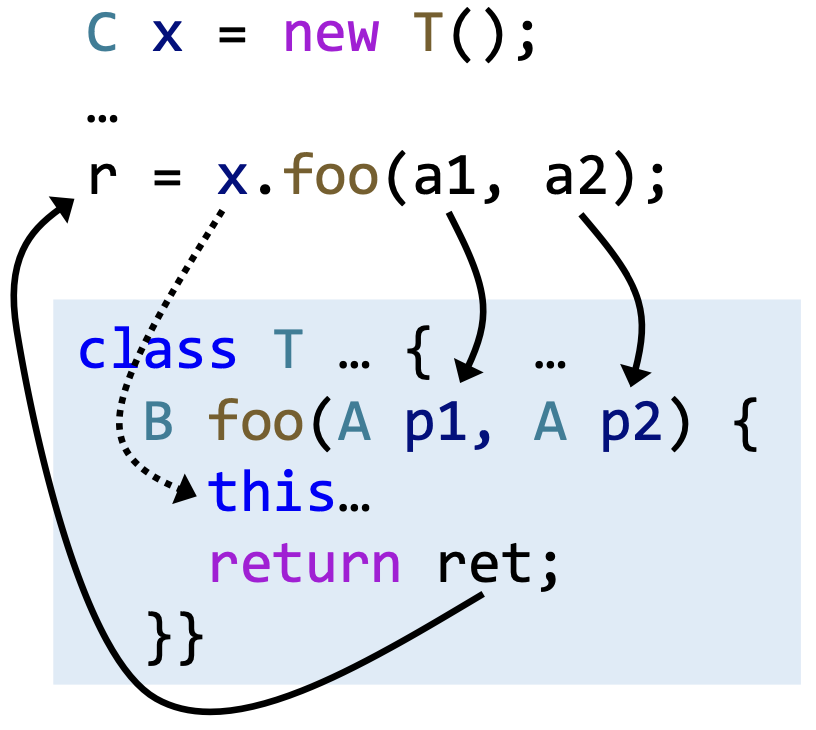</p>

这里需要再解释一下的问题是，我们为什么不添加 $x\to this$ 作为一条 PFG 边？

接收对象（Receiver Object）只应当流到对应目标方法的 `this` 变量中。比如说，如果 `x` 的指向集合里面有T类型的 $o_i$ ，以及C类型的 $o_j$ ，那么我们处理调用的时候，应当把 $o_i$ 赋给T类中的 `foo` 方法的 `this` 变量，把 $o_j$ 赋给C类中的 `foo` 方法的 `this` 变量。

如果我们在 `x` 和 `this` 之间建立了 `PFG` 边，那么 `x` 指向集中的所有对象都会流到 `this` 中，这会导致一个父类的对象流到子类的方法中，或者子类的对象流到父类的方法中（假设子类中存在目标实例方法），这是错误的，为 `this` 变量增加了虚假的指向关系，因此我们不添加 $x\to this$ 作为PFG边。

### 7.4.3 过程间的指针分析思路

过程间的指针分析是和调用图的构建一起进行的，也就是说，指针分析和调用图构建之间就像指针分析和指针流图构建之间一样，是相互依赖的。

调用图向我们描述了一个”可达的世界”：
- 入口方法（比如说 `main` 方法）是一开始就可达的；
- 其他的可达方法是在分析的过程中不断发现的；
- 只有可达的方法和语句才会被分析。

::: definition 定义7.8
称调用图中，**入口方法（Entry Methods）**以及从入口方法可达的其他结点为**可达方法（Reachable Methods）**。所有的可达方法构成了一个**可达调用子图（Reachable Sub-Call-Graph）**。
:::

其实我们平时所说的调用图，指的就是可达调用子图，对于控制流无法到达的其他方法，我们并不关心，也不必去分析。比如说我使用了一些库方法，这个库的类中有许许多多的方法，而我们不需要分析整个库，只需要分析我们的控制流可达的方法即可。

比如说下面这个例子， $m_6, m_7, m_8, m_9$ 就是不可达的方法，哪怕它们之间还有一些调用边之类的，我们也不关心了，因为程序的控制流不会经过那些边。

<p style="text-align:center"></p>

### 7.4.4 算法

#### 算法内容

**算法7.2** 过程间上下文不敏感的全程序指针分析算法

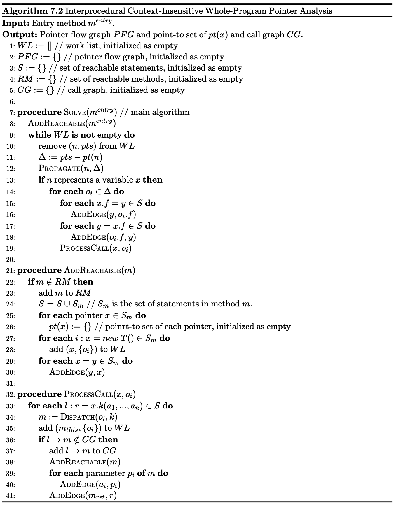

<!--
    \begin{algorithm}
    \caption{Interprocedural Context-Insensitive Whole-Program Pointer Analysis}
    \begin{algorithmic}
    \INPUT Entry method $m^{entry}$.
    \OUTPUT Pointer flow graph $PFG$ and point-to set of $pt(x)$ and call graph $CG$.
    \STATE $WL := []$ \COMMENT{work list, initialized as empty}
    \STATE $PFG := \{\}$ \COMMENT{pointer flow graph, initialized as empty}
    \STATE $S := \{\}$ \COMMENT{set of reachable statements, initialized as empty}
    \STATE $RM := \{\}$ \COMMENT{set of reachable methods, initialized as empty}
    \STATE $CG := \{\}$ \COMMENT{call graph, initialized as empty}
    \STATE
    \PROCEDURE{Solve}{$m^{entry}$} \COMMENT{main algorithm}
        \STATE \CALL{AddReachable}{$m^{entry}$}
        \WHILE{$WL$ \textbf{is not} empty}
            \STATE remove $(n, pts)$ from $WL$
            \STATE $\Delta := pts - pt(n)$
            \STATE \CALL{Propagate}{$n, \Delta$}
            \IF{$n$ represents a variable $x$}
                \FOR{\textbf{each} $o_i \in \Delta$}
                    \FOR{\textbf{each} $x.f = y \in S$}
                        \STATE \CALL{AddEdge}{$y, o_i.f$}
                    \ENDFOR
                    \FOR{\textbf{each} $y = x.f \in S$}
                        \STATE \CALL{AddEdge}{$o_i.f, y$}
                    \ENDFOR
                    \STATE \CALL{ProcessCall}{$x, o_i$}
                \ENDFOR
            \ENDIF
        \ENDWHILE
    \ENDPROCEDURE
    \STATE
    \PROCEDURE{AddReachable}{$m$}
        \IF{$m \notin RM$}
            \STATE add $m$ to $RM$
            \STATE $S = S \cup S_{m}$ \COMMENT{$S_m$ is the set of statements in method $m$.}
            \FOR{\textbf{each} pointer $x \in S_{m}$}
                \STATE $pt(x) := \{\}$ \COMMENT{poinrt-to set of each pointer, initialized as empty}
            \ENDFOR
            \FOR{\textbf{each} $i:x=new\ T()\in S_{m}$}
                \STATE add $(x, \{o_i\})$ to $WL$
            \ENDFOR
            \FOR{\textbf{each} $x=y\in S_{m}$}
                \STATE \CALL{AddEdge}{$y, x$}
            \ENDFOR
        \ENDIF
    \ENDPROCEDURE
    \STATE
    \PROCEDURE{ProcessCall}{$x, o_i$}
        \FOR{\textbf{each} $l: r = x.k(a_1, ..., a_n) \in S$}
            \STATE $m :=$ \CALL{Dispatch}{$o_i, k$}
            \STATE add $(m_{this}, \{o_i\})$ to $WL$
            \IF{$l \to m \notin CG$}
                \STATE add $l \to m$ to $CG$
                \STATE \CALL{AddReachable}{$m$}
                \FOR{\textbf{each} parameter $p_i$ \textbf{of} $m$}
                    \STATE \CALL{AddEdge}{$a_i, p_i$}
                \ENDFOR
                \STATE \CALL{AddEdge}{$m_{ret}, r$}
            \ENDIF
        \ENDFOR
    \ENDPROCEDURE
    \end{algorithmic}
    \end{algorithm}
-->

其中， `Propagate` 和 `AddEdge` 子过程同算法7.1，`Dispatch` 过程见算法5.1。


#### 算法分析

算法第21-30行的 `AddReachable(m)` 子过程是的作用是拓展可达调用子图，分为两步：
1. 添加新的可达的方法和语句（算法第22-24行）
2. 为新发现的语句更新工作表和指针流图（算法第25-30行）

这个子过程会在两种情况下被调用：
- 一开始的时候对入口方法调用（算法第8行）
- 当新的调用边被发现的时候对（算法第36-38行）

这个算法中另一个新的子过程是算法32-41行的 `ProcessCall(x, o_i)` ，它的主要作用就是实现7.4.2（第7讲，即本讲的4.2节）中的调用规则，基本步骤为：
1. 根据接收对象类型以及调用点处的方法签名作方法派发（第33-34行）
2. 即时（on-the-fly）构建调用图（第36-38行）
3. 传递参数和返回值（第39-41行）

#### 实例

比如说，对于下面的一段程序：

```java
class A {
    static void main() {
        A a = new A();
        A b = new B();
        A c = b.foo(a);
    }
    A foo(A x) {...}
}
class B extends A {
    A foo(A y) {
        A r = new A();
        return r;
    }
}
```

运行算法7.2，我们可以得到如下的结果（读者可以自行尝试在纸上手动算一遍这个算法，能够加深印象）：

<p style="text-align:center">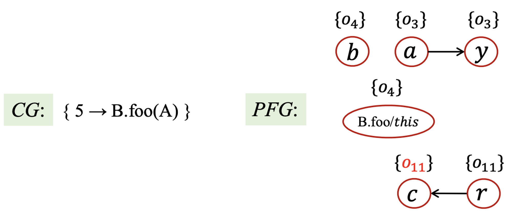</p>

## 7.5 自检问题

1. 指针分析的规则（Pointer Analysis Rules）是什么？
2. 如何理解指针流图（Pointer Flow Graph）？
3. 指针分析算法（Pointer Analysis Algorithms）的基本过程是什么？
4. 如何理解方法调用（Method Call）中指针分析的规则？
5. 怎样理解过程间的指针分析算法（Inter-procedural Pointer Analysis Algorithm）？
6. 即时调用图构建（On-the-fly Call Graph Construction）的含义是什么？

