# 8 指针分析-上下文敏感

## 8.1 引入

### 8.1.1 引例

首先，我们通过一个例子来看一下上下文不敏感的指针分析存在的问题。考虑如下的类结构：

```java
interface Number {
    int get();
}

class One implements Number {
    public int get() {
        return 1;
    }
}

class Two implements Number {
    public int get() {
        return 2;
    }
}
```

假设我们要对下面这段程序进行常量传播的分析：

```java
void main() {
    Number n1, n2, x, y;
    n1 = new One(); // o1
    n2 = new Two(); // o2
    x = id(n1);
    y = id(n2);
    int i = x.get();
}

Number id(Number n) {
    return n;
}
```

变量 $i$ 在常量传播分析中的结果是？

如果我们进行上下文不敏感的指针分析，最终我们得到的PFG如下：

<p style="text-align:center">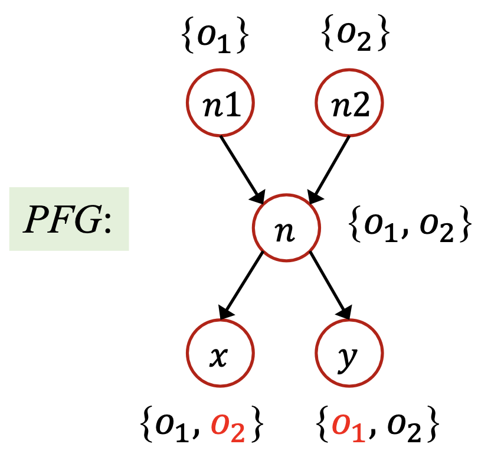</p>

从而，分析 `x.get()` 时会对两个可能的接收对象分别调用 `get` 方法，从而得到结果为1或2，即 $i$ 的常量传播分析结果为 NAC，这是错误的。

错误的原因是，由于我们不区分上下文，导致对于 `id` 方法的所有调用会汇合到一处，从而丢失了精度，造成了后续指针的指向集合当中存在假的积极值（False Positive）。

但如果我们进行上下文敏感的分析，则最终得到的PFG如下：

<p style="text-align:center">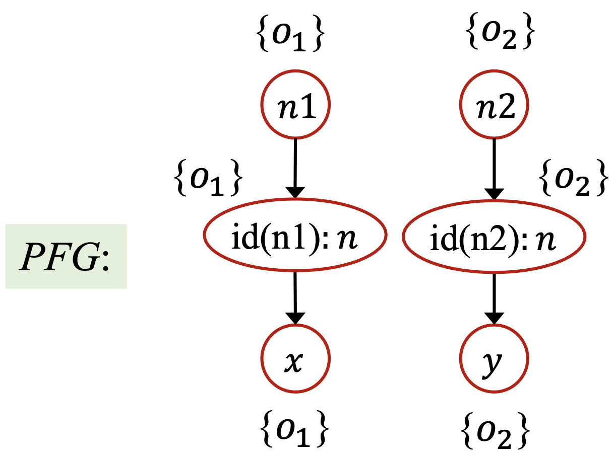</p>

于是，分析 `x.get()` 只会对接收对象 $o_1$ 调用目标方法，从而 $i$ 的常量传播分析结果为 $i = 1$ ，这是准确的。

### 8.1.2 上下文不敏感与上下文敏感

关于上下文敏感与不敏感的基本概念参见定义6.6以及6.3.2节的相关内容。

上下文不敏感的分析的精度丢失主要是由于下面一些原因：
- 在动态执行的过程中，每一个方法可能在不同的调用语境中被调用多次。
- 在不同的调用语境下面，方法中的变量可能会指向不同的对象。
- 在上下文不敏感的指针分析中，不同的上下文被混合在了一起，并传递给程序的其他部分（通过返回值或者副作用），这就导致了虚假的数据流。
    - 比如说上面的引例，其上下文不敏感的分析结果中， $pt(x)$ 中的 $o_2$ 和 $pt(y)$ 中的 $o_1$ 都是虚假的指向对象，从而给常量传播分析造成了虚假的数据流。

::: conclusion 结论8.1
上下文敏感通过区分不同语境下的不同数据流来模拟调用上下文，从而提高精度。
:::

最古老的，也是最为人熟知的上下文敏感策略是调用点敏感（也称为调用串），用一连串的调用点来表示上下文，即：本方法的调用点、调用者的调用点、调用者的调用者的调用点...... 调用点敏感其实就是对动态执行过程中调用栈的抽象，这里我们有个直觉上的印象就好，因为我们后面会以它为例去讲解规则和算法。具体的各种上下文敏感策略的形式化的定义会在8.4（这一讲的第4节）中详细讲解。

比如说之前的引例，方法 `id(Number)` 有两个上下文，`[5]` 和 `[6]`。

#### 基于克隆的上下文敏感

::: definition 定义8.1
定义**基于克隆的上下文敏感的指针分析（Cloning-based Context-sensitive Pointer Analysis）**为满足以下3个条件的指针分析：
- 每个方法都被一个或者多个上下文修饰；
- 变量也被上下文修饰（继承自声明该变量的方法）；
- 对于每个上下文，都会恰有一个方法及该方法中的变量的克隆。
:::

基于克隆的上下文敏感分析是实现上下文敏感最直接的方法，就像我们在引例中所做的那样，我们将两个不同上下文中的 `id` 方法用两个结点表示，在前面分别用其上下文修饰。

### 8.1.3 上下文敏感的堆

在6.3.1节中，我们讨论了指针分析四大要素中的的堆抽象，当时我们提出的抽象策略是分配点抽象，将同一分配点处产的所有对象抽象成一个对象。

而现在，分配点处的变量已经上下文敏感了，那么分配点处分配的对内存也应该是上下文敏感的，这样可以细化堆内存抽象的粒度，从而提高指针分析的精度。

并且，面向对象语言（比如说Java）本身就是典型的堆密集型（heap-intensive）语言，会频繁地操作堆内存。

在实践中，为了提升精度，上下文敏感也应当被应用到堆抽象中。
- 抽象的对象也应当用上下文来修饰（称为堆上下文），最普遍的选择是继承该对象分配点所在方法的上下文。
- 上下文敏感的堆抽象在分配点抽象的基础上提供了一个粒度更精确的堆模型。

<p style="text-align:center">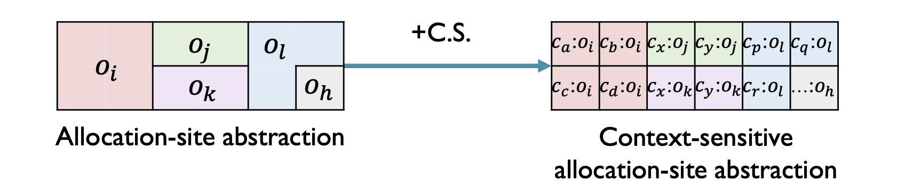</p>

::: definition 定义8.2
称区分 **堆上下文（Heap Context）** 的分配点抽象为 **上下文敏感的分配点抽象（Context-sensitive Allocation-site Abstraction）** 。
:::

那么，为什么上下文敏感的堆抽象能够提升精度呢？
- 在动态执行的过程中，一个分配点可以在不同的调用语境下创建多个对象；
- 不同的对象（有相同的分配点分配）可能会携带不同的数据流被操作，比如说在它们的字段中存储不同的值。
- 在指针分析中，不带堆上下文分析这样的代码可能会由于合并不同上下文中的数据流到一个抽象对象中而丢失精度。
- 相比之下，通过堆上下文来区分同一个分配点的不同对象能够获得不少的精度。

比如对于下面这个例子：

```java
n1 = new One();
n2 = new Two();
x1 = newX(n1);
x2 = newX(n2);
n = x1.f;

X newX(Number p) {
    X x = new X();
    x.f = p;
    return x;
}
class X {
    Number f;
}
```

我们对上面的程序作3次指针分析进行对比，分别是：上下文敏感，不考虑堆上下文、上下文敏感，考虑堆上下文、上下文不敏感，考虑堆上下文。

<p style="text-align:center">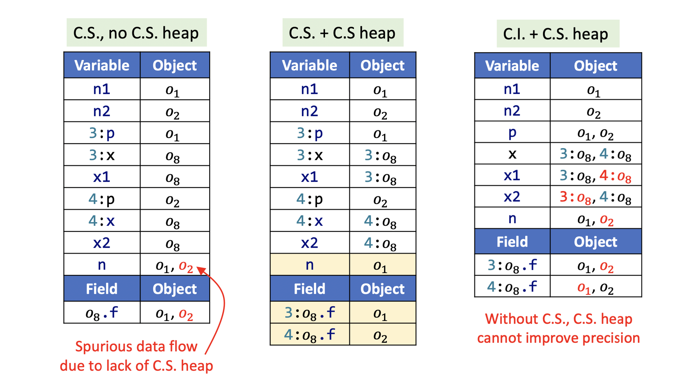</p>

从第一次分析中，我们会发现，在将 $3:p$ 和 $4:p$ 合并给 $o_8$ 的时候造成了虚假的数据流，从而导致了对 $n$ 分析的误差。

在第二次分析中，我们可以看到，考虑了堆上下文之后，第一次分析的问题就被解决了，我们分别考虑了在程序第8行分配点处分配的两个对象，用分配点的上下文修饰（这里上下文暂定为调用点的位置），即 $3:o_8$ 和 $4:o_8$ ，从而避免了数据流合并带来的精度丢失。

而第三次分析告诉我们，在不考虑调用上下文的情况下单单考虑堆上下文是无法提高精度的，因为堆上下文是由于调用上下文而产生的。

## 8.2 上下文敏感的指针分析规则

和7.1一样，我们将用一系列推导式的形式来形式化地定义上下文敏感的指针分析规则。

### 8.2.1 定义和记号

为了表示方便，我们依然是要引入一些记号的，表示方法和7.1.1类似，这里我就直接列出，不加赘述了。

|内容|记号|
|:-:|:-:|
|上下文（Context）|$c, c', c'' \in C$|
|上下文敏感方法（C.S. Methods）|$c:m\in C\times M$|
|上下文敏感变量（C.S. Variables）|$c:x, c':y \in C\times V$|
|上下文敏感对象（C.S. Objects）|$c:o_i, c':o_j\in C\times O$|
|字段（Fields）|$f, g\in F$|
|实例字段（Instance Fields）|$c:o_i.f, c':o_j.g \in C\times O\times F$|
|上下文敏感指针（C.S. Pointers）|$CSPointer \subseteq (C\times V)\cup(C\times O\times F)$|
|指向关系（Points-to Relations）|$pt: CSPointer \to P(C\times O)$|

其中，$M$ 是程序中所有方法的集合， $V$ 是程序中所有变量的集合， $O$ 是程序中会产生的所有对象的集合。 $P(S)$ 表示集合 $S$ 的幂集， $f: S_1 \to S_2$ 表示从集合 $S_1$ 到集合 $S_2$ 的映射，满足 $f \subseteq S_1 \times S_2$ 。

### 8.2.2 规则

先看前4种基本的指针影响型语句（见定义6.9）：

|类型|语句|规则（在上下文 $c$ 下）| 图示|
|:-:|:-:|:-:|:-:|
|创建|`i: x = new T()`| $\overline{c:o_i \in pt(c:x)}$|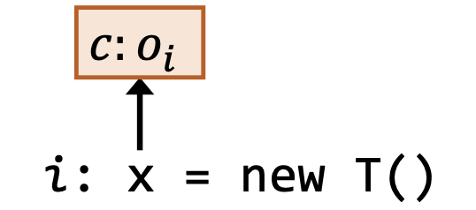|
|赋值|`x = y`|$\underline{c':o_i\in pt(c:y)}$<br/>$c':o_i \in pt(c:x)$|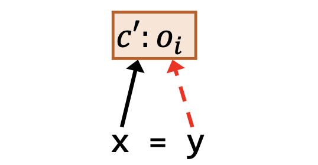|
|存储|`x.f = y`|$\underline{c':o_i\in pt(c:x), c'':o_j\in pt(c:y)}$<br/>$c'':o_j\in pt(c':o_i.f)$|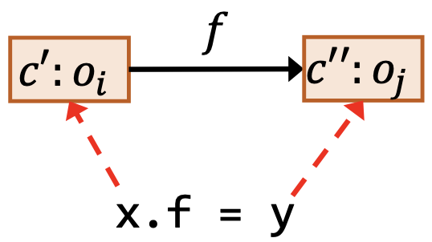|
|载入|`y = x.f`|$\underline{c':o_i\in pt(c:x), c'':o_j\in pt(c':o_i.f)}$<br/>$c'':o_j\in pt(c:y)$|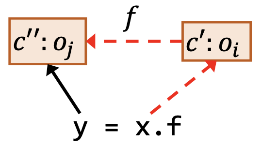|

其中，和上一讲一样，红色虚线依然表示作为前提条件的指向关系，黑色实线依然表示作为结论的指向关系。

前面四个语句其实和上下文不敏感的规则除了在指针和对象面前增加了上下文的修饰以外别无二致。

不过调用语句就又些别的区别了，因为调用语句除了在原本上下文不敏感的规则之上增加了上下文之外，还有负责被调用者上下文的生成，我们用 `Select` 函数来表示调用者根据调用点处的信息生成被调用者上下文的过程。

|类型|语句|规则（在上下文 $c$ 下）|
|:-:|:-:|:-:|
|调用|`l: r = x.k(a1, ..., an)`|$c':o_i\in pt(c:x),$<br/>$m = Dispatch(o_i, k), c^t = Select(c, l, c':o_i)$<br/>$c'':o_u\in pt(c:a_j), 1\le j\le n$<br/>$\underline{c''':o_v\in pt(c^t:m_{ret})}$<br/>$c':o_i\in pt(c^t:m_{this})$<br/>$c'':o_u\in pt(c^t:m_{p_j}), 1\le j\le n$<br/>$c''':o_v\in pt(c:r)$|

其中， $c$ 是调用者的上下文， $c^t$ 是被调用者，即目标方法的上下文， $c^t:m_{this}$ 是方法 $c^t:m$ 的 `this` 变量， $c^t:m_{p_j}$ 是方法 $c^t:m$ 的第j个形参， $c^t:m_{ret}$ 是存放 $c^t:m$ 返回值的变量。

-  $Dispatch(o_i, k)$ 和上一讲一致，根据 $o_i$ 的类型对虚调用 $k$ 做方法派发，从而获得一个目标方法。
-  $Select(c, l, c':o_i)$ 根据在调用点 $l$ 处可获得的信息为目标方法 $m$ 选择一个上下文，即目标上下文的生成函数。
    -  `Select` 的输入是调用点 $l$ 、调用点处的上下文 $c$ 、接收对象 $c':o_i$；
    - `Select` 的输出是目标方法的的上下文 $c^{t}$ 。

<p style="text-align:center">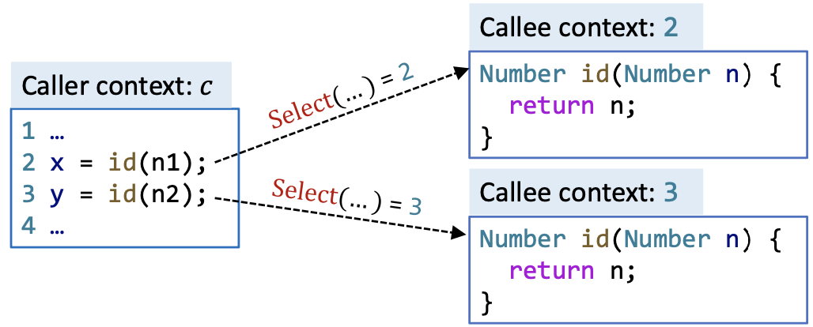</p>

> 关于 `Select` ，我们暂时将其视为一个抽象，详细的内容，我们会在第4部分具体讨论。

## 8.3 上下文敏感的指针分析算法

### 8.3.1 实现思路

再上一讲中，我们是通过构建指针流图、在指针流图上传递指向信息这两个步骤相互依赖的方式来进行上下文不敏感的指针分析的。上下文敏感的指针分析我们也是采用类似的思路，只不过对于PFG上的结点以及指向集中的对象，我们会用上下文修饰来加以区分，不同修饰下的变量或者对象都有单独的一份克隆。

<p style="text-align:center">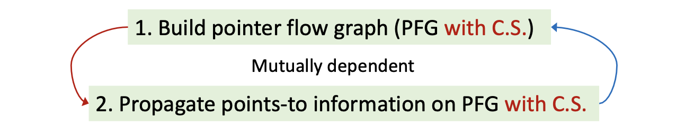</p>

::: definition 定义8.3
**上下文敏感的指针流图（Pointer Flow Graph with C.S.）** 是一个有向图，表达了不同堆上下文下的对象是怎样在不同调用上下文下的变量之间流动的。

- PFG中的结点 $n$ 代表了一个上下文敏感的变量或者一个上下文敏感的对象的某个字段，即程序中的被上下文修饰的指针。

$$n \in CSPointer \subseteq (C\times V)\cup(C\times O\times F)$$

- PFG中的边 $x\to y \in CSPointer \times CSPointer$ 表示指针 $x$ 指向的对象可能会流向指针 $y$ 的指向集合。

其中， $C$ 表示所有上下文的集合， $V$ 表示所有变量的集合， $O$ 表示左右对象的集合， $F$ 表示所有字段的集合。
:::

比如说下面这个例子中，PFG-C.S.中包含了两个方法 `id` 中变量 `n` 的结点，每个上下文各有一个节点。

<p style="text-align:center">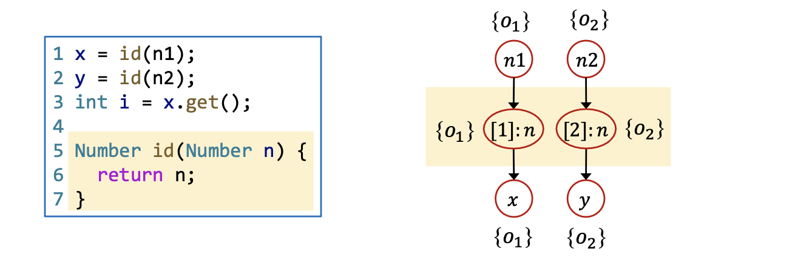</p>

> 为了表达简洁，本讲后续的PFG都默认是上下文敏感的PFG。

|类型|语句|规则（在上下文 $c$ 下）|PFG边|
|:-:|:-:|:-:|:-:|
|创建|`i: x = new T()`| $\overline{c:o_i \in pt(c:x)}$|$N/A$|
|赋值|`x = y`|$\underline{c':o_i\in pt(c:y)}$<br/>$c':o_i \in pt(c:x)$|$c:y \to c:x$|
|存储|`x.f = y`|$\underline{c':o_i\in pt(c:x), c'':o_j\in pt(c:y)}$<br/>$c'':o_j\in pt(c':o_i.f)$|$c:y \to c':o_i.f$|
|载入|`y = x.f`|$\underline{c':o_i\in pt(c:x), c'':o_j\in pt(c':o_i.f)}$<br/>$c'':o_j\in pt(c:y)$|$c':o_i.f\to c:y$|
|调用|`l: r = x.k(a1, ..., an)`|$c':o_i\in pt(c:x),$<br/>$m = Dispatch(o_i, k), c^t = Select(c, l, c':o_i)$<br/>$c'':o_u\in pt(c:a_j), 1\le j\le n$<br/>$\underline{c''':o_v\in pt(c^t:m_{ret})}$<br/>$c':o_i\in pt(c^t:m_{this})$<br/>$c'':o_u\in pt(c^t:m_{p_j}), 1\le j\le n$<br/>$c''':o_v\in pt(c:r)$|$c:a_1\to c^t:m_{p_1}$<br/>$... ...$<br/>$c:a_n \to c^t:m_{p_n}$<br/>$c^t:m_{ret}\to r$|

### 8.3.2 算法

**算法8.1** 过程间上下文敏感的全程序指针分析算法

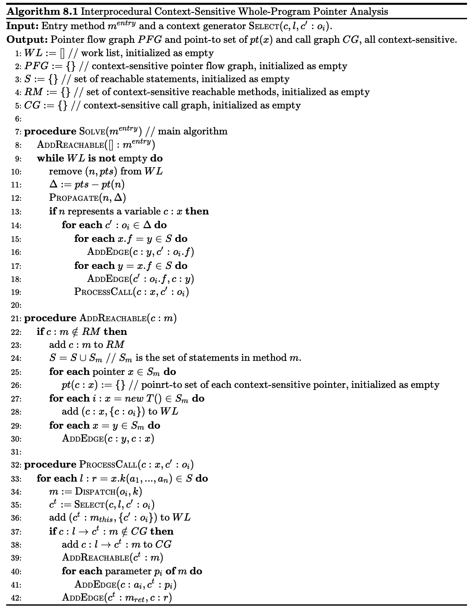

<!--
    \begin{algorithm}
    \caption{Interprocedural Context-Sensitive Whole-Program Pointer Analysis}
    \begin{algorithmic}
    \INPUT Entry method $m^{entry}$ and a context generator \CALL{Select}{$c, l, c':o_i$}.
    \OUTPUT Pointer flow graph $PFG$ and point-to set of $pt(x)$ and call graph $CG$, all context-sensitive.
    \STATE $WL := []$ \COMMENT{work list, initialized as empty}
    \STATE $PFG := \{\}$ \COMMENT{context-sensitive pointer flow graph, initialized as empty}
    \STATE $S := \{\}$ \COMMENT{set of reachable statements, initialized as empty}
    \STATE $RM := \{\}$ \COMMENT{set of context-sensitive reachable methods, initialized as empty}
    \STATE $CG := \{\}$ \COMMENT{context-sensitive call graph, initialized as empty}
    \STATE
    \PROCEDURE{Solve}{$m^{entry}$} \COMMENT{main algorithm}
        \STATE \CALL{AddReachable}{$[]:m^{entry}$}
        \WHILE{$WL$ \textbf{is not} empty}
            \STATE remove $(n, pts)$ from $WL$
            \STATE $\Delta := pts - pt(n)$
            \STATE \CALL{Propagate}{$n, \Delta$}
            \IF{$n$ represents a variable $c:x$}
                \FOR{\textbf{each} $c':o_i \in \Delta$}
                    \FOR{\textbf{each} $x.f = y \in S$}
                        \STATE \CALL{AddEdge}{$c:y, c':o_i.f$}
                    \ENDFOR
                    \FOR{\textbf{each} $y = x.f \in S$}
                        \STATE \CALL{AddEdge}{$c':o_i.f, c:y$}
                    \ENDFOR
                    \STATE \CALL{ProcessCall}{$c:x, c':o_i$}
                \ENDFOR
            \ENDIF
        \ENDWHILE
    \ENDPROCEDURE
    \STATE
    \PROCEDURE{AddReachable}{$c:m$}
        \IF{$c:m \notin RM$}
            \STATE add $c:m$ to $RM$
            \STATE $S = S \cup S_{m}$ \COMMENT{$S_m$ is the set of statements in method $m$.}
            \FOR{\textbf{each} pointer $x \in S_{m}$}
                \STATE $pt(c:x) := \{\}$ \COMMENT{poinrt-to set of each context-sensitive pointer, initialized as empty}
            \ENDFOR
            \FOR{\textbf{each} $i:x=new\ T()\in S_{m}$}
                \STATE add $(c:x, \{c:o_i\})$ to $WL$
            \ENDFOR
            \FOR{\textbf{each} $x=y\in S_{m}$}
                \STATE \CALL{AddEdge}{$c:y, c:x$}
            \ENDFOR
        \ENDIF
    \ENDPROCEDURE
    \STATE
    \PROCEDURE{ProcessCall}{$c:x, c':o_i$}
        \FOR{\textbf{each} $l: r = x.k(a_1, ..., a_n) \in S$}
            \STATE $m :=$ \CALL{Dispatch}{$o_i, k$}
            \STATE $c^t :=$ \CALL{Select}{$c, l, c':o_i$}
            \STATE add $(c^t: m_{this}, \{c':o_i\})$ to $WL$
            \IF{$c:l \to c^t:m \notin CG$}
                \STATE add $c:l \to c^t:m$ to $CG$
                \STATE \CALL{AddReachable}{$c^t:m$}
                \FOR{\textbf{each} parameter $p_i$ \textbf{of} $m$}
                    \STATE \CALL{AddEdge}{$c:a_i, c^t:p_i$}
                \ENDFOR
                \STATE \CALL{AddEdge}{$c^t:m_{ret}, c:r$}
            \ENDIF
        \ENDFOR
    \ENDPROCEDURE
    \end{algorithmic}
    \end{algorithm}
-->

其中， `Propagate` 和 `AddEdge` 子过程同算法7.1，`Dispatch` 过程见算法5.1。

对比算法7.2可以发现，算法8.1只是在算法7.2的基础上增加了上下文敏感的内容，更具体的，只是在指针和对象之前加上了上下文的修饰，并在调用语句的处理当中增加了新上下文的生成（见算法第35行）而已，整体的思路和框架没有发生任何变化。详细的分析同7.3.2以及7.4.4.2，这里不作赘述。

其中，需要注意以下的是我们设置入口方法的上下文为空（见算法第8行），因为一般情况下程序只有一个入口。

## 8.4 上下文敏感性的各种变体

在8.2.2节的最后，我们埋了一个抽象，就是 `Select` 函数，包括在算法8.1中，我们也将这个抽象的 `Select` 作为了我们算法的输入。在这个小节，我们将剥开 `Select` 的抽象，讨论几种常见的上下文敏感性的变体。

### 8.4.1 关于上下文敏感性

::: definition 定义8.4
定义一个指针分析的 **上下文敏感性（Context Sensitivity）** 为一个 **上下文生成子（Context Generator）** ，记为 $Select(c, l, c':o_i)$ ，描述了实例方法调用的时候用怎样的上下文去修饰目标方法。

- `Select` 函数的输入是调用点处的上下文 $c$ ，调用点 $l$ ，以及调用方法的带有堆上下文的接收对象 $c':o_i$ 。
- `Select` 函数的输出是用于修饰目标方法上下文。

:::

> 简单理解， `Selective` 函数是从调用者上下文（Caller Context）到被调用者上下文（Callee Context）的映射。

::: definition 定义8.5
如果对于不同的输入，`Select` 给出了相同的输出，称这种现象为**上下文重叠（Context Overlap）**。
:::

::: conclusion 结论8.2
如果 `Select` 输出的目标方法的上下文是和现有的所有的该方法的上下文不同的话，我们就 **发现了一个新的上下文敏感的可达方法（discover a new context-sensitive reachable method）** ，否则我们将会和现有的同名且同上下文的方法进行合并。

从而，我们可以直观的感受到：

- 如果 `Select` 经常出现上下文重叠，指针分析的精度会受损，相应的，速度会提高；
- 如果 `Select` 偶尔出现上下文重叠，指针分析的精度会提高，相应的，速度会减缓。
:::

基于上述定义和结论，我们可以形式化地定义出什么是上下文不敏感分析：

::: definition 定义8.6
定义**上下文不敏感（Context InSensitivity）**：

$$
Select(\underline{\ }, \underline{\ }, \underline{\ }) = []
$$

:::

下面，我们将会讨论几种不同的 `Select` 函数，比较它们之间精度和速度上的区别。

### 8.4.2 调用点敏感

::: definition 定义8.7
定义**调用点敏感（Call-Site Sensitivity）**：

$$
c = [l', ..., l''] \Longrightarrow Select(c, l, \underline{\ }) = [l', ..., l'', l]
$$

调用点敏感也称为**调用串敏感（Call-String Sensitivity）**。
:::

不过，定义8.7给出的 `Select` 函数在实践中是会出问题的。

考虑递归调用，因为我们的分析是流不敏感的，在分析递归调用的时候不会有所谓的基础情况（Base Case）的概念，从而一旦碰到递归，定义8.7中的 `Select` 函数就会构建出一个无穷的调用串，从而使得我们的指针分析算法无法终止。

从而，我们会对调用串的长度进行认为的限制，以保证指针分析的算法能够终止。并且过长的调用串也会破坏我们的指针分析算法，因为递归调用的调用串是无意义的一长串相同的调用点。

我们的处理方法是为上下文的长度设置一个上界，比如说 $k$ （k-Limiting Context Abstraction）。
- 对于调用点敏感，每个上下文都由调用串的最后 $k$ 个调用点组成；
- 在实际操作中， $k$ 是一个小数字，通常不超过3；
- 方法上下文和堆上下文可能会使用不同的k。
    - 比如说方法上下文的 $k = 2$ ，堆上下文的 $k = 1$ 之类的。

::: definition 定义8.8
定义**k-调用点敏感（k-Call-Site Sensitivity）**：

$$
c = [l_1, l_2, ..., l_k] \Longrightarrow Select(c, l, \underline{\ }) = [l_2, ..., l_k, l]
$$

k-调用点敏感也称为**k-控制流分析（k-CFA, Control Flow Analysis）**。
具体地：
- 1-调用点敏感

$$Select(\underline{\ }, l, \underline{\ }) = [l]$$

- 2-调用点敏感

$$c = [l', l''] \Longrightarrow Select(c,l,\underline{\ }) = [l'', l]$$

:::

下面我们以 `1-Call-Site` 为例，用下面的例子来跑一下算法8.1。

```java
class C {
    static void main() {
        C c = new C();
        c.m();
    }

    Number id(Number n) {
        return n;
    }
    void m() {
        Number n1, n2, x, y;
        n1 = new One();
        n2 = new Two();
        x = this.id(n1);
        y = this.id(n2);
        x.get();
    }
}
```

其中，关于 `Number` 、 `One` 、 `Two` 的类结构和引例中相同。为了简单起见，我们不考虑堆上下文，且忽略 `C.id(Number)` 方法中的 `this` 变量。

最终，我们得到的结果为如下，在这个例子中，我们通过区分上下文的方式成功的避免了对象数据流的汇合（对比8.1.1的引例）：

<p style="text-align:center">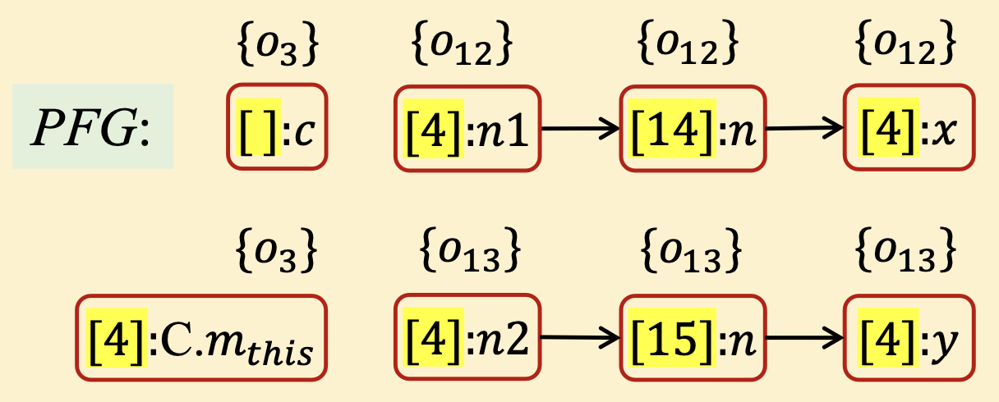</p>

### 8.4.3 对象敏感

::: definition 定义8.9
定义**对象敏感（Object Sensitivity）**：

$$
c' = [o_j, ..., o_k] \Longrightarrow Select(\underline{\ }, \underline{\ }, c':o_i) = [o_j, ..., o_k, o_i]
$$

对象敏感也称作**分配点敏感（Allocation-Site Sensitivity）**。
:::

对象敏感中的上下文由一组抽象对象（由它们的分配点表示）组成。
- 在方法调用的时候，使用接收对象以及接收对象的堆上下文作为被调用者的上下文（就像定义8.9中所形式化定义的那样）；
- 根据不同的对象来区分不同的数据流操作，因为流动的数据往往都是由对象携带的（至少对于OO语言来说这是很常见的）。

和调用点敏感类似的，我们可以通过限制上下文的尺寸来牺牲一部分精度，从而提高效率，并且避免由于递归导致的不可终止问题。

::: definition 定义8.10
定义**k-对象敏感（k-Object Sensitivity）**：

$$
c' = [o_1, ..., o_k] \Longrightarrow Select(\underline{\ }, \underline{\ }, c':o_i) = [o_2, ..., o_k, o_i]
$$

特别地，1-对象敏感：

$$
Select(\underline{\ }, \underline{\ }, c':o_i) = [o_i]
$$

:::

我们通过下面这个例子来对比一下调用点敏感和对象敏感。

```java
a1 = new A();
a2 = new A();
b1 = new B();
b2 = new B();
a1.set(b1);
a2.set(b2);
x = a1.get();

class A {
    B f;
    void set(B b) {
        this.doSet(b);
    }
    void doSet(B p) {
        this.f = p;
    }
    B get() {
        return this.f;
    }
}
```

对上述程序分别做1-对象敏感分析和1-调用点敏感分析，我们会得到如下结果：

<p style="text-align:center">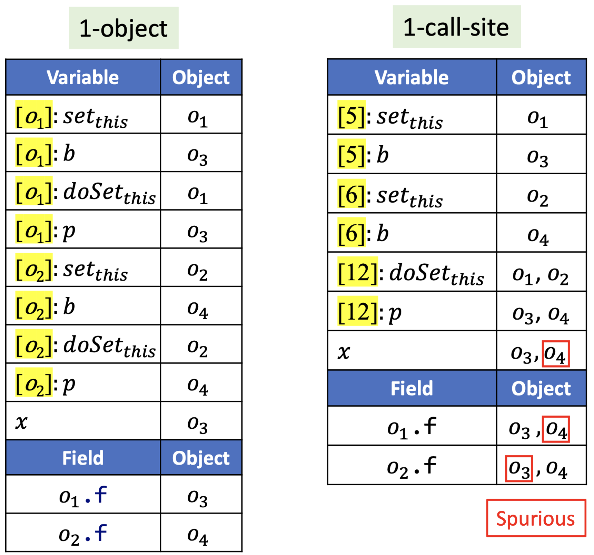</p>

在这个例子中，我们发现，同一个调用点接收对象不同的时候被调用函数的上下文也是不同的，因此，有些时候对象敏感要比调用点敏感更精确。从调用图上我们可以更直观的看出这一点。

<p style="text-align:center">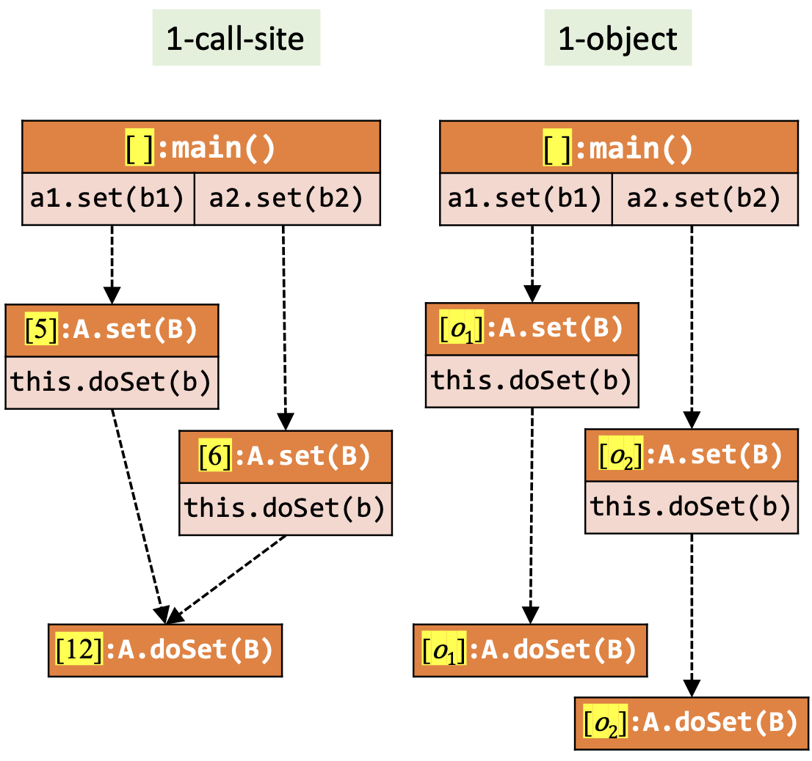</p>

类似的，同一个接收对象在不同的调用点处被调用函数的上下文其实也是不同的，所以，有些时候调用点敏感也会被比对象敏感更精确。

其实，在理论上，调用点敏感和对象敏感的精度是不可比的，因为它们各自有各自准的场景和不准的场景，而对于一个程序来说，各种场景的比例是不确定的东西，所以这两种上下文敏感的精度比较也就没有定论了。

不过，在实践过程中，对于面向对象语言（比如说Java）来说，对象敏感的整体表现要由于调用点敏感，因为使用面向对象语言编程的时候我们会频繁地使用对象来传递数据，从而对象敏感能够更好的避免数据流的合并，从而提升精度。

### 8.4.4 类型敏感

::: definition 定义8.11
定义**类型敏感（Type Sensitivity）**

$$
c' = [t', ..., t''] \Longrightarrow Select(\underline{\ }, \underline{\ }, c':o_i) = [t', ..., t'', InType(o_i)]
$$

其中，$InType(o_i)$ 表示 $o_i$ 是在哪个类中被创建的。
:::

类型敏感的上下文由一组类型组成，在方法调用的时候，用接收对象的分配点所在的类（注意是分配点所在类，而不是对象本身的类型）以及该对象的堆上下文作为被调用者的上下文。

类型敏感其实是对对象敏感的一种更粗糙的抽象（Coarser Abstraction），因为我们用接收对象分配点所在的类代替了接收对象作为上下文，这是一种更粗糙的做法。

类似的，我们也可以定义k-类型敏感来限制冗长的上下文。

::: definition 定义8.12
定义**k-类型敏感（k-Type Sensitivity）**：

$$
c' = [t_1, ..., t_k] \Longrightarrow Select(\underline{\ }, \underline{\ }, c':o_i) = [t_2, ..., t_k, InType(o_i)]
$$

其中，$InType(o_i)$ 表示 $o_i$ 是在哪个类中被创建的。
:::

在相同的 $k$ 限制下，类型敏感不会比对象敏感更加精确，因为类型敏感是对对象敏感更粗糙的抽象。和对象敏感相比，类新敏感通过牺牲精度的方式来换取了更好的性能，它将同一个类型中的各个分配点在上下文中合并了。

### 8.4.5 对比

下面我们给一组数据来对比一下前面三种上下文敏感的策略：

<p style="text-align:center">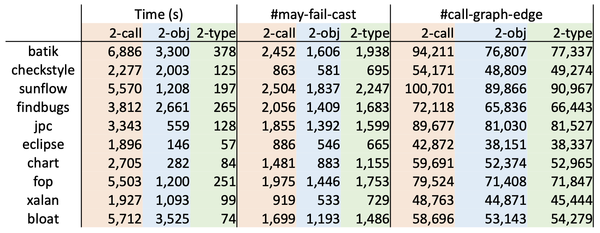</p>

> 数据来源：Yue Li, Tian Tan, Anders Møller, and Yannis Smaragdakis. “A Principled Approach to
Selective Context Sensitivity for Pointer Analysis”. TOPLAS 2020.

表中的数字越小越好，对于时间和可能错误的类型转换来说自然是越少越好；对于调用边，因为我们做的是饱和估计（见定义1.3）和可能性分析（见定义3.2），因此输出集越小说明我们的答案越精确。

从上表中，我们可以得出结论：

::: conclusion 结论8.3
通常，在面向对象语言的实践过程中：
- 精度方面：
    - 对象敏感 > 类型敏感 > 调用点敏感
- 效率方面：
    - 类型敏感 > 对象敏感 > 调用点敏感
:::

## 8.5 自检问题

1. 上下文敏感（Context Sensitivity, C.S.）是什么？
2. 上下文敏感堆（C.S. Heap）是什么？
3. 为什么 C.S. 和 C.S. Heap 能够提高分析精度？
4. 上下文敏感的指针分析有哪些规则？
5. 如何理解上下文敏感的指针分析算法（Algorithm for Context-sensitive Pointer Analysis）？
6. 常见的上下文敏感性变体（Context Sensitivity Variants）有哪些？
7. 常见的几种上下文变体之间的差别和联系是什么？

