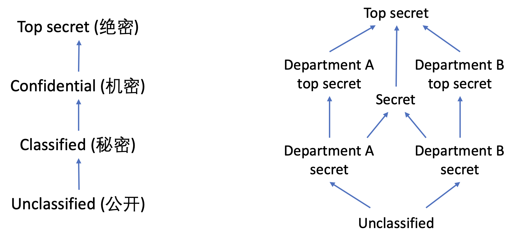
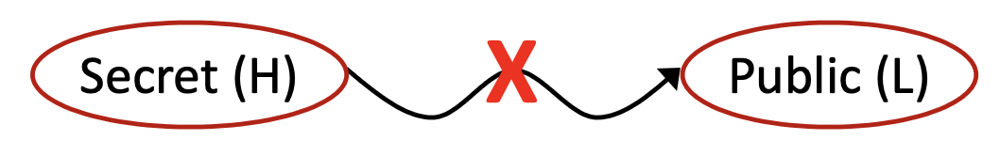
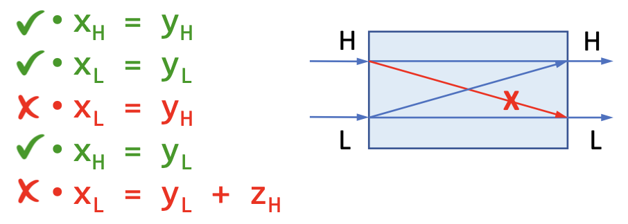
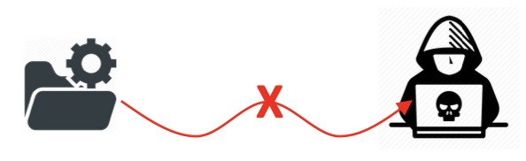
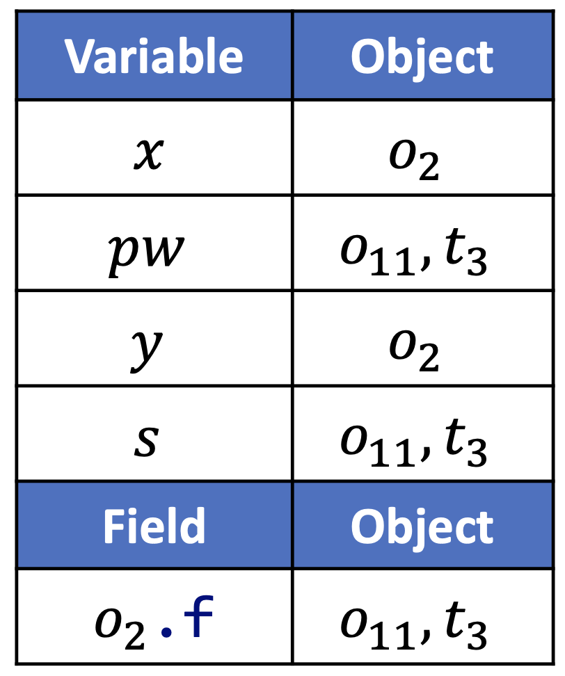

# 9 静态分析与安全

## 9.1 信息流安全

### 9.1.1 关于安全

::: definition 定义9.1
称一个系统是 **安全的（secure）** ，如果它能够在存在 **对手（adversaries）** 的情况下达成原本的目标。
:::

比如说，在现实生活中，我们可以称自己是安全的，如果我们能够在存在小偷和罪犯的情况下保持自己的生命和财产安全。在数字世界中，如果某个系统能够在骇客以及数字攻击者存在的情况下保证服务的可靠性（Dependability）以及数据的安全性（Data Safety），那么我们或许就可以认为这个系统是相对安全的。

在[前十大网络应用安全风险](https://owasp.org/)中，排名第一的是注入(Injection)，排名第三的是敏感信息曝露（Sensitive Data Exposure）。在2013-2019年被披露的[漏洞](https://nvd.nist.gov/)中，注入排到了第一，信息泄漏（Information Leaks）排到了第四。

这注入攻击与信息信息泄漏都和程序中的信息流有关。

### 9.1.2 研究信息流的动机

在我们使用程序的时候，比如说微信，有一些敏感的信息，比如说密码，我们希望它能够正常的传递到微信的服务器去，但是不希望它传递到其他的主体，比如说黑客那里去。

如果我们能够阻止我们不想要的信息流（比如说流向攻击者的信息流），那么我们就可以保护信息安全了。这是我们讨论信息流安全的动机。

### 9.1.3 访问控制和信息流安全

::: definition 定义9.1
**访问控制（Access Control）** 是指对于特定的信息检查请求访问该信息的程序是否具有相应的权限（rights）或者是否得到了相应的许可（permissions）。
:::

访问控制是一种标准的保护敏感信息的方式，它关心的是信息是被怎样的主体访问的。不过，这个主体访问到了信息之后会干什么，就不在访问控制的管辖范畴了。

这个时候，如果只有访问控制的话，其实还是会出问题的。我们不妨假设访问控制能够做到绝对的控制，这样的话，访问到敏感信息的一定是一个受信任的主体，我们大概能够认为这个受信任的主体主观上并不希望泄漏信息，但是我们并不能保证它客观上并没有泄漏信息。毕竟，程序总是有可能会有bug的。

::: definition 定义9.2
**信息流安全（Information Flow Security）** 是指通过追踪信息是如何在程序中流动的方式，来确保程序安全地处理了它所获得的信息。
:::

信息流安全关心的是信息是如何被传播的。一个实用的系统既需要访问控制，也需要流控制来满足它的所有安全需求。

### 9.1.4 信息流与安全等级

::: definition 定义9.3
如果变量 $x$ 中的信息转移到了变量 $y$ 中，则存在 **信息流（Information Flow）** $x \to y$ 。
:::

其实这个看起来很像指针分析中的指针流，一个指针指向的对象会流到另一个指针的指向集中。

那么信息流和安全有什么联系呢？我们可以将程序中的变量分成不同的安全等级（Security Levels），然后我们制定一些信息流政策，来规约不同安全等级之间的信息流。

最基本的模型是两层政策，也就是说将变量分成两种安全等级：
1. H级，意思是高安全等级（High Security），表示秘密信息；
2. L级，意思是低安全等级（Low Security），表示公开可见的信息。

比如说：

```java
h = getPassword(); // h is high security
broadcast(l); // l is low security
```

安全等级可以建模成一个格，因为它们之间存在偏序关系且两两之间存在上下确界： $L \le H$ 。

除了简单的两层模型之外，实际应用中还有更复杂的模型。

比如说下面左图中是中国使用的一种链式分类方式，右边是一个可能的商业上的划分模式。

<p style="text-align:center"></p>

### 9.1.5 信息流政策

::: definition 定义9.4 blue
**信息流政策（Information Flow Policy）** 是指对于不同 **安全等级（Security Level）** 之间信息流动的限制。
:::

::: definition 定义9.5 blue
**不介入政策（Noninterference Policy）** 是一种信息流政策，它要求高安全等级的变量的信息不应当作用于，或者说不应当干涉低安全等级变量的信息。
:::

<p style="text-align:center"></p>

直观地理解就是，你不应当能够通过观察低安全等级变量的方式得出任何关于高安全等级变量的结论。

<p style="text-align:center"></p>

这样保证了在安全等级格当中信息流只会自下而上流动（从低安全等级流向高安全等级）。

## 9.2 机密性和完整性

### 9.2.1 基本概念

::: definition 定义9.6
**机密性（Confidentiality）** 指的是阻止机密的信息泄漏， **完整性（Integrity）** 指的是阻止不信任的信息污染受信任的关键信息。
:::

这是另一种信息流分析的视角（每个视角下有自己的安全性分类策略）：
- 在机密性层面，信息流只能从低机密性流向高机密性；
    - 考虑机密性的时候信息分类为**保密（Secret）**和**公开（Public）**。
<p style="text-align:center"></p>
    - 机密性可以理解成是一种“读保护”。
- 在完整性方面，信息流只能从高完整性流向低完整性。
    - 考虑完整性的时候信息分类为**信任（Trusted）**和**不信任（Untrusted）**。
<p style="text-align:center"></p>
    - 完整性可以理解成是一种“写保护”。

为什么要有机密性很好理解，但为什么要有完整性可能不是很直观，我们看一个例子：

```java
x = readInput(); // untrusted
cmd = "..." + x;
execute(cmd); // critical (trusted)
```

我们之前讨论安全的时候提到了两份数据，两份数据中排名第一的安全隐患都是注入攻击，上面就是一个简单的注入攻击的例子——命令注入。除此之外，SQL注入、XSS攻击也是常见的注入攻击方式。

### 9.2.2 广义的完整性

::: definition 定义9.7
**广义的完整性（Broad Definition of Integrity）** 是指保证数据的正确性（Correctness），完全性（Completeness）以及一致性（Consistency）。
:::

下面我们通过一些例子来理解一下上面提到的3层完整性的含义：

- 正确性
    - 比如说对于信息流完整性来说，受信任的关键数据不应当被不受信任的数据所污染。
- 完全性
    - 比如说一个数据库系统应当完全地储存所有的数据，不应该有数据丢失
- 一致性
    - 比如说一个文件传输系统应该保证在文件内容在两端（发送端和接受端）相同

## 9.3 显式流和隐藏信道

### 9.3.1 信息如何流动

::: definition 定义9.8 blue
信息可以通过直接拷贝的方式进行流动，这样的信息流称为**显式流（Explicit Flow）**。
:::

我们这一讲到现在为止看到的信息流都是显式流，那么信息有其他的流动方式么？

答案是有的，比如说下面这个例子。

```java
secret = getSectre();
if (secret < 0)
    publik = 1;
else
    publik = 0;
```

这个程序其实是有信息泄漏的，我们可以通过观察 `publik` 的方式推测出 `secret` 是否为负，这样就泄漏了1比特的信息。

::: definition 定义9.9
信息可以通过影响控制流的方式向外传递，这样的信息流称为**隐式流（Implicit Flow）**。
:::

### 9.3.2 隐藏通道

::: definition 定义9.10
称在计算系统中指示信息的机制为 **信道（Channels）** 。如果这个指示信息的机制的本意并不是信息传递，这样的信道称为 **隐藏信道（Covert/Hidden Channels）** 。
:::

常见的隐藏信道有如下几类：
- 隐式流
    - 通过程序的控制结构来指示信息
    - 例如：
        ```java
        if (secret < 0)
            public = 1;
        else
            public = 0;
        ```
- 终止信道（Termination Channels）
    - 通过程序是否终止来指示信息
    - 例如：
        ```java
            while (secret < 0)
                ...;
        ```
- 时间信道
    - 通过程序的计算时间来指示信息
    - 例如：
        ```java
        if (secret < 0)
            for (int i = 0; i < 1000000; i++)
                ...;
        ```
- 异常
    - 通过程序的异常来指示信息
    - 例如：
        ```java
        if (secret < 0)
            throw new Exception("...");
        ```
        或者
        ```java
        int sa[] = getSecretArray();
        sa[secret] = 0; // 异常可以指示secret是负数
        ```
- ......

### 9.3.3 现实流和隐藏信道

现实流通畅能够比隐藏信道承载更多的信息，比如说：

```java
int secret = getSecret();
int publik = secret;
```

这个现实流泄漏了32比特的信息。

```java
int secret = getSecret();
if (secret % 2 == 0)
    publik = 1;
else
    publik = 0;
```

而这个隐式流只泄漏了1比特的信息。

所以我们接下来聚焦于显式流的处理。那么我们应该怎样阻止不想要的信息流呢？或者说，我们应该怎样保证我们制定的信息流政策能够被不打折扣的执行呢？这就是我们接下来要讨论的问题。

## 9.4 污点分析

### 9.4.1 概念

::: definition 定义9.11

**污点分析（Taint Analysis）** 将程序中的数据分为两类：

- 关心的敏感数据，给这些数据加一些标签，叫做 **污点数据（Tainted Data）** ；
- 其他数据，叫做 **无污点数据（Untainted Data）** 。

污点分析追踪污点数据是如何在程序中流动的，并且观察它们是否流动到了一些我们关心的敏感的地方。其中，污点数据产生的地方称为 **源头（Source）** ，我们不希望污点数据流向的敏感地带称为 **水槽（Sink）** 。

:::

污点分析是最常用的信息流分析方法。在实践中，污点分析的源头通常是一些特殊的方法，这些方法会返回一些污点数据（比如说密码、命令之类的）；而污点分析的水槽通常也是一些敏感的方法（比如说写日志、执行命令之类的）。

具体来讲，我们并不希望应当被保密的密码被写到公开的日志中，我们也不希望用户输入的非法命令被系统执行。

于是，我们法案污点分析可以检测我们在9.2.1中提到的两种不想要的信息流。

我们在这里稍微总结一下污点分析的两种应用方式：
- 机密性
    - 源头：保密数据源
    - 水槽：泄漏点
    - 可以处理信息泄漏，比如说：
        ```java
        x = getPassword(); // source
        y = x;
        log(y); // sink
        ```
- 完整性
    - 源头：不信任数据源
    - 水槽：关键计算
    - 可以处理注入攻击，比如说：
        ```java
        x = readInput(); // source
        cmd = "..." + x;
        execute(cmd); // sink
        ```

### 9.4.2 污点分析与指针分析

污点分析相当于在问：“污点数据能够流到水槽中吗？”，其实也就是在问“水槽对应的那个指针能够指向哪个污点数据么？”

污点分析的本质是追踪污点数据是如何在程序中流动的，而指针分析的本质是是追踪抽象对象是如何在程序中流动的；这两者其实是很像的。我们可以

- 将污点视为是一种人造的对象，随着数据一起流动；
- 将源头视作是污点的分配点；
- 借用我们前面3讲中的指针分析手段来分析污点数据的传播。

下面我们就基于指针分析的规则来定义一下污点分析的规则。

#### 定义域和记号

|内容|记号|
|:-:|:-:|
|变量（Variables）| $x, y \in V$ |
|字段（Fields）| $f,g \in F$ |
|对象（Objects）| $o_i, o_j \in O$ |
|污点数据（Tainted data）|$t_i, t_j \in T \subseteq O$|
|实例字段（Instance Fields）| $o_i.f, o_j.g \in O\times F$ |
|指针（Pointers）|$Pointer = V\cup (O\times F)$|
|指向关系（Point-to Relations）|$pt: Pointer\to P(O)$|

其中， $t_i$ 表示来自分配点 $i$ 的污点数据，其他的记号含义和指针分析一致。

#### 算法规约

- 输入：
    - 源头（Sources）：污点源方法的集合（会返回污点数据的方法调用）
    - 水槽（Sinks）：带有敏感参数的水槽方法的集合（如果污点数据流到了这些方法的敏感参数重就会违背我们已经制定的安全政策）
        - 其元素形式为一个元祖，比如说 $(m, i)$ 表示方法 $m$ 的第 $i$ 个参数是敏感的水槽。
- 输出：
    - 污点流（TaintFlows）：一个污点源和水槽调用的元组的集合。
        - $(i, j, k) \in TaintFlows$ 表示从调用点 $i$ （调用污点源方法的调用点）流出的污点数据有可能流到调用点 $j$ （调用水槽方法的调用点）的第 $k$ 个参数中。

#### 算法规则

- 处理源头（产生污点数据）

|类型|语句|规则|
|:-:|:-:|:-:|
|调用|`l: r = x.k(a1, ..., an)`|$l\to m\in CG$<br/>$\underline{m\in Sources}$<br/>$t_l \in pt(r)$|

- 传播对象和污点数据（和指针分析一致）

|类型|语句|规则|
|:-:|:-:|:-:|
|创建|`i: x = new T()`| $\overline{o_i \in pt(x)}$ |
|赋值|`x = y`| $o_i\in pt(y)$<br/>$\overline{o_i \in pt(x)}$|
|存储|`x.f = y`| $\underline{o_i \in pt(x), o_j\in pt(y)}$<br/>$o_j \in pt(o_i.f)$ |
|载入|`y = x.f`| $\underline{o_i\in pt(x), o_j\in pt(o_i.f)}$<br/>$o_j\in pt(y)$ |
|调用|`l: r = x.k(a1, ..., an)`|$o_i\in pt(x), m=Dispatch(o_i, k)$<br/>$o_u\in pt(a_j), 1\le j\le n$<br/>$o_v\in pt(m_{ret})$<br/>$\overline{o_i\in pt(m_{this})}$<br/>$o_u\in pt(m_{p_j}), 1\le j\le n$<br/>$o_v\in pt(r)$|

- 处理水槽（产生污点流信息）

|类型|语句|规则|
|:-:|:-:|:-:|
|调用|`l: r = x.k(a1, ..., an)`|$l\to m\in CG$<br/>$(m, i) \in Sinks$<br/>$t_j\in pt(a_i)$<br/>$\overline{(j, l, i) \in TaintFlows}$|

### 9.4.3 污点分析示例

比如说对于下面这一段程序：

```java
void main() {
    A x = new A();
    String pw = getPassword();
    A y = x;
    x.f = pw;
    String s = y.f;
    log(s);
}
String getPassword() {
    ...
    return new String(...);
}
class A {
    String f;
}
```

污点分析的输入为 $Sources = \{getPassword()\}, Sinks = \{(log(String)), 0\}$ ，污点分析的结果为 $TaintFlows = (3, 7, 0)$ ，即从调用点3产生的污点数据会流到调用点7的水槽方法的第0个参数中去。

分析过程中各个变量和对象的对应关系为：

<p style="text-align:center"></p>

## 9.5 自检问题

1. 信息流安全（Information Flow Security）的概念是什么？
2. 如何理解机密性（Confidentiality）与完整性（Integrity）？
3. 什么是显式流（Explicit）和隐藏信道（Covert Channels）？
4. 如何使用污点分析（Taint Analysis）来检测不想要的信息流？

