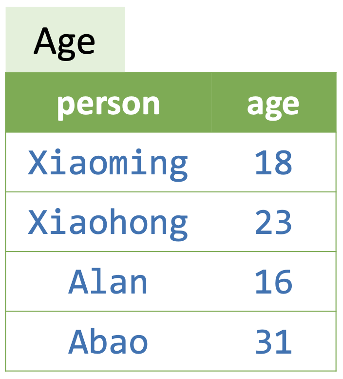
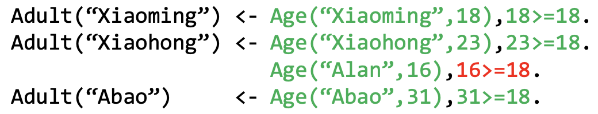
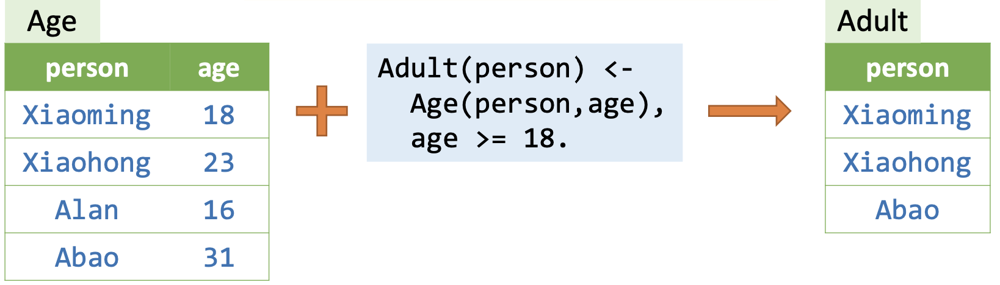
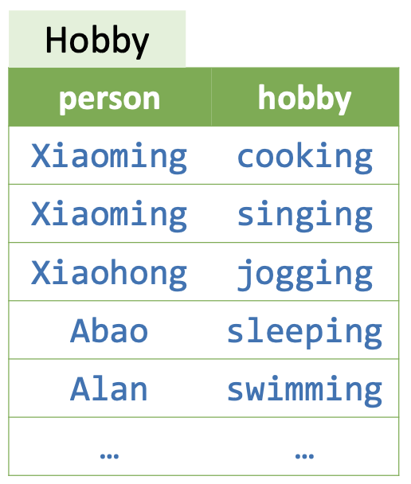
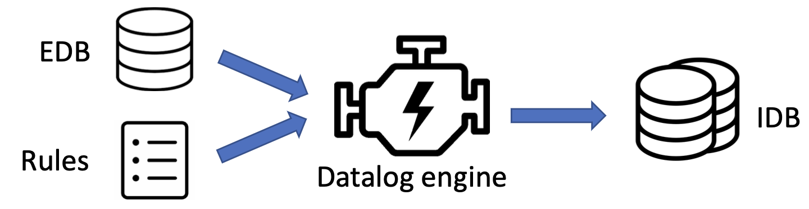
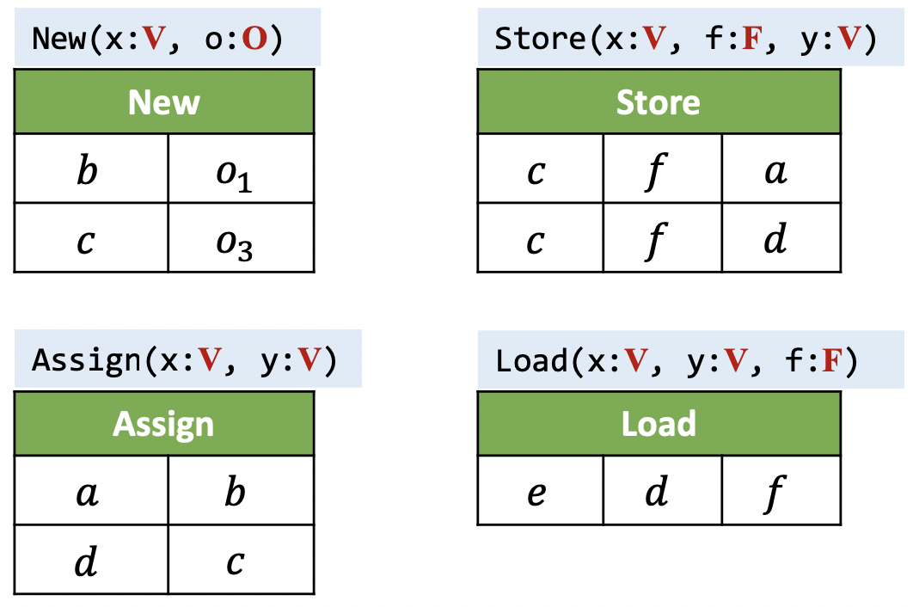
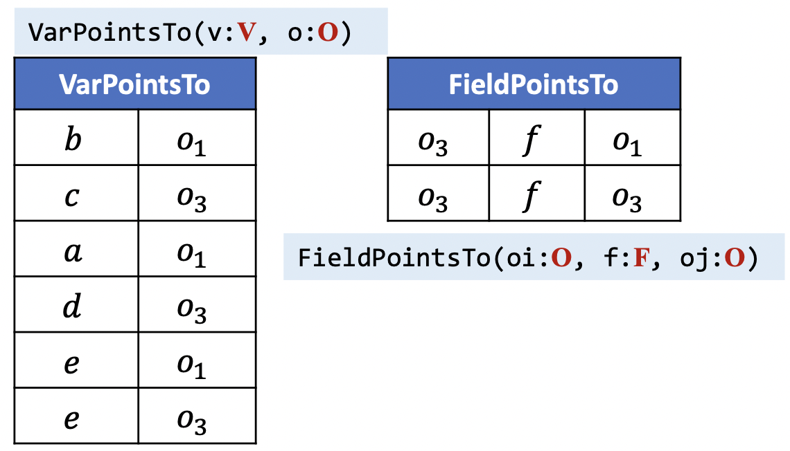

# 10 基于Datalog的程序分析

## 10.1 命令式与申述式

::: definition 定义10.1
称描述怎么做的编程语言是 **命令式（Imperative）** 的，其内容是一个目标的 **实现（Implementation）** ；描述做什么的语言是 **申述式（Declarative）** 的，其内容是一个目标的 **规约（Specification）** 。
:::

比如说，如果我要从一群人的集合，要选出其中的成年人，命令式的程序写法应该是：

```java
Set<Person> selectAdults(Set<Person> people) {
    Set<Person> result = new HashSet<>();
    for (Person person : people)
        if (person.getAge() >= 18)
            result.add(person);
    return result;
}
```

而申述式的程序写法则是：

```sql
SELECT * FROM People WHERE Age >= 18;
```

### 10.1.1 怎样实现程序分析

我们之前的所有的实现静态分析的方式都是命令式的，通过一个具体的图算法来实现。以指针分析为例，我们花了很大的篇幅来讲解算法的步骤。不过在讲解具体的算法之前，我们其实已经有了一个定义良好的规约，就是我们下面的这些规则（以上下文不敏感为例）。

|类型|语句|规则|
|:-:|:-:|:-:|
|创建|`i: x = new T()`| $\overline{o_i \in pt(x)}$ |
|赋值|`x = y`| $o_i\in pt(y)$<br/>$\overline{o_i \in pt(x)}$|
|存储|`x.f = y`| $\underline{o_i \in pt(x), o_j\in pt(y)}$<br/>$o_j \in pt(o_i.f)$ |
|载入|`y = x.f`| $\underline{o_i\in pt(x), o_j\in pt(o_i.f)}$<br/>$o_j\in pt(y)$ |
|调用|`l: r = x.k(a1, ..., an)`|$o_i\in pt(x), m=Dispatch(o_i, k)$<br/>$o_u\in pt(a_j), 1\le j\le n$<br/>$o_v\in pt(m_{ret})$<br/>$\overline{o_i\in pt(m_{this})}$<br/>$o_u\in pt(m_{p_j}), 1\le j\le n$<br/>$o_v\in pt(r)$|

基于上述的规则，我们设计了算法7.2，但其实算法7.2在具体实现的时候还有许多细节上需要考虑的地方：

- 如何实现Worklist?
    - 使用ArrayList还是LinkedList？（算法7.2第1行）
    - Worklist中的哪一项应当被先处理？（算法7.2第10行）
- 如何实现指向集pt？
    - HashSet或者BitVector?（算法7.2第26行）
- 怎样联系PFG结点和指针？（算法7.2第13行）
- 如何讲变量和相关语句联系起来？（算法7.2第15、17行）
- ......

我们还有很多很多的实现细节要考虑，这是很让人头疼的，这是在进行指针分析时使用命令式编程的困境。

当然，我们并不能贬低命令式编程，因为使用申述式编程的便捷性是由其他人承受了其背后的苦楚而换来的，追根究底还得是命令时编程，毕竟机器就是机器。

接下来，我们会介绍一种申述式的编程语言Datalog，能够极大地简化指针分析的实现，我们只需要描述规约即可，代码简介且可读性强。

最终的代码如下：

```datalog
VarPointsTo(x, o) <-
    Reachable(m),
    New(x, o, m).

VarPointsTo(x, o) <-
    Assign(x, y),
    VarPointsTo(y, o).

FieldPointsTo(oi, f, oj) <-
    Store(x, f, y),
    VarPointsTo(x, oi),
    VarPointsTo(y, oj).

VarPointsTo(y, oj) <-
    Load(y, x, f),
    VarPointsTo(x, oi),
    FieldPointsTo(oi, f, oj).

VarPointsTo(this, o),
Reachable(m),
CallGraph(l, m) <-
    VCall(l, x, k),
    VarPointsTo(x, o),
    Dispatch(o, k, m),
    ThisVar(m, this).

VarPointsTo(pi, o) <-
    CallGraph(l, m),
    Argument(l, i, ai),
    Parameter(m, i, pi),
    VarPointsTo(ai, o).

VarPointsTo(r, o) <-
    CallGraph(l, m),
    MethodReturn(m, ret),
    VarPointsTo(ret, o),
    CallReturn(l, r).
```

现在看不懂没关系，我们后面会讲解Datalog的语法语义。

## 10.2 Datalog语言初步

### 10.2.1 介绍

Datalog是一个申述式的逻辑编程语言，是Prolog语言的一个子集，它在上世纪80年代中叶作为一种数据库语言而出现。现在，它已经有了很多的应用，比如说：
- 程序分析（Program Analysis）
- 申述式网路编程（Declarative Networking）
- 大数据（Big Data）
- 云计算（Cloud Computing）
- ...

Datalog的语法语义由两部分组成，数据（Data）和逻辑（Logic），这种语言没有副作用，没有控制流，没有函数，也不是图灵完备的语言。在Datalog中，用谓词表示数据，用规则表示逻辑。

### 10.2.2 原子

::: definition 定义10.2
在Datalog语言中，称返回值为 `True` 或者 `False` 的 **表达式（Expression）** 为 **原子（Atom）** 。
:::

::: definition 定义10.3
在Datalog语言中，称形如

$$
P(x_1, x_2, ..., x_n)
$$

的表达式为 **关系型原子（Relational Atoms）** ，其中 $P$ 称为 **谓词（Predicates）** 或 **关系（Relation）** ， $x_i(1 \le i \le n)$ 称为 **实参（Arguments）** 或者 **项（Terms）** 。

记 $x_1 \in X_1, x_2\in X_2, ..., x_n\in X_n$ ，则有

$$
P \subseteq X_1\times X_2\times ...\times X_n
$$

且定义

$$
P(x_1, x_2, ..., x_n) = True \Leftrightarrow (x_1, x_2, ..., x_m) \in P
$$

此时，称为 $(x_1, x_2, ..., x_n)$ 为 $P$ 中的一个 **事实（Fact）** 。
:::

从上面的定义中我们会发现，其实一个谓词就是一张表格，是每一列集合的笛卡尔积的子集。比如说：

<p style="text-align:center"></p>

`Age` 是一个谓词，表示了一些人的年龄，对于 `Age` 来说：
- `("Xiaoming", 18)` 表示小明18岁，是一个事实，所以 `Age("Xiaoming", 18)` 返回值为真；
- `("Abao", 23)` 表示阿宝23岁，这不是一个事实，所以 `Age("Alan", 23)` 返回值为假。

::: definition 定义10.4
在Datalog语言中，称可判定真假的代数表达式为 **代数型原子（Arithmetic Atoms）** 。
:::

比如说 `age >= 18` 就是一个代数型原子。

### 10.2.3 规则

::: definition 定义10.5
在Datalog语言中，称形如

$$
H <- B_1, B_2, ..., B_n.
$$

的语句为**规则（Rules）**，其中：
- $H$ 称为**头部（Header）**，是规则的**结果（Consequent）**，其形式上是一个原子。
- $B_1, B_2, ..., B_n$ 称为**主体（Body）**，是规则的**前提（Antecedent）**，其中的 $B_i$ 是一个原子或者原子的否定（见10.2.5），称为**子目标（Subgoal）**。

规则的含义是如果主体为真，则头部为真。

这里 `,` 表示合取关系，即逻辑与，也就是说主体 $B_1, B_2, ..., B_n$ 为真当且仅当所有的子目标 $B_i(1\le i\le n)$ 都为真。
:::

基于上述的定义，我们可以通过如下的Datalog规则来推导成年人。

```datalog
Adult(person) <-
    Age(person, age),
    age >= 18.
```

那么Datalog的解释器会如何解释这个规则呢？

Datalog会考虑子目标中变量的所有可能的组合，如果存在某个组合使得所有的子目标都为真，那么带有相应变量的头部原子也为真。头部谓词会包含所有为真的原子的项，作为该谓词的事实存下来。

比如说上面的那个例子，执行过程如下：

<p style="text-align:center"></p>

到此我们发现，一个Datalog程序的基本运行逻辑是根据现有的事实加上一些规则来推导出新的事实。

<p style="text-align:center"></p>

到现在为止，我们学习了原子表达式，学习了规则语句，也就是说我们学习了判断事实，也学习了推导事实，那么最初的原始的事实从何而来呢？

### 10.2.4 EDB和IDB谓词

通常，Datalog中的谓词有两类：EDB和IDB。

::: definition 定义10.5
在Datalog语言中，称先验定义的谓词为 **外延数据库（Extensional Database， EDB）** ，其中的关系是不可修改的，可视为输入关系。
:::

::: definition 定义10.6
在Datalog语言中，称由规则建立的谓词为 **内涵数据库（Intensional Database， IDB）** ，其中的关系是由规则推导出来的，可视为输出关系。
:::

::: conclusion 结论10.1
在Datalog本身的规约中，对于规则语句，其头部只能是IDB，但主体部分的原子既可以是EDB，也可以是IDB。换句话说，Datalog支持递归的规则（Recursive Rules）。
:::

### 10.2.5 析取和否定

我们已经见到了用 `,` 表示合取关系用法，下面我们来看一下析取和否定。

<p style="text-align:center"></p>

在Datalog中，有两种方式来表达析取逻辑：
1. 书写多个具有相同头部的规则，其含义是任意一个规则都能够生成那个头部原子谓词中的事实。

    ```datalog
    SportFan(person) <- Hobby(person, "jogging").
    SportFan(person) <- Hobby(person, "swimming").
    ```
2. 使用逻辑或操作符 `;`。

    ```datalog
    SportsFan(person) <-
        Hobby(person, "jogging");
        Hobby(person, "swimming").
    ```

上述两种表达方式的效果是等价的。其中需要注意一下的是，当 `;` 操作符和 `,` 操作符混合使用的时候， `,` 的优先级是要高于 `;` 的，所以，如果要优先运算析取关系，需要使用括号，例如 `H <- A, (B; C)` 。

在Datalog的规则中，一个子目标也可以是某个原子的否定，写作 `!B(...)` ，表示 `B(...)` 的相反意思，即 `!B(...)` 为真当且仅当 `B(...)` 为假。

比如说，如果我要计算需要补考的学生，我们可以这样写：

```datalog
MakeupExamStd(student) <-
    Student(student),
    !PassedStd(student).
```

其中， `Student` 储存了所有的学生， `PassedStd` 储存了通过考试的学生。

### 10.2.6 递归

其实在结论10.1中，我们已经提到了Datalog支持递归，也就是说Datalog允许一个IDB是直接或者间接从它本身推到出来的。

比如说，我们可以计算通过如下的递归的规则来计算一个图的可达性信息（即传递闭包）：

```datalog
Reach(from, to) <-
    Edge(from, to).

Reach(from, to) <-
    Reach(from, node),
    Edge(node, to).
```

其中， `Edge(a, b)` 表示图中存在从结点 `a` 到结点 `b` 的边， `Reach(a, b)` 表示 `b` 从 `a` 可达。

如果没有递归的话，Datalog就只能表达基础的关系型代数的请求，就像形如 `SELECT-FROM-WHERE` 这样的SQL语句一样。

但是有了递归，Datalog就强大了许多，并且能够表达出更复杂的程序分析，比如说指针分析了。

### 10.2.7 规则安全

我们下面看两个例子来体会一下什么是不安全的规则。

```datalog
A(x) <- B(y), x > y.

A(x) <- B(y), !C(x, y).
```

对于上面的这两个例子，都有无穷多个 `x` 能够满足规则，这使得A成为了一个无穷的关系，这样的规则是不安全的，会导致程序无法终止，因此Datalog会拒绝这样的规则，只有安全的规则才会被允许指向。

那什么样的表达式会限制变量的范围呢？非否定的关系型原子。于是，我们可以得到如下的结论：

::: conclusion 结论10.2
如果一个规则中的每个变量都在至少一个非否定的关系型原子中出现过，那么这个规则就是安全（Safe）的。
:::

再看一个例子：

```datalog
A(x) <- B(x), !A(x).
```

假设 `B(1)` 是真的，如果 `A(1)` 是假的，那么 `A(1)` 就是真的；如果 `A(1)` 是真的，那么 `A(1)` 就是假的。诶， `A(1)` 情何以堪......

这个规则本身是矛盾（Contradictory）的并且没有任何意义。于是，我们可以总结一个如下的结论：

::: conclusion 结论10.3
在Datalog中，一个原子的递归和否定必须分开，否则这个规则可能会包含矛盾，且逻辑推理无法收敛。
:::

### 10.2.8 Datalog程序的执行

Datalog语言本身只是一个规约，就像SQL一样，不同的Datalog引擎会有特性上的区别，不过不会违背语言本身的规约。一些现代的Datalog引擎有：LogicBlox, Souffle, XSB, Datomic, Flora-2, ...

Datalog引擎会根据给定的规则和EDB推导事实，直到没有任何新的事实可以被推导出为止，程序终止。

<p style="text-align:center"></p>

Datalog程序具有单调性，因为它只会推导新的事实，而无法删除已有的事实。

::: theorem 定理10.1
Datalog程序总能够终止。
:::

> 首先，Datalog程序具有单调性，其次规则安全保证了IDB的所有可能值是有限的，从而根据单调有界原则，Datalog程序总能够终止。

## 10.3 使用Datalog进行指针分析

我们之前讲解指针分析的时候说过指针分析的过程可以视为求解一个约束系统的过程（见定义7.4）。结合这一讲前面的内容我们可以很明显的感受到，Datalog语言就是一个很好的求解约束系统的语言。

### 10.3.1 分析思路

用Datalog进行指针分析的话，
- EDB其实就是我们能够从程序句法上直接提取的指针相关的信息，
- IDB就是我们需要的指针分析的结果。
- 而规则其实就可以直接用指针分析的规则，
    - 只需要从数学推导式的形式转化成Datalog规则的形式即可，并且这种转化几乎是一一对应的，实现起来非常简单。

我们下面会先聚焦于过程内的情况，最后再讨论调用语句，拓展到全程序的指针分析。

### 10.3.2 指针分析的Datalog建模

首先，我们以EDB的形式将要分析的语句存下来。

|类型|语句|EDB|
|:-:|:-:|:-:|
|创建|`i: x = new T()`|`New(x: V, o: O)`|
|赋值|`x = y`|`Assign(x: V, y: V)`|
|存储|`x.f = y`|`Store(x: V, f: F, y: V)`|
|载入|`y = x.f`|`Load(y: V, x: V, f: F)`|

其中，和之前指针分析一样，V是变量集合，F是字段集合，O是对象集合。

则指针分析的结果IDB的形式为 `VarPointsTo(v: V, o: O)` 和 `FieldPointsTo(oi: O, f: F, oj: O)` 。

比如说
-  $VarPointsTo(x, o_i)$ 表示 $o_i \in pt(x)$ ， 
-  $FieldsPointsTo(o_i, f, o_j)$ 表示 $o_j \in pt(o_i.f)$ 。

例如，对于下面这个程序来说，

```java
b = new C();
a = b;
c = new C();
c.f = a;
d = c;
c.f = d;
e = d.f;
```

它的EDB为：

<p style="text-align:center"></p>

### 10.3.3 指针分析的Datalog规则

根据我们已经熟悉的指针分析的规则以及对应的语句，不难得到对应的Datalog规则如下：

|类型|语句|规则|Datalog|
|:-:|:-:|:-:|:-:|
|创建|`i: x = new T()`| $\overline{o_i \in pt(x)}$ |`VarPointsTo(x, o) <-`<br/><br/>`New(x, o).`|
|赋值|`x = y`| $o_i\in pt(y)$<br/>$\overline{o_i \in pt(x)}$|`VarPointsTo(x, o) <-`<br/><br/>`Assign(x, y),`<br/><br/>`VarPointsTo(y, o).`|
|存储|`x.f = y`| $o_i \in pt(x)$<br/>$\underline{o_j\in pt(y)}$<br/>$o_j \in pt(o_i.f)$ |`FieldPointsTo(oi, f, oj) <-`<br/><br/>`Store(x, f, y),`<br/><br/>`VarPointsTo(x, oi),`<br/><br/>`VarPointsTo(y, oj).`|
|载入|`y = x.f`|$o_i\in pt(x)$<br/>$\underline{o_j\in pt(o_i.f)}$<br/>$o_j\in pt(y)$ |`VarPointsTo(y, oj) <-`<br/><br/>`Load(y, x, f),`<br/><br/>`VarPointsTo(x, oi),`<br/><br/>`FieldPointsTo(oi, f, oj).`|

有了EDB，也有了规则，根据之前讲的Datalog语言的语义，我们也不难得到上面那个例子的IDB如下：

<p style="text-align:center"></p>

### 10.3.4 处理方法调用

|类型|语句|规则|
|:-:|:-:|:-:|
|调用|`l: r = x.k(a1, ..., an)`|$o_i\in pt(x), m=Dispatch(o_i, k)$<br/>$o_u\in pt(a_j), 1\le j\le n$<br/>$o_v\in pt(m_{ret})$<br/>$\overline{o_i\in pt(m_{this})}$<br/>$o_u\in pt(m_{p_j}), 1\le j\le n$<br/>$o_v\in pt(r)$|

方法调用的规则比较复杂，我们可以分成3个部分，分别对应了上表中的3行：

1. 方法派发与 `this` 变量绑定：
    - EDB：
        - `VCALL(l: S, x: V, k: M)`
        - `Dispatch(o: O, k: M, m: M)`
        - `ThisVar(m: M, this: V)`
    - IDB：
        - `Reachable(m: M)`
        - `CallGraph(l: S, m: M)`
    - 其中，S是语句集合，M是方法集合。Datalog规则为：
        ```datalog
        VarPointsTo(this, o),
        Reachable(m),
        CallGraph(l, m) <-
            VCall(l, x, k),
            VarPointsTo(x, o),
            Dispatch(o, k, m),
            ThisVar(m, this).
        ```
2. 将形参绑定到实参：
    - EDB：
        - `Argument(l: S, i: N, ai: V)`
        - `Parameter(m: M, i: N, pi: V)`
    - Datalog规则为：
        ```datalog
        VarPointsTo(pi, o) <-
            CallGraph(l, m),
            Argument(l, i, ai),
            Parameter(m, i, pi),
            VarPointsTo(ai, o).
        ```
3. 将返回值传递给接收变量：
    - EDB：
        - `MathodReturn(m: M, ret: V)`
        - `CallReturn(l: S, r: V)`
    - Datalog规则为：
        ```datalog
        VarPointsTo(r, o) <-
            CallGraph(l, m),
            MathodReturm(m, ret),
            VarPointsTo(ret, o),
            CallReturn(l, r).
        ```

### 10.3.5 全程序指针分析的Datalog实现

综上，一个全程序的指针分析的Datalog实现为：

```datalog
Reachable(m) <-
    EntryMethod(m).

VarPointsTo(x, o) <-
    Reachable(m),
    New(x, o, m).

VarPointsTo(x, o) <-
    Assign(x, y),
    VarPointsTo(y, o).

FieldPointsTo(oi, f, oj) <-
    Store(x, f, y),
    VarPointsTo(x, oi),
    VarPointsTo(y, oj).

VarPointsTo(y, oj) <-
    Load(y, x, f),
    VarPointsTo(x, oi),
    FieldPointsTo(oi, f, oj).

VarPointsTo(this, o),
Reachable(m),
CallGraph(l, m) <-
    VCall(l, x, k),
    VarPointsTo(x, o),
    Dispatch(o, k, m),
    ThisVar(m, this).

VarPointsTo(pi, o) <-
    CallGraph(l, m),
    Argument(l, i, ai),
    Parameter(m, i, pi),
    VarPointsTo(ai, o).

VarPointsTo(r, o) <-
    CallGraph(l, m),
    MethodReturn(m, ret),
    VarPointsTo(ret, o),
    CallReturn(l, r).
```

> 其中，我们添加了入口方法的相关逻辑。

## 10.4 使用Datalog进行污点分析

上一讲我们的污点分析是建立在指针分析的基础上的，这一讲我们已经用Datalog实现了指针分析，基于这个实现，再添加一些规则，就可以很容易地实现污点分析了。

### 10.4.1 污点分析的Datalog建模

基于指针分析，下面只描述指针分析以外的部分。

- EDB谓词：
    - `Source(m: M)` 污点源方法；
    - `Sink(m: M, i: N)` 槽方法；
        - 其中 `N` 是自然数集。
    - `Taint(l: S, t: T)` 联系调用点和从调用点出来的污点数据。
- IDB谓词
    - `TaintFlow(sr: S, sn: S, i: N)` 检测到的污点流。
        - `TaintFlow(sr, sn, i)` 表示从 `sr` 流出的污点数据可能会流到槽调用 `sn` 的第 `i` 个参数中。

### 10.4.2 污点分析的Datalog实现

- 处理源头（生成污点数据）

|类型|语句|规则|Datalog|
|:-:|:-:|:-:|:-:|
|调用|`l: r = x.k(a1, ..., an)`|$l\to m\in CG$<br/>$\underline{m\in Sources}$<br/>$t_l \in pt(r)$|`VarPointsTo(r, t) <-`<br/><br/>`CallGraph(l, m),`<br/><br/>`Source(m),`<br/><br/>`CallReturn(l, r),`<br/><br/>`Taint(l, t).`|

- 处理槽（生成污点流信息）

|类型|语句|规则|Datalog|
|:-:|:-:|:-:|:-:|
|调用|`l: r = x.k(a1, ..., an)`|$l\to m\in CG$<br/>$(m, i) \in Sinks$<br/>$t_j\in pt(a_i)$<br/>$\overline{(j, l, i) \in TaintFlows}$|`TaintFlow(j, l, i) <-`<br/><br/>`CallGraph(l, m),`<br/><br/>`Sink(m, i),`<br/><br/>`Argument(l, i, ai),`<br/><br/>`VarPointsTo(ai, t)`<br/><br/>`Taint(j, t).`|

## 10.5 基于Datalog的程序分析的优缺点

- 优点：
    - 简洁易懂；
    - 容易实现；
    - 能够得益于现成的Datalog引擎的优化
- 缺点：
    - 表达能力受限；
        - 比如说可能无法或者不方便表达某些逻辑。
    - 无法完全控制其表现；
        - 因为这是一个申述式的语言，对于用户来说还是一个黑盒，有些东西是用户不可控的。

## 10.6 自检问题

1. Datalog语言的基本语法和语义是什么？
2. 如何用Datalog来实现指针分析？
3. 如何用Dataloh来实现污点分析？

