# 11 CFL可达与IFDS

## 11.1 可行路径与可实现路径

### 11.1.1 可行路径

到现在为止，为了演示方便，我们讲过的例子都是比较简单的。但在实际应用当中，一个程序可以是很复杂的，比如说下图是JDK中的**一个**方法的真实的控制流图：

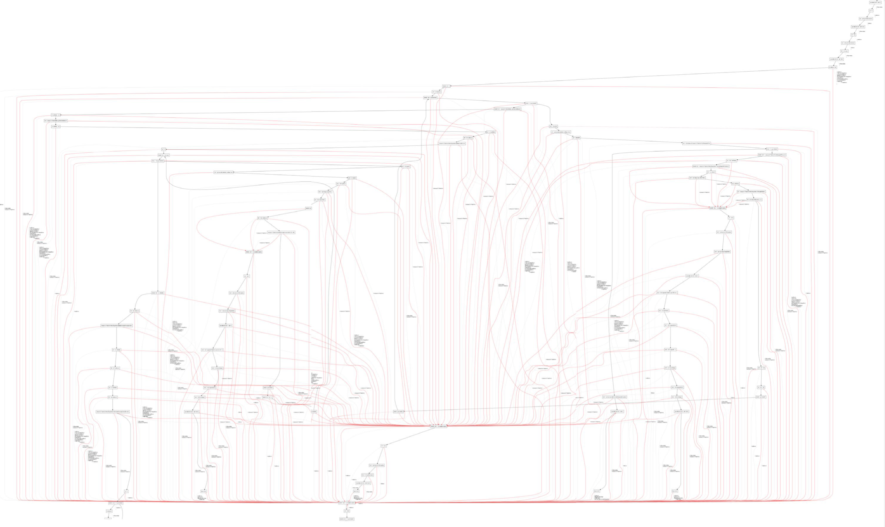

这个控制流图肉眼可见的胖达，但是这张图里面的所有的路径，在程序运行的时候都会被执行吗？

答案是否定的，更准确的说，如果是一个单线程的基本的程序的话，真实的控制流其实只会执行众多路径中的一条路径而已。不过，这不妨碍有很多路径都存在被执行的可能性，这是由具体的程序输入所决定的；但是，有一些路径，是永远也不可能被执行的。

::: definition 定义11.1
称在CFG中，当实际运行时，某个特定的输入下，控制流会经过的路径为**可行路径（Feasible Path）**；相反，如果任何输入下，控制流都不经过某条路径，那么这条路径就称为**不可行路径（Infeasible Path）** 。
:::

我们希望程序分析的结果不会被不可行路径污染，或者尽可能少得被不可行路径污染。但是，在静态分析的阶段，给定一个路径，判断它是否可行在整体上是不现实的，因为静态分析阶段我们并不知道这个程序的具体输入是什么，而一个路径是否会被执行又是与具体的输入息息相关的。

那我们还有希望能够做点什么吗？答案是能的。我们先来看下面这个例子：

```java
void main() {
    x = foo(8);
    ...
    y = foo(30);
    ...
}

int foo(int age) {
    if (age >= 0) 
        r = age;
    else
        r = -1;
    return -1;
}
```

这个程序的控制流图为：

<p style="text-align:center">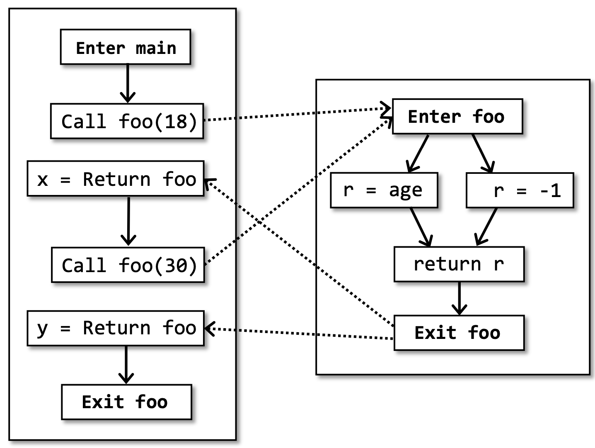</p>

在这幅图当中进行常量传播的分析，考虑x和y的取值情况，我们会发现x和y的结果都是 `{18, 30, -1}` ，也就是最没用的 `NAC` 。但我们很明显能够看到， `x = 18` ， `y = 30` 。

以x为例，在x的结果当中，有两个假积极（False Positive，见定义1.5），30和-1。我们分别来考虑这两个假积极是怎样产生的。

- `-1` 是由于下图中标红色的部分产生的，这个假积极是我们无法避免的。
    - 因为从静态分析的角度，我们并不知道这个函数的输入是什么，根据安全估计（Safe-Approximation, 见定义3.1）的原则，我们应该进行饱和估计（Over-Approximation，见定义1.3），因此左边和右边的路径都只能保留下来。

<p style="text-align:center">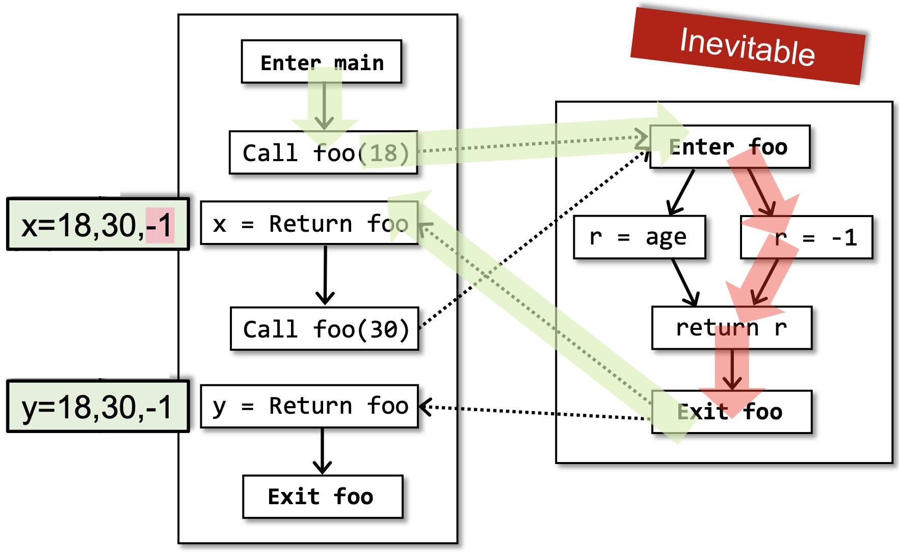</p>

- `30` 是由于下图中标红色的部分产生的，这个假积极是我们可以避免的。
    - 因为从 `foo(30)` 调用点出发的调用控制流，不可能会回到 `foo(18)` 的返回点，这一点是和程序的输入无关的，是在静态分析的阶段我们就可以确定下来的。
    - 言下之意，如果我们能够避免这样的不可行路径，我们至少可以再提高一些静态分析的精度。

<p style="text-align:center">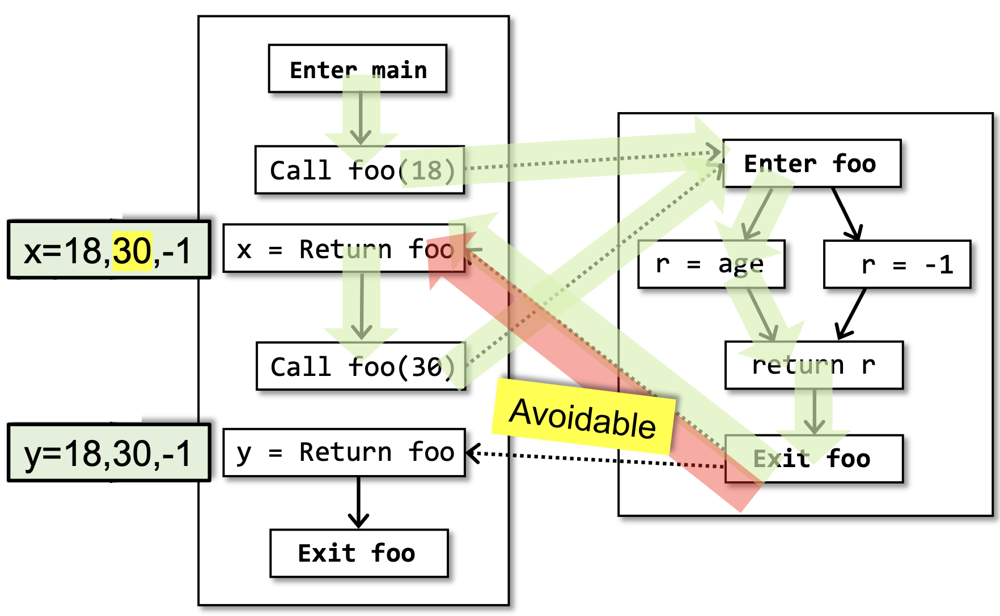</p>

### 11.1.2 可实现路径

::: definition 定义11.2
称返回边和调用边（见定义5.8）相匹配的路径为**可实现路径（Realizable Path）**，不匹配则称为**不可实现路径（Unrealizable Path）**。
这里，相匹配指的是符合程序运行的逻辑（具体形式化定义见11.2节）。
:::

我们会发现，一个可实现的路径不一定会被执行，但是一个不可实现的路径一定不会被执行。

所以，我们现在的目标就是识别出可实现的路径，且只分析这些路径，从而避免不可实现的路径来对我们静态分析结果产生的污染，这样我们就可以提高静态分析的精度。

<p style="text-align:center">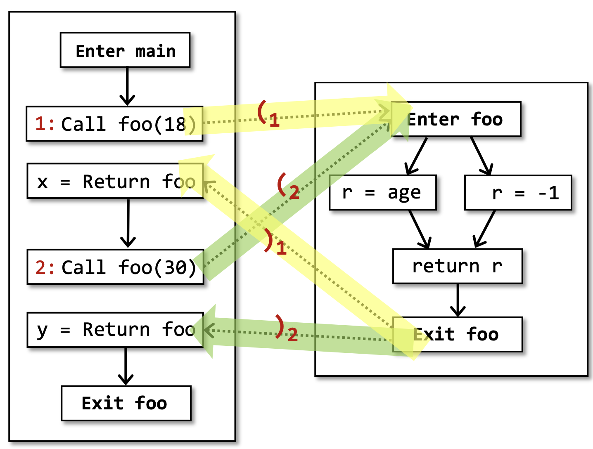</p>

那怎样才能系统地识别可实现的路径呢？这种调用边和返回边匹配的问题恰好和我们以前遇到过的括号匹配的问题很像。

下面我们会以一种特殊的更抽象的视角来考量路径，将路径建模成一种语言，然后再回头，应用这种视角来解决偏括号匹配问题（偏匹配是因为可实现路径的半路上括号不一定是完全匹配的，后续会给出形式化的完整定义）。

## 11.2 CFL可达性

### 11.2.1 上下文无关文法

::: definition 定义11.3
定义 **语言（Language）** 是字符串的集合，其中 **字符串（String）** 是一个符号序列，所有的 **符号（Symbol）** 构成了这个语言的 **字母表（Alphabet）** 。
用 $L$ 表示语言， $A$ 表示字母表，则可以形式化的描述语言：

$$
L \subseteq \{s| s = a_1a_2...a_k, a_i\in A, 0 \le k \le n \in\mathbb{N}\}
$$

其中，当 $k = 0$ 时，用 $\varepsilon$ 表示空字符串。
:::

具体 $L$ 的边界可以自定义规则进行限制（比如说用形式文法（见定义11.6）描述），也可直接列举法表示，只要理解语言（这里）本质上是一个集合就可以了。

::: definition 定义11.4
称在数学、逻辑学以及计算机学科中，用精确的数学公式或者算法描述的语言为 **形式语言（Formal Language）** 。
:::

::: definition 定义11.5
定义 **推导规则（Production Rule）** 形如：

$$
S \to S'
$$

表示字符串 $S$ 在规则 $S \to S'$ 的作用下可以生成字符串 $S'$ 。

前提相同的多个推导规则可承前省略，形如：

$$
S \to \begin{cases}
S_1 \\
S_2 \\
......\\
S_n
\end{cases}
$$

:::

有了单个的推导规则，我们只要合理地组合多个推导规则就可以对语言进行由少到多的推导。

::: definition 定义11.6
定义一个形式语言的 **形式文法（Formal Grammar）** 是由若干条生成规组成的集合。

给定某个语言的一些基本的字符串，基于这些基本的字符串可以定义形式文法来推导整个语言，但是这些字符本身无法被推导，称为 **终结符（Terminals）**，形式文法中的其他字符称为 **非终结符（Nonterminal）** 。
:::

::: definition 定义11.7
**上下文无关文法（Context-free Grammar）** 是一个形式文法，其中，每一个推导式都形如

$$
S \to \alpha
$$

其中，$S$ 是单个非终结符，而 $\alpha$ 可以是终结符与/或非终结符形成的字符串，也可以是空字符串。

称由上下文无关文法推导出来的语言为 **上下文无关语言（Context-free Language, CFL）**。
:::

::: theorem 定理11.1
考虑某个上下文无关语言中的任意3个有效字符串 $S$ ， $a$ ， $b$ 。可以在 $S$ 出现的任何地方， 将 $S$ 替换成 $aSb$ 或者 $\varepsilon$ 而不破坏该上下文无关语言的规则。
:::

### 11.2.2 CFL可达性

::: definition 定义11.8
为一张有向图中的每条边打上标签，称结点B从结点A **CFL可达（CFL Reachable）**，如果存在从A到B的路径，该路径上每条边的标签组成了某个特定的上下文无关语言的合法字符串。

其中，这个上下文无关语言是根据需求相应定义的。
:::

有了上面的基础，我们可以通过CFL定义出 **部分平衡括号问题（Partially Balanced-Parenthesis Problem）**：

- 每个右括号 $)_i$ 都应当有一个左括号 $(_i$ 与之平衡，但反之不亦然；
- 对于每个调用点 $i$ ，将它的调用边标记为 $(_i$ ，返回边标记为 $)_i$ ；
- 将其他所有的边标记为 $e$ 。

于是，我们会发现，一个路径是可实现的，当且仅当这个路径上的标记所形成的字符串在语言 $L(realizable)$ 中，其中：

$$
realizable \to \begin{cases}
matched\ realizable\\
(_i\ realizable\\
\varepsilon
\end{cases},
matched \to \begin{cases}
(_i\ matched\ )_i\\
e\\
\varepsilon\\
matched\ matched
\end{cases}
$$

比如说， $(_1(_2e)_1)_2(_3$ 、$(_1(_2e)_1)_2(_3(_4$ 、 $(_1(_2eee)_1)_2(_3(_4$ 、 $ee(_1(_2eee)_1)_2(_3(_4e$ 都是合法的 $L(realizable)$ 字符串。

> 注： $L(realizable)$ 表示语言 $L$ 由文法中的 $realizable$ 字符串组成。

例如：

<p style="text-align:center">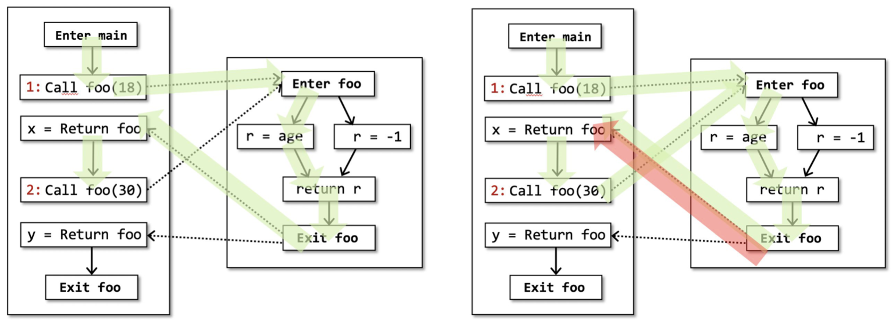</p>

左图中路径的标签形成的单词是 $e(_1eee)_1e \in L(realizable)$ ，所以该路径是可实现的；而右图中路径的标签形成的单词是 $e(_1eee)_1e(2_eee)_1 \notin L(realizable)$ ，所以该路径是不可实现的。 

## 11.3 IFDS概述

### 11.3.1 概念

IFDS是一种通过图可达性的方式进行静态程序分析的框架。

> “Precise Interprocedural Dataflow Analysis via Graph Reachability” —— Thomas Reps, Susan Horwitz, and Mooly Sagiv, POPL’95

::: definition 定义11.9
**IFDS（Interprocedural Finite Distributive Subset Problem）** 指的是一类过程间（Interprocedural）数据流分析的子问题，其流函数具有分配性（Distributive），定义域（Domain，见定义3.5）是有限（Finite）集。

其中， **流函数（Flow Functions）** 由结点转移（node Transfer，见定义5.12）和边转移（见定义5.11）组成。
:::

IFDS为数据流分析提供了一种可实现全路汇集（MRP）的解决方案，在定义4.14中，我们定义了全路汇集（MOP）的解决方案，MRP的定义也是类似的。

::: definition 定义11.10
基于定义4.13以及定理4.10，和定义4.14类似，定义 **可实现全路汇集（Meet-Over-All-Realizable-Paths）** 的解决方案通过如下步骤计算某个程序点 $(s_i, s_{i+1})$ （见定义3.4）处的数据流值，记为 $MOP[s_i]$ ：
- 考虑从程序入口到 $s_i$ 处的路径 $P$ 的流函数为 $F_P$ ，所有可实现路径的集合记为 $RPaths(ENTRY, s_i)$ ；
    - 这里的流函数就是定义4.14中的状态转移方程，只不过4.14是在过程内分析的背景下定义的，未考虑边转移，而本定义是在过程间分析的背景下定义的，因此采用了流函数的说法。
    - 一条路径的流函数，和定理4.10类似，是路径上流函数的组合。
- 使用联合或者汇集操作来求这些值的最小上界或者最大下界。

形式化表示为：

$$
MRP[s_i] = \bigvee_{\forall P \in RPaths(ENTRY, s_i)} F_P(OUT[ENTRY])
$$

或

$$
MRP[s_i] = \bigwedge_{\forall P \in RPaths(ENTRY, s_i)} F_P(OUT[ENTRY])
$$

:::

::: theorem 定理11.2
若采用联合操作，则 $MRP[s_i] \preceq MOP[s_i]$ ； 若采用汇集操作，则 $MOP[s_i] \preceq MRP[s_i]$ 。
:::

> 证明：若采用联合操作：
> 
> $$ MRP[s_i] = \bigvee_{\forall P \in RPaths(ENTRY, s_i)} F_P(OUT[ENTRY])\\ \preceq \bigvee_{\forall P \in RPaths(ENTRY, s_i)} F_P(OUT[ENTRY]) \vee \bigvee_{\forall P \in Paths(ENTRY, s_i) - RPaths(ENTRY, s_i)} F_P(OUT[ENTRY])\\ = \bigvee_{\forall P \in Paths(ENTRY, s_i)} F_P(OUT[ENTRY]) = MOP[s_i]$$
> 
> 若采用汇集操作：
>
>$$ MOP[s_i] = \bigwedge_{\forall P \in Paths(ENTRY, s_i)} F_P(OUT[ENTRY])\\ = \bigwedge_{\forall P \in RPaths(ENTRY, s_i)} F_P(OUT[ENTRY]) \wedge \bigwedge_{\forall P \in Paths(ENTRY, s_i) - RPaths(ENTRY, s_i)} F_P(OUT[ENTRY])\\ \preceq \bigwedge_{\forall P \in RPaths(ENTRY, s_i)} F_P(OUT[ENTRY]) = MRP[s_i]$$
>

### 11.3.2 基本步骤

我们先明晃晃地给出IFDS分析的框架，之后会每一步分别讲解，现在只要留一个印象就可以了。

::: conclusion 结论11.1
IFDS分析框架：

给定一个程序 $P$ ，和一个数据流分析问题 $Q$

- 为 $P$ 建立一个 **超图（Supergraph）** $G^{*}$ 并且根据 $Q$ 定义 $G^{*}$ 中边的流函数；
- 通过将流函数转化成 **代表关系（Representation Relations）** 的方式，基于 $G^{*}$ 为 $P$ 建立一个 **分解超图（Exploded Supergraph）** $G^{\sharp}$ 。
- $Q$ 可以被当作图 $G^{\sharp}$ 上的可达性问题来解决（寻找MRP解决方案），具体地，通过在 $G^{\sharp}$ 上运行制表算法来解决。

令 $n$ 是某个程序点， 数据因素 $d \in MRP[n_i]$ 当且仅当在 $G^{\sharp}$ 中存在一条从 $(s_{main}, 0)$ 到 $(n_i, d)$ 的可实现的路径。
:::

> 这里数据流因素（dataflow fact）在3.2.4节中定理3.4的证明后面注解块里面有提到过，数据流值（dataflow value）也称作因素（facts），一般是一个集合，这个集合中的一个元素称为一个因素（fact）。所以其实 $D$ 就是数据流值。

## 11.4 超图与流函数

### 11.4.1 超图的构建

::: definition 定义11.11
在IFDS中，程序用 **超图（Supergraph）** $G^{*} = (N^{*}, E^{*})$ 表示。

- $G^{*}$ 是由一组控制流图（Control Flow Graph，见定义2.4与算法2.2） $G_1, G_2, ...$ 组成的，每个过程 $Procedure_i$ 都有一个对应的控制流图 $G_i$。
    - 每一个控制流图 $G_p$ 都有自己独特的一个起始结点（Start Node） $s_p$ 和结束结点（Exit Node） $e_p$ 。
    - 在每个过程的控制流图 $G_i$ 中，用调用结点（Call Node） $Call_p$ 和 返回点结点（Return-site Node） $Ret_p$ 。
- 除了每个过程内部的控制流边以外，对于每个过程调用， $G^{*}$ 还有另外3种边：
    - 一条过程内的，从调用者的 $Call_p$ 到 $Ret_p$ 的**调用返回边（call-to-return-site edge）**，
    - 一条过程间的，从调用者 $Call_p$ 到被调用者的 $s_p$ 的**调用起始边（call-to-start-edge）**，
    - 一条过程间的，从被调用者的 $e_p$ 到调用者的 $Ret_p$ 的**结束返回边（exit-to-return-edge）**。 
:::

> 其实这里的超图和我们在5.3中讲的过程间控制流图很像，只是它将调用点拆分成了调用结点与返回点结点两个部分而已。

比如说对于下面这段程序：

```java
int g;
void main() {
    int x;
    x = 0;
    P(x);
}
void P(int a) {
    if (a > 0) {
        g = 0;
        a = a - g;
        P(a);
        Print(a, g);
    }
}
```

根据定义11.11，构建出的上述程序的超图如下：

<p style="text-align:center">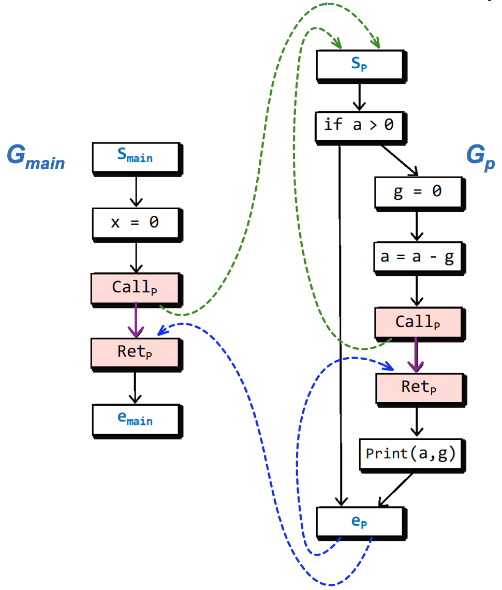</p>

其中，
- 对于结点，白底蓝字的是起始结点和结束结点，红底黑字的是调用结点和返回结点，白底黑字的是普通结点。
- 对于边，黑色的是普通控制流边，紫色的是调用返回边，绿色的是调用起始边，蓝色的是结束返回边。

### 11.4.2 流函数的设计

在结论11.1中，我们提到了流函数是根据研究的问题 $Q$ 决定的，为了后续演示方便，我们先定义一个数据流分析问题作为例子。

::: definition 定义11.12
定义 **可能未初始化变量（Possibly-uninitialized Variables）** 问题：对于 $N^{*}$（见定义11.11） 中的每个结点 $n$ ，求在执行 $n$ 之前有可能未初始化的变量集合。
:::

由于一些历史原因，在IFDS中，我们会使用lambda表达式来书写流函数，所以在正式开始前我们再定义一下lambda表达式的数学记号。

::: definition 定义11.13
定义**lambda表达式**形如 $\lambda e_{param}. e_{body}$ ，其中 $e_{param}$ 是形参表， $e_{body}$ 是函数体。

采用 $(\lambda e_{param}. e_{body})(e_{arg})$ 的形式来调用这个匿名函数，其中 $e_{arg}$ 是实参表，如果只有一个元素，实参表的括号可以省略。
:::

比如说， $\lambda x.x+1$ 是一个lambda表达式，对3调用这个匿名函数： $(\lambda x.x+1)3 = 3 + 1 = 4$ 。

下面，我们基于上面已经构建好的超图来定义其中每条边的流函数：

<p style="text-align:center">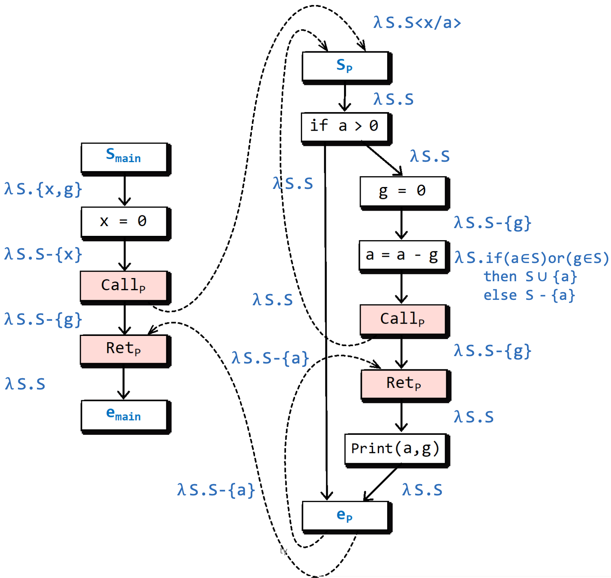</p>

其中 $S$ 是可能未初始化的变量的集合，也是我们要分析的数据流值（具体参见定义3.3，结论3.1）。流函数的输入是上一个程序点的数据流值，输出是本程序点的数据流值。

下面请顺着程序的控制流对照上图来看下面的分析。

一开始的时候， $S_{main}$ 之前没有程序点，流函数 $\lambda S . \{x, g\}$ 的含义是无论输入S是啥，输出总是 $\{x, g\}$ ，因此 $S_{main}$ 之后的程序点的数据流值为 $\{x, g\}$。

之后， `x = 0` 这个结点之前的程序点处，根据上面的分析，数据流值是 $\{x, g\}$ ，`x = 0` 的作用是给 `x` 一个定义，所以此时 `x` 就不是未初始化的变量了，因此就不应该在 $S$ 中了。从而，这个地方的流函数是 $\lambda S.S - \{x\}$ 。

然后看第一条调用开始边，其作用是将实参绑定到形参且进入子过程，相当于给了 `x` 一个别名 `a`， 我们写作 $\lambda S.S<x/a>$ 。也就是说，如果没有 $x = 0$ 这个语句的话，在 $Call_p \to S_p$ 处的数据流值为 $\{a, g\}$ 。当然，在我们的程序中这个地方 `x` 已经被初始化了。

对于 `a = a - g` 这个语句，根据安全估计的原则，右值 `a` 和 `g` 只要有任何一个未初始化，作为左值的 `a` 就是未初始化的，于是，其流函数用了一个分支结构。

下面我们关注两条调用返回边，调用返回边的作用是传播本地信息（这一点在定义5.9后面的相关解释中也有说明）。

- 比如说，我有好多个变量，但是我调用的过程只需要其中一两个，那么剩下的变量就可以不需要进入过程体，直接通过调用返回边传递给后面的结点即可。
- 此外，有些方法的副作用，我们也可以用调用返回边来传递。

比如说我们上面这个例子， $\lambda S.S - \{g\}$ 函数体中的 $S$ 传递的是本地信息（如果 `x` 还在S里的话就通过这个地方被传递到后面）， $- \{g\}$ 其实是函数P的副作用，我们用一个函数表达出了上面说的两种作用。

当然，最重要的是传递本地信息，表达副作用这一点更多的是为了提高精度。

最后我们来看两条结束返回边的流函数 $\lambda S.S - \{a\}$ ，在从本地作用域退出的时候本地变量就消亡了，因此不会带着向后分析，所以结束返回边的作用在这里就是处理已经消亡的本地变量。

综上，流函数的设计就分析完啦。总结一下：

- 起点边：定义初始状态；
- 普通边：表达出语句的语义；
- 调用起始边：绑定参数，换别名；
- 调用返回边：传递本地信息和过程副作用；
- 结束返回边：剔除已经消亡的本地变量。

## 11.5 分解超图和制表算法

### 11.5.1 代表关系

在结论11.1中的第二点我们说要通过将流函数转化成代表关系的方式将 $G^{*}$ 转化成 $G^{\sharp}$ 。所以我们先定义一下什么是代表关系。

每一个流函数可以被表示成一个有 $2(|D| + 1)$ 个结点的图（最多 $(|D| + 1)^2$ 条边，因为是一个二部图），其中， $D$ 是数据流因素的集合，是一个有限集（也就是IFDS中的F = Finite）。

::: definition 定义 11.14
对于流函数 $f$ ，其 **代表关系（Representation Relation）** 是一个二元关系 $R_{f} \subseteq (D \cup \{0\}) \times (D \cup \{0\})$ ，其定义如下：

$$
R_f = \{(0, 0)\} \cup \{(0, y)| y \in f(\emptyset)\}\cup\{(x, y)|y \notin f(\emptyset) \wedge y\in f(\{x\})\}
$$

用二部图 $G$ 来表示上面的二元关系，则 $(d_1, d_2) \in R_f \Leftrightarrow d_1\to d_2 \in G$ 。
:::

下面是几个流函数转化成代表关系的例子：

<p style="text-align:center">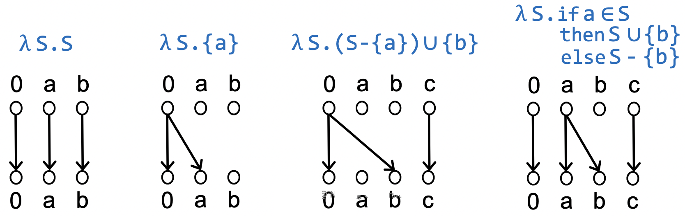</p>

### 11.5.2 构建分解超图

有了代表关系的定义，我们就可以构建分解超图了。其实就是将上面的二部图一个个首尾相接连起来。

::: definition 定义11.15
用有序对 $(n_i, d)$ 表示程序点 $(n_i, n_{i+1})$ 处的数据流因素 $d$ ，用 $(n_i, 0)$ 表示该程序点处特殊的数据流因素 $0$ 。

定义 **分解超图（Exploded Supergraph）** 形如 $G^{\sharp} = (V^{\sharp}, E^{\sharp})$ ，其中：

- $V^{\sharp} = \{(n_i, d)|n_i\ is\ a\ program\ point\ and\ d\ is \ a\ dataflow\ factor\}$ 。
- $(n_i, d_1) \to (n_{i + 1}, d_2) \in E^{\sharp} \Leftrightarrow (d_1, d_2) \in R_{f_i}$ ，其中， $f_i$ 是 $i$ 处的流函数。
:::

基于此，我们可以得到之前那个程序的分解超图 $G^{\sharp}$ 如下：

<p style="text-align:center">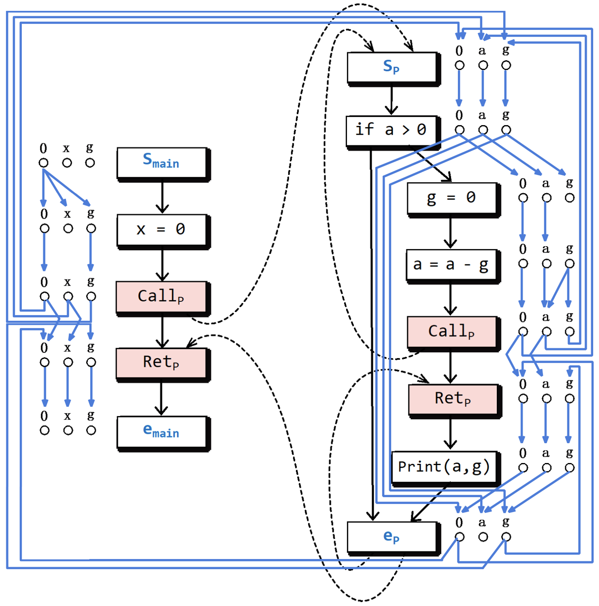</p>

### 11.5.3 粘边

其中，还有一点会有疑问的是，我们能够理解为什么会有 $0\to y$ ，这个表示和输入无关的输出，比如 $lambda S.\{x, g\}$ 这种。但是为什么要有 $0\to 0$ 这条边呢？

在传统的数据流分析中，我们会通过检查数据流因素 $a$ 是否在 $OUT[s_i]$ 中来检查该数据流因素是否在程序点 $(s_i, s_{i+1})$ 处成立 。因为数据流因素是通过流函数的组合进行传递的（见定理4.10），从而我们可以通过直接查看 $OUT[s_i]$ 的方式来判断。

但是，在IFDS中，数据流因素 $a$ 是否在 $n_4$ 处成立是通过判断在 $G^{\sharp}$ 中是否存从 $(s_{main}, 0)$ 到 $(n_4, a)$ 的路径来决定的。

上述的两者（传统数据流分析和IFDS）之间是有区别的，我们看一个简单的例子就能明白了。

<p style="text-align:center">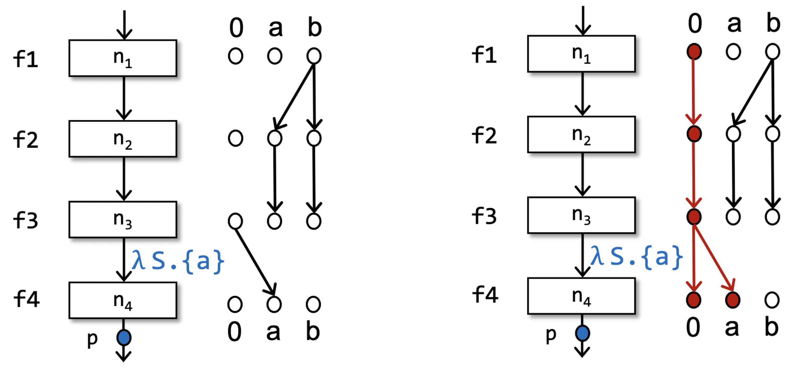</p>

上面左图中是不含 $0\to 0$这条边的情况，右图是符合我们定义的情况。在左图中，我们发现， $\lambda S.\{a\}$ 说无论 $S$ 的输入是什么， $a$ 都成立。

但是，如果没有像右图中的 $0\to 0$ 这样的边，很多个代表关系形成的二部图就没办法“粘”在一起了，就相当于无法表达出原本的流函数的组合了。

从而，IFDS无法在这样的分裂的图上通过可达性分析得出正确的结论了。

::: definition 定义11.16
称分解超图 $G^{\sharp}$ 中形如 $(n_i, 0) \to (n_{i+1}, 0)$ 这样的边围 **粘边（Glue Edge）** 。
:::

### 11.5.4 制表算法

#### 直观感知

有了 $G^{\sharp}$ 之后，下面我们只要解决图 $G^{\sharp}$ 上的CFL可达性问题就行了。先来看两个例子：

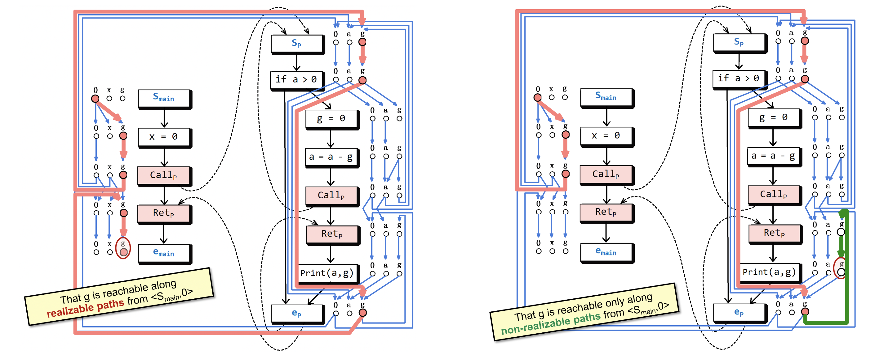

上面左图中圈起来的 $g$ 是有可能未初始化的，因为存在一条可实现的路径，其CFL表示是 $ee(_5ee)_5e \in L(realizable)$ （如果到这里已经忘了请回头再看一眼11.2.2）。 

但是上面右图中圈起来的 $g$ 是不可能未初始化的，因为到达这个 $g$ 的是不可实现的，其CFL表示为 $ee(_5ee)_{11}e \notin L(realizable)$ ，一个不可实现的路径一定是不可行的。

当然了，没有路径肯定是不行了，也就不用再检查是否可实现了了，这里就不举例了。

那有没有一个算法能够帮助我们判断所有的点是否CFL可达呢？答案是有的，制表算法能够帮助我们把从 $(S_{main}, 0)$ 开始的所有的可实现路径找出来。

<p style="text-align:center">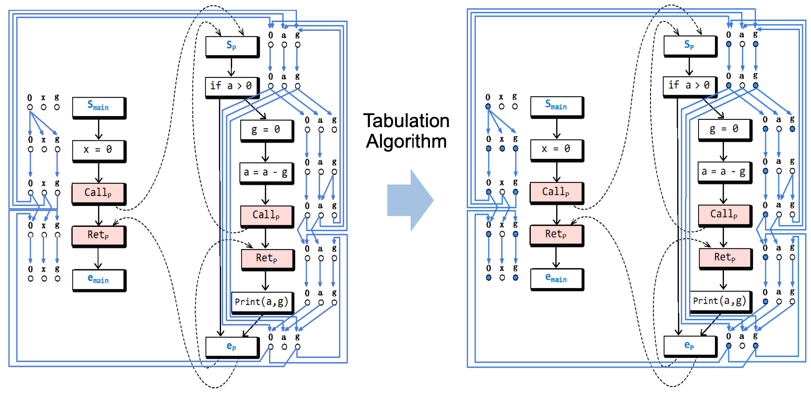</p>

其中标蓝色的就是CFL可达的点，空心的就是CFL不可达的点。其中，CFL使用的是 $L(realizable)$ 这个语言。到现在为止，我们完成了对该程序的数据流分析，最后的问题就是制表算法到底是啥了。

#### 制表算法

从结论11.1的第3点，我们应该能够知道的是 **制表算法（Tabulation Algorithm）** 的功能是给定分解超图，求其中的所有可实现路径。

**算法11.1** 制表算法（Tabulation Algorithm）

<p style="text-align:center">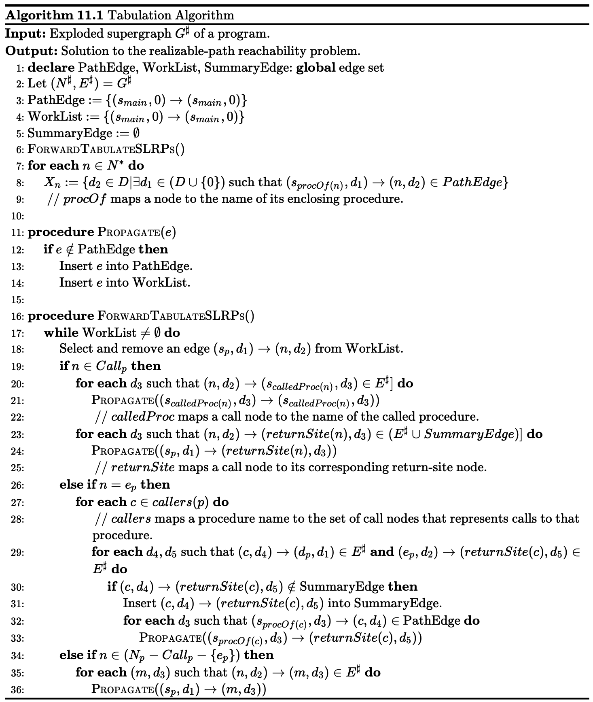</p>

<!--
    \begin{algorithm}
    \caption{Tabulation Algorithm}
    \begin{algorithmic}
    \INPUT Exploded supergraph $G^{\sharp}$ of a program.
    \OUTPUT Solution to the realizable-path reachability problem.
    \STATE \textbf{declare} PathEdge, WorkList, SummaryEdge: \textbf{global} edge set
    \STATE Let $(N^{\sharp}, E^{\sharp}) = G^{\sharp}$
    \STATE PathEdge := $\{(s_{main}, 0) \to (s_{main}, 0)\}$
    \STATE WorkList := $\{(s_{main}, 0) \to (s_{main}, 0)\}$
    \STATE SummaryEdge := $\emptyset$
    \STATE \CALL{ForwardTabulateSLRPs}{}
    \FOR{\textbf{each} $n \in N^{*}$}
        \STATE $X_n$ := $\{d_2 \in D | \exists d_1 \in (D \cup \{0\})$ such that $(s_{procOf(n)}, d_1) \to (n, d_2) \in PathEdge\}$
        \STATE \COMMENT{$procOf$ maps a node to the name of its enclosing procedure.}
    \ENDFOR
    \STATE
    \PROCEDURE{Propagate}{$e$}
        \IF{$e \notin$ PathEdge}
            \STATE Insert $e$ into PathEdge.
            \STATE Insert $e$ into WorkList.
        \ENDIF
    \ENDPROCEDURE
    \STATE
    \PROCEDURE{ForwardTabulateSLRPs}{}
        \WHILE{WorkList $\ne \emptyset$}
            \STATE Select and remove an edge $(s_p, d_1) \to (n, d_2)$ from WorkList.
            \IF{$n \in Call_p$}
                \FOR{\textbf{each} $d_3$ such that $(n, d_2) \to (s_{calledProc(n)}, d_3) \in E^{\sharp}]$}
                    \STATE \CALL{Propagate}{$(s_{calledProc(n)}, d_3) \to (s_{calledProc(n)}, d_3)$}
                    \STATE \COMMENT{$calledProc$ maps a call node to the name of the called procedure.}
                \ENDFOR
                \FOR{\textbf{each} $d_3$ such that $(n, d_2) \to (returnSite(n), d_3) \in (E^{\sharp} \cup SummaryEdge)]$}
                    \STATE \CALL{Propagate}{$(s_p, d_1) \to (returnSite(n), d_3)$}
                    \STATE \COMMENT{$returnSite$ maps a call node to its corresponding return-site node.}
                \ENDFOR
            \ELIF{$n = e_p$}
                \FOR{\textbf{each} $c \in callers(p)$}
                    \STATE \COMMENT{$callers$ maps a procedure name to the set of call nodes that represents calls to that procedure.}
                    \FOR{\textbf{each} $d_4, d_5$ such that $(c, d_4)\to (d_p, d_1) \in E^{\sharp}$ \AND $(e_p, d_2)\to(returnSite(c), d_5)\in E^{\sharp}$}
                        \IF{$(c, d_4) \to (returnSite(c), d_5) \notin$ SummaryEdge}
                            \STATE Insert $(c, d_4) \to (returnSite(c), d_5)$ into SummaryEdge.
                            \FOR{\textbf{each} $d_3$ such that $(s_{procOf(c)}, d_3) \to (c, d_4) \in$ PathEdge}
                                \STATE \CALL{Propagate}{$(s_{procOf(c)}, d_3) \to (returnSite(c), d_5)$}
                            \ENDFOR
                        \ENDIF
                    \ENDFOR
                \ENDFOR
            \ELIF{$n \in (N_p - Call_p - \{e_p\})$}
                \FOR{\textbf{each} $(m, d_3)$ such that $(n, d_2)\to (m, d_3) \in E^{\sharp}$}
                    \STATE \CALL{Propagate}{$(s_p, d_1) \to (m, d_3)$}
                \ENDFOR
            \ENDIF
        \ENDWHILE
    \ENDPROCEDURE
    \end{algorithmic}
    \end{algorithm}
-->

算法的复杂度为 $O(|E||D|^3)$ ，其中 $E$ 是分解超图的边集大小， $D$ 是数据流值。

关于算法的具体细节我们不多分析，具体可以看前面提到的[论文](https://www.csa.iisc.ac.in/~raghavan/CleanedPav2011/idfs-popl95.pdf)

不过我们会通过一个简单的例子稍微介绍一下制表算法核心的工作原理。

#### 工作原理

我们以一个单个的数据流因素来解释一下制表算法的核心工作机制。

<p style="text-align:center">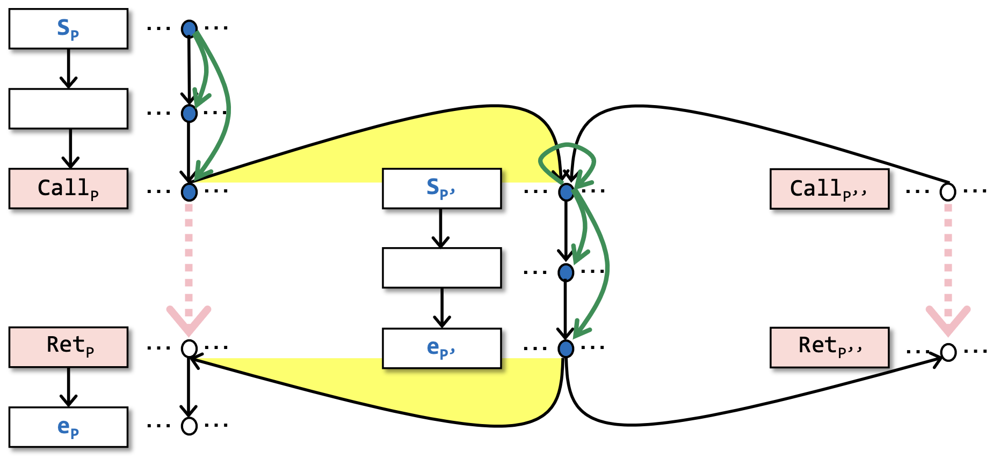</p>

1. 在处理每一个结束结点（Exit Node）的时候，做调用-返回的匹配（Call-to-return Matching）：
    > 见图上黄色部分。
    - 先找到所有的调用 $p'$ 的调用点 $(Call_p, Call_{p''})$ ；
    - 然后找出它们对应的返回点 $(Ret_{p}, Ret_{p''})$ 。
2. 从 $(Call, d_m)$ 到 $(Ret, d_n)$ 的总结边（Summary Edge）表示通过调用方法 $p'$ ， $d_n$ 是从 $d_m$ 可达的。
    > 见图上粉色部分。
    - 在此时，有些方法调用可能还没有被处理，等之后再用到这个方法的时候，有了总结边，我们就知道了这个方法的可达性，从而就不需要再重复地分析一遍这个方法了。
    - 其实，我感觉这里的总结边有点像是一种缓存，用空间换时间，从而提高算法效率。
3. 当图上的一个点 $(n, d)$ 从空心变成实心的时候，说明存在一条从 $(S_{main}, 0)$ 到 $(n, d)$ 的可实现路径。

## 11.6 理解IFDS的分配性

分配性是IFDS的关键，定义可达性问题、活跃变量问题、空闲表达式问题是可分配的（所有的 $gen/kill$ 问题都是可分配的），可以用IFDS解决。但是像常量传播、指针分析这类不可分配的问题，就没有办法用标准的IFDS方法解决。

### 11.6.1 分配性的理解和判断

在4.5.2中，我们提过如果流函数具有分配性，那么迭代算法可以达到MOP同等的精度，否则迭代算法不如MOP。分配性的具体定义见定义4.11，以汇集（Meet）操作为例：

$$
F(x \wedge y) = F(x) \wedge F(y)
$$

在IFDS中，每个流函数一次只能处理一个数据流因素。因为每个代表关系（见定义11.4）只能说明“如果x存在，那么 ...”，“如果y存在，那么...”但是并不能表达“如果x和y都存在，那么...”这样的逻辑。

于是，比如说常量传播问题（我们暂时忽略它数据流值不是有限集的问题），对于 `z = x + y` 来说，只有同时知道了 `x` 和 `y` 的值，才能判断 `z` 的值。而这是代表关系所无法表达出来的。

然而，如果不考虑定义域无限的问题，我们其实是可以用IFDS的方式来分析线性常量传播（只包含 `y = 2x + 3` 这种语句）或者拷贝常量传播（只包含 `x = 2, y = x` 这种语句）的，因为它们的结果只受一个因素影响。

所以，我们可以总结一个简单的判断一个分析问题能否通过IFDS表达和解决的规则：

::: conclusion 结论11.2
给定一个语句s，除了s本身，如果我们还需要考虑 **多个（Multiple）** 数据流因素作为输入来产生正确的输出，那么这个分析就不具有分配性，也就不能用IFDS来表达。

在IFDS中，每个数据流因素及其传播都可以被独立地处理，并且这样做并不会影响最终结果的正确性。
:::

### 11.6.2 指针分析

考虑如下的指针分析问题，应用IFDS算法，我们无法表达出图中红色虚线所指示的关系。其中，为了方便，假设我们已知整个程序只有这4条语句，也就是说需要分析的对象只有那个 `new T` ，相当于我们是在分析哪些指针指向了 `new T` 。

<p style="text-align:center">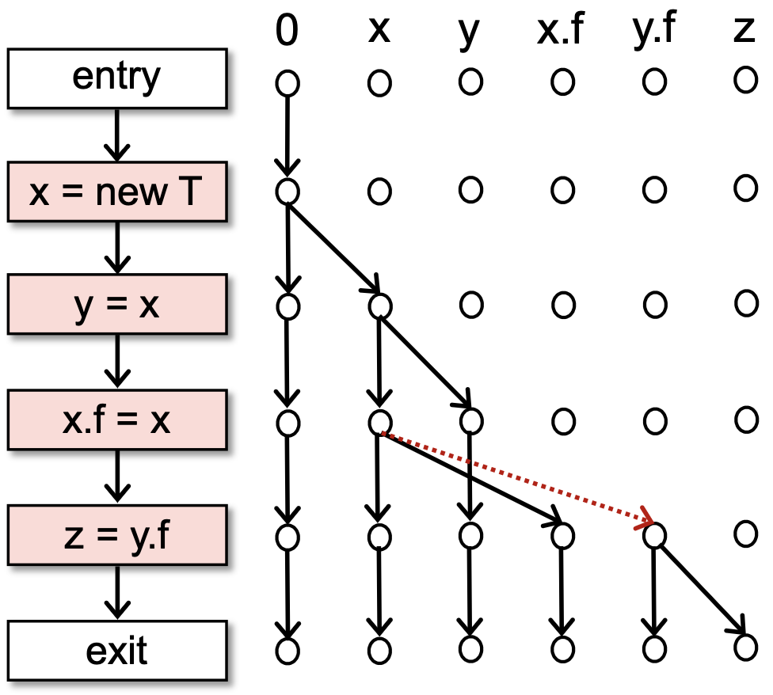</p>

按理说， `z` 和 `y.f` 应该也指向 `new T` ，但是因为缺了红色虚线那条边，所以没有到 `y.f` 和 `z` 的可实现路径。却那条线的原因在于在 `x.f = x` 的时候， `y.f` 也随之指向 `new T` 了。简单总结，就是流函数只看自己这一步，它的输入数据缺少别名信息，比如说 `x` 和 `y` 是别名， `x.f` 和 `y.f` 也是别名，为了产生正确的结果，我们需要用到这些信息。

但是，如果考虑别名信息的话，我们就需要同时考虑多个输入的数据流因素，比如说 `x` 和 `y` ，但标准IFDS的流函数只能独立地一次处理一个因素，因此不能用标准的IFDS来解决。

综上，指针分析也是不具有分配性的。

## 11.7 自检问题

1. 什么是CFL可达（CFL-Reachability）？
2. IFDS（Interprocedural Finite Distributive Subset Problem）的基本想法是什么？
3. 怎样的问题可以用IFDS来解决？

