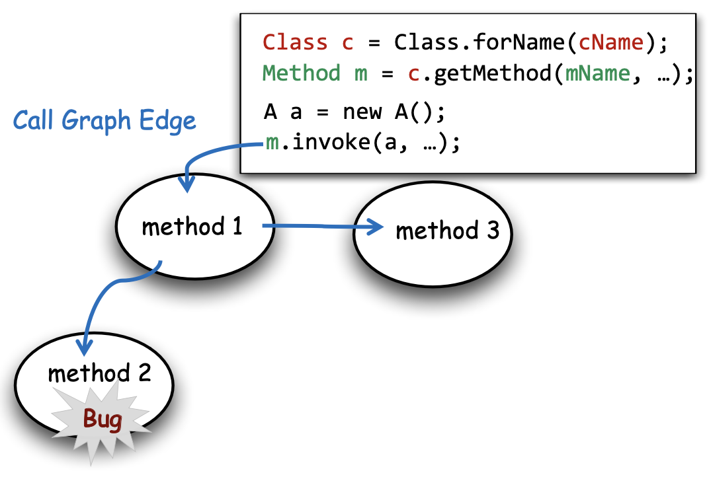
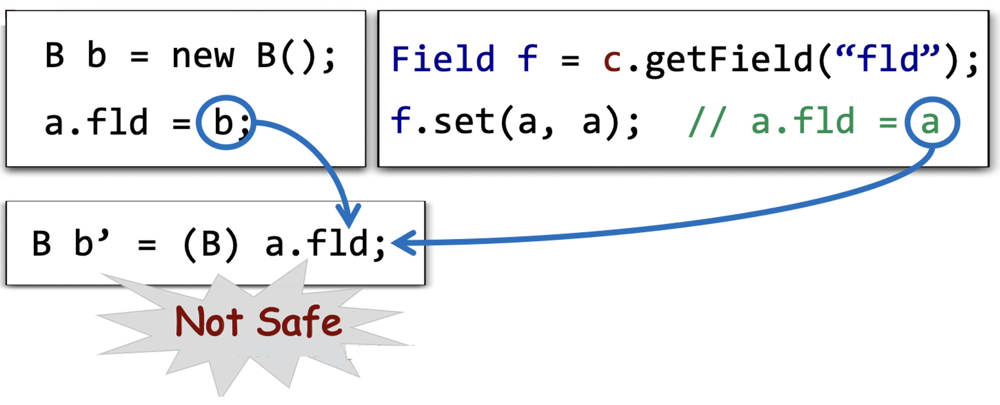
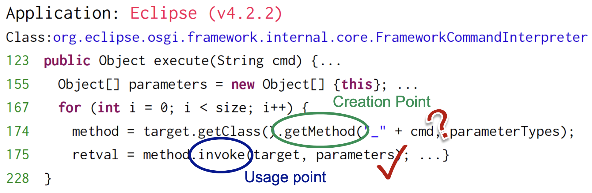
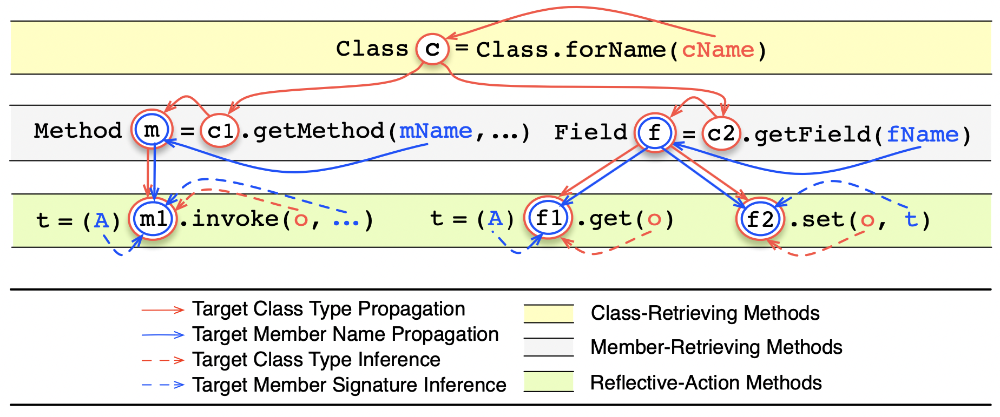
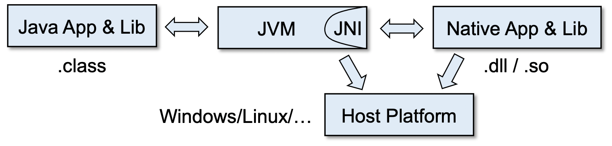
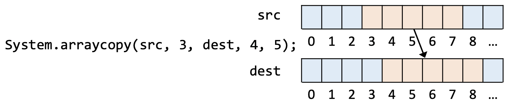

# 12 完整性与近似完整性

## 12.1 完整性和近似完整性的概念

### 12.1.1 完整性的现实困境

其实完整性（Soundness）我们在定义1.2中已经定义过了，简单来说就是需要做饱和估计（Over-Approximation），具有完整性的静态分析应当能够捕捉到所有的程序行为，或者说该分析应当模拟出程序所有可能的执行状态。

那么我们能够对于实际应用中的程序达到一个完全完整（Sound）的分析么？

- 从学术界的角度来讲，几乎所有发表的全程序分析当应用到现实中广泛应用的编程语言以及程序的时候都是不完整（unsound）的。
- 从产业界的角度来说，几乎所有的现实中的全程序静态分析工具（比如说bug检测，安全分析等等）都不得不做出一些不完整（undound）的选择。

那这是为什么呢？这是因为现代的编程语言有一些对于静态分析来说难的语言特性。

比如说，下面是一些对于静态分析来说难的语言特性的例子：
- Java
    - 反射（Reflection），原生代码（Native Code），动态类加载（Dynamic Class Loading）......
- JavaScript
    - 检测（eval），文档对象模型（Document Object Model, DOM）......
- C/C++
    - 指针运算（Pointer Arithmetic），函数指针（Functions Pointers）......

::: definition 定义12.1
对于静态分析来说， **难分析的特性（Hard-to-analyze Features）** 或者简称 **难的特性（Hard Feature）** 是指：对这些特性进行激进的保守处理（即完全的饱和估计）可能会使分析过于不精确而无法扩展，从而使分析变得无用。
:::

于是，

- 一般来说，声称自己完整的静态分析在它的视线中会有一个完整的核心（sound core）
    - 也就是说，对于大部分的语言特性作饱和估计（见定义1.3）
    - 对于一些特定的，或者难的特性作保守估计（见定义1.4）
- 在论文的一些实现或者评估的部分中，对难的语言性的处理通常被省略或仅以一种比较水的方式提及
- 但对于一些特定的难的语言特性（比如说Java反射）没有合适的处理的话，对于分析的结果会有举足轻重的影响。

并且，在论文中声称完整性可能会误导读者：

- 对于非专家的读者来说，他们可能会错误地认为分析的结果是完整的，并且自信地依赖于分析结果；
- 对于专家来说，没有一个关于如何处理重要且难的语言特性的清晰解释，想要解释分析结果（比如说告诉我们这个分析到底有多完整、多块、多精确）也是很难的。

### 12.1.2 近似完整性

于是，程序分析领域的一些前辈和大佬在2015年的ACM通讯上发表了一份[宣言](/Soundiness-CACM.pdf)，提出了近似完整性（Soundiness）这个概念。

::: definition 定义12.2
一个 **近似完整的（soundy）** 静态分析通常意味着这个分析大多数时候是完整的，并且对于进行了不完整处理的难的或者特定的语言特性有着良好的标注和说明。 称一个近似完整的静态分析具有 **近似完整性（Soundiness）** 。
:::

总的来说，我们可以有如下的结论：

::: conclusion
完整性、近似完整性与不完整性：
- 一个 **完整的（sound）** 静态分析需要捕捉到程序所有的动态行为；
- 一个 **近似完整的（soundy）** 静态分析致力于捕捉到程序所有的动态行为，但是对于特定的难的语言特性进行了不完整的处理，且这种不完整的处理是有原因的；
- 一个 **不完整（unsound）** 静态分析在其设计当中故意地忽略了一些特定的行为，从而去换取更高的效率、精度或者可访问性。
:::

## 12.2 难语言特性：Java反射

### 12.2.1 基本概念

Java反射是一种公认的静态分析难的问题，是一种静态分析中臭名昭著的Java特性。

那什么是Java反射呢？

::: definition 定义 12.3
**反射（Reflection）** 是Java编程语言中的一个特性。它允许正在执行的Java程序检查或“自省”自身，并操纵程序的内部属性。
:::

例如，Java 类可以获取其所有成员的名称并显示它们。

比如说，一般的Java程序会这么写：

```java
class Person {
    String name;
    void setName(String nm) { ... }
}

Person p = new Person();
p.setName("John");
p.name = "BearSir";
String s = p.name;
```

其中，`class` 、 `name` 、 `field` 是语言内部的属性，主要表现为这个语言的关键字或者和语法（调用表达式、点表达式等等），是一些编译时的东西，在运行时的阶段我们无法访问，就像一个函数没办法访问函数自己的名字，一个类没办法访问这个类自己的或者类中某个属性的名字一样。

而Java反射为这些程序的内部属性提供了一些访问和使用的接口，称为 **元对象（Metaclass）** ，我们可以借助反射在运行时访问到编译时的程序的内部属性，像编译时写代码一样，在运行时操作这些内部属性。

例如，上述程序对应的Java反射写法如下：

```java
Class c = Class.forName("Person");
Method m = c.getMethod("setName");
Field f = c.getField("name");

Object p = c.newInstance();
m.invoke(p, "John")
f.set(p, "BearSir");
String s = (String)f.get(p);
```

引入Java反射机制是为了在大型程序开发的过程中降低程序的耦合性，使得程序易于拓展、修改和维护。

### 12.2.2 动机

那么我们为什么要分析Java反射呢？下面举两个例子来说明。

第一点是全程序、过程间的分析很多时候是避不开的，比如说在做bug检测（Bug Detection）或者安全性分析（Security Analysis）的时候，而Java反射出了反射函数本身之外，还会产生别的新的过程间的控制流边。

<p style="text-align:center"></p>

第二点是Java反射回修改程序的内部属性，从而产生一些副作用，这也是不能忽略的，特别是在做一些确认（Verification）或者优化（Optimization）的时候，如果忽略了反射机制的副作用就会导致不安全或者产生错误。

<p style="text-align:center"></p>

### 12.2.3 一些处理思路

常见的处理Java反射的处理思路有：

- 字符串常量分析 + 指针分析
    > Reflection Analysis for Java (APLAS 2005) Benjamin Livshits, John Whaley, Monica S. Lam. Stanford University
- 类型接口 + 字符串分析 + 指针分析
    > Self-Inferencing Reflection Resolution for Java (ECOOP 2014) Yue Li, Tian Tan, Yulei Sui, Jingling Xue. UNSW Sydney
- 辅以动态分析
    > Taming reflection: Aiding static analysis in the presence of reflection and custom class loaders (ICSE 2011) Eric Bodden, Andreas Sewe, Jan Sinschek, Hela Oueslati, Mira Mezini. Technische Universität Darmstadt

#### 思路1: 字符串常量分析 + 指针分析

这是一个最直接的思路，反射机制通过字符串来获取元对象，如果我们能够分析出这个字符串是啥，就可以根据反射函数的语义去推导出它获取的是哪一个类、方法或者字段的元对象了。

```java
String cName = "Person";
String mName = "setName";
String fName = "name";
... ...
Class c = Class.forName(cName);
Method m = c.getMethod(mName, ...);
Field f = c.getField(fName);
... ...
m.invoke(p, ...);
```

但是字符串不一定是明晃晃的常量，也有可能是：
- 从配置文件（Configuration Files）中获取的；
- 从网络中获取的；
- 来自命令行的输入；
- 包含复杂的字符串处理操作（分析不出常量结果）；
- 动态生成的；
- 经过加密的。

所以这个方法有一个问题：如果我们不能够静态地知道字符串参数的值，反射目标就无法被解析出来。

#### 思路2: 类型接口 + 字符串分析 + 指针分析

::: definition 定义12.4
称反射目标创建函数的调用点为 **创建点（Creation Points）** ，反射目标行为函数的调用点为 **使用点（Usage Point）** 。
:::

当创建点的字符串参数没有办法静态地解析出来的时候，我们可以尝试通过这个反射目标的使用点来推测反射目标是什么。

也就是说，我们虽然在这个反射目标刚出生的时候不知道它是谁。但是，我们可以根据它后面干了什么反过来推测它是谁。

<p style="text-align:center"></p>

比如说，上面这个例子，我们可以推测出第175行反射的目标方法一定有一个参数（根据第155行的内容），且这个参数的声明类型一定是 `FrameworkCommandInterpreter` 或者它的基类/子类（因为实际类型是`FrameworkCommandInterpreter`）.

根据这个信息，我们就可以缩小目标方法的范围，再根据一些别的辅助信息，从而将目标方法的可能性缩小到一个比较小的范围里面，甚至确定目标方法。

<p style="text-align:center"></p>

这样做是因为Java有很强大的类型接口，能够辅助我们推测，并达到一个比较好的精度。

#### 思路3: 辅以动态分析

这种思路是做起来最简单的，放弃静态解析的幻想，使用一些动态测试样例去帮助确定目标方法，然后使用动态分析的结果来辅助静态分析。

但是，这个方法是很难做到完全的，因为动态生成的测试样例想要覆盖所有的可能性是很难做到的。

如果我已经提前静态地知道了所有的可能性，用来生成测试样例的话，此时已经不再需要再用测试样例了，因为我要解决的问题就是我不知道所有的可能性。

## 12.3 难语言特性：原生代码

### 12.3.1 Java原生接口

Java是一个虚拟机语言，是运行在JVM上的，而JVM是用C/C++写的，因为毕竟需要和操作系统打交道，以及更底层的各种设备的访问和驱动。

::: definition 定义12.5
**Java原生接口（Java Native Interface, JNI）** 是JVM的一个功能模块，允许Java代码和原生代码（C/C++）之间的交互。
:::

<p style="text-align:center"></p>

为什么我们需要JNI呢？

- 首先是因为我们需要一些平台相关的特性支持（也就是需要一些操作系统提供的功能）；
- 其次是为了复用现有的很多用C/C++书写的原生库。

### 12.3.2 原生代码难分析的原因

我们来看一个Java使用原生代码的例子。

首先是一段C代码，下面这段C代码会被编译打包成 `GuessMeLib.so` （假设在Linux平台上）。

```c
#include <jni.h>

JNIEXPORT jobject JNICALL Java_JNIExample_guessMe(JNIEnv *env, jobject obj) {
    jclass clz = (*env)->FindClass(env, "JNIExample");
    jmethodID constructor = (*env)->GetMethodID(env, clz, "<init>", "()V");
    return (*env)->NewObject(env, clz, constructor);
}
```

其中，`jni.h` 提供了很多接口，比如说 `JNIEnv` 提供了 `FindClass` 、 `GetMethodID` 、 `NewObject` 、 `CallVoidMethod` 等等接口。这些JNI函数能够让我们在原生代码中创建对象、访问字段、调用方法等等。

然后是一段使用原生代码的Java代码。

```java
public class JINExample {
    static { 
        System.loadLibrary("GuessMeLib"); // 载入原生库
    }

    private native Object guessMe(); // 声明原生方法

    public static void main(String[] args) {
        JNIExample je = new JNIExample();
        Object obj = je.guessMe();
        ... ...
    }
}
```

考虑上面这段代码的第10行，Java的静态分析器怎样分析这个方法调用呢？这个方法里面甚至都不是Java代码，我们根本无法用Java的分析器直接分析这样的Java代码。所以这是一个难问题。

### 12.3.3 一些处理思路

现在实践中使用的原生代码处理方法是对于关键原生代码进行人工模拟。简单来说，就是为关键的原生代码编写等价的Java代码用于静态分析。

比如说下面这个函数：

```java
java.lang.System.arraycopy(src, srcPos, dest, destPos, length)
```

它的作用是将一个数组从某个位置开始的若干个元素拷贝到另一个数组从某个位置开始一段空间内。

<p style="text-align:center"></p>

为了提高效率， `arraycopy()` 是用原生代码实现的，我们静态分析的可以将它转化成等价的java代码：

```java
for (int i = 0; i < length; i++)
    dest[destPos + i] = src[srcPos + i];
```

如果是进行指针分析的话，在6.4.1节中，我们对数组做过一层抽象，忽略数组下标，将数组的所有元素抽象成一个 `arr` 字段，这样的话 `arraycopy()` 就可以等价于：

```java
dest.arr = src.arr;
```

看起来简洁了不少。这个例子告诉我们，在手动实现原生代码的时候，可以针对我们要研究的问题进行一些抽象，从而在不影响问题研究的前提下简化实现。

出了人工模拟关键原生代码以外，现在也有研究是通过二进制扫描的方式来识别原生代码中的Java调用。

> Identifying Java Calls in Native Code via Binary Scanning (ISSTA 2020) George Fourtounis, Leonidas Triantafyllou, Yannis Smaragdakis,, University of Athens

更多的和近似完整性相关的内容可以参见[soundiness](http://soundiness.org/)主页。

## 12.4 自检问题

1. 近似完整性（Soundiness）的动机和概念是什么？
2. 为什么Java反射（Reflection）和原生代码是难分析的？

::: tip
完结撒花！
:::
